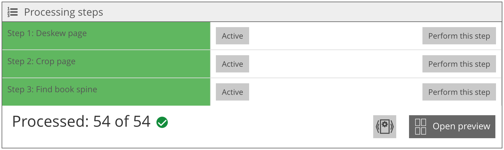
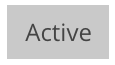
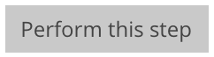

# Working steps

## Overview

Name                     | Wert
-------------------------|-----------
Identifier               | intranda_step_layoutwizzard
Repository               | [https://github.com/intranda/goobi-plugin-step-layoutwizzard](https://github.com/intranda/goobi-plugin-step-layoutwizzard)
Licence              | GPL 2.0 or newer 
Last change    | 25.07.2024 14:15:32

The work step area contains a list of all configured analysis steps. These are each listed with several buttons.

| Icon | Description |
| :--- | :--- |
|  | The background color of the step indicates whether this step has already been executed for the current image. If the background is green, this means that the analysis step has already been executed. This should always be the case if an automatic analysis has already been performed and no errors occurred during processing. If, on the other hand, the background is highlighted in white, the data for this step must be entered manually or a new automatic analysis must be attempted. |
|  | The individual steps can be activated or deactivated with the `Active/Inactive` switch. Please note that deactivating a step always results in the loss of all analysis data of the respective step. However, you can then re-enter the data manually. |
|  | If you click on the button `To this step`, the respective step is selected. This changes the image display so that the analysis data of the step can be displayed and edited. In addition, the `Analysis Step` area opens, where the configuration of the step can be adjusted and the step can be executed or reset for all images. A currently selected step cannot be deactivated. To end the step selection, the title bar `Steps` can be clicked on. |

‌

Below the analysis phases, the section contains the following additional options:

| Icon | Description |
| :--- | :--- |
|  | The number of images that have already been fully analyzed is displayed here. When all images are processed, the green icon with the check mark appears. This should already be the case after the automatic analysis is completed. If not, the missing images must be searched for and the analysis steps must be completed manually or automatically. Note that the step to automatically save the LayoutWizzard data only works if all images have been completely analyzed before. A red icon with a cross appears if an automatic analysis is currently being performed within the plugin. A click on this red icon will stop the analysis. |
|  | The button `Process all images` starts an automatic analysis of all images in the plugin. The analysis is aborted if the icon with the red cross is clicked, the results are discarded or the plugin is closed. Normally, this function is not needed because the automatic analysis is performed in another workflow step within the Goobi process. This function is mainly intended for testing the automatic analysis or for analyzing small datasets. |
|  | This button opens the preview view, in which all images can be displayed and edited one below the other. |