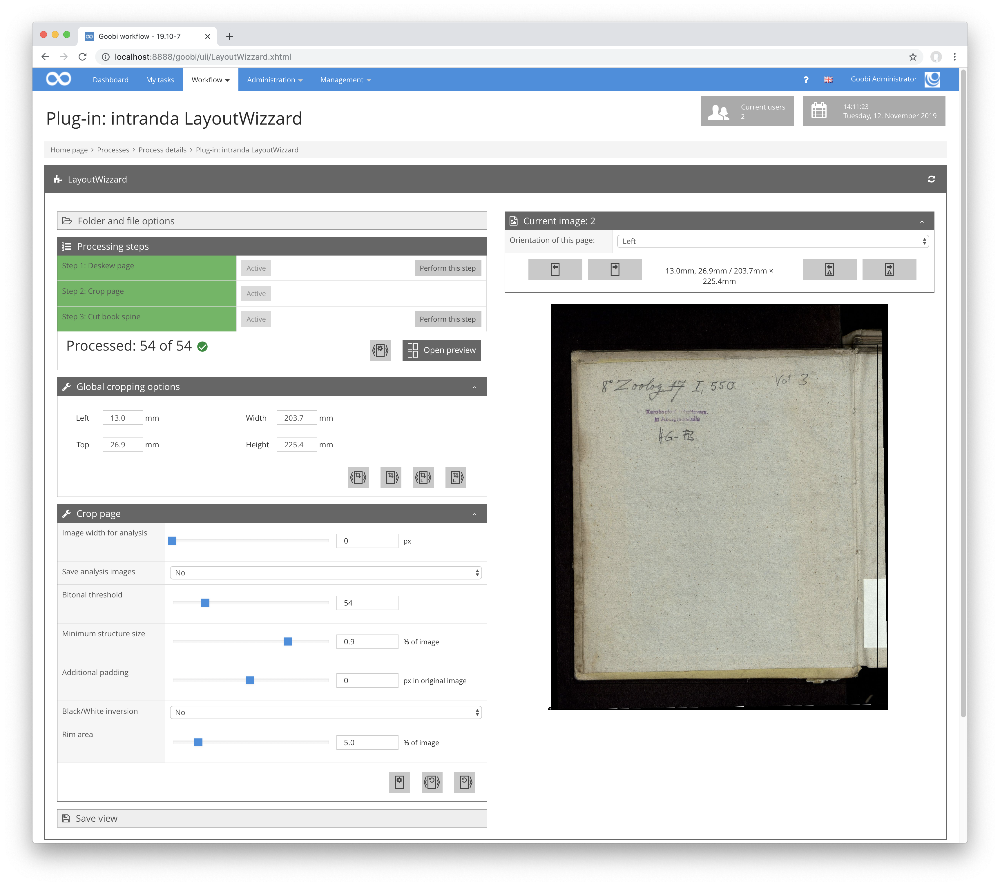
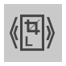

This area is only available if the `Crop page` step is selected and this option is enabled in the configuration. It shows the position and size of the crop frame for the current image. It is displayed in millimeters or another configurable unit of measurement. The values displayed here can be edited directly and always remain synchronous with the frame in the image display.

Additionally, this area has buttons to transfer the size and position of the current frame to other images:

| Icon | Description |
| :--- | :--- |
|  | Transfer frame to all other images. |
|  | Transfer frame to all subsequent images. |
|  | Transfer frame to all right images. This is only available if the current image is a right image. |
|  | Transfer frame to all subsequent right images. This is only available if the current image is a right image. |
|  | Transfer frame to all left images. This is only available if the current image is a left image. |
|  | Transfer frame to all subsequent left images. This is only available if the current image is a left image. |