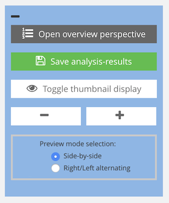
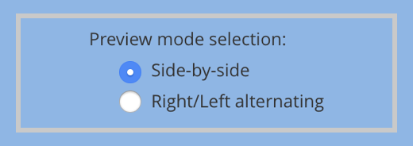

# Display and navigation options

## Overview

Name                     | Wert
-------------------------|-----------
Identifier               | intranda_step_layoutwizzard
Repository               | [https://github.com/intranda/goobi-plugin-step-layoutwizzard](https://github.com/intranda/goobi-plugin-step-layoutwizzard)
Licence              | GPL 2.0 or newer 
Last change    | 25.07.2024 14:16:33

Within the preview view there is a menu with several buttons for the configuration of the image display in the left area.

The functions offered in this menu have the following meaning:

| Function | Description |
| :--- | :--- |
|  | This button takes you to the overview page of the LayoutWizard. Depending on the configuration, this is also the initial page. From there you can return to the preview view by clicking on the button Open Preview. |
|  | With this button you can save the changes you have made so far. Using this button is especially advisable if you foresee an interruption of your work, which might last longer and thus lead to a timeout of the current user session. |
|  | A click on this button toggles the display of the preview images, so that either a preview of the final image or a display of the original image with book fold and frame lines is shown. |
|  | These buttons change the size of the preview images displayed. Larger images allow better direct editing. Smaller images, on the other hand, allow more images to be viewed at the same time. |
|  | These options allow you to switch between displaying right and left pages separately and displaying left and right pages simultaneously. |