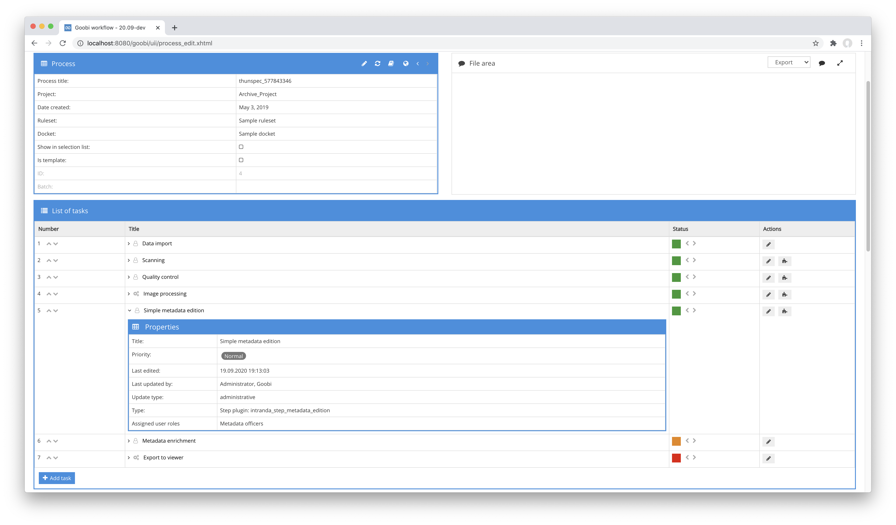
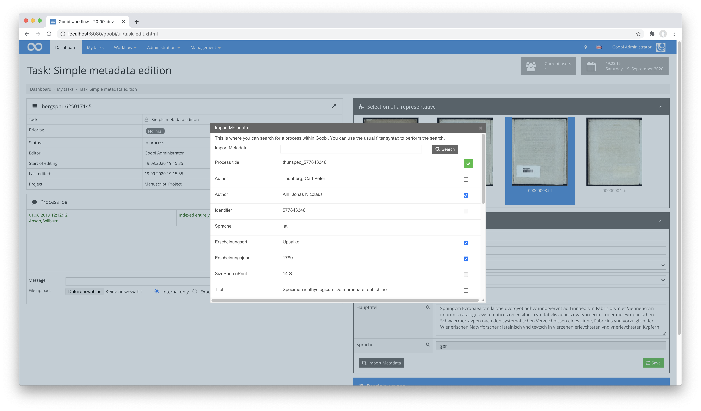

# Metadata edition

## Overview

Name                     | Wert
-------------------------|-----------
Identifier               | intranda_step_metadata_edition
Repository               | [https://github.com/intranda/goobi-plugin-step-metadata-edition](https://github.com/intranda/goobi-plugin-step-metadata-edition)
Licence              | GPL 2.0 or newer 
Last change    | 25.07.2024 11:57:05


## Introduction
This plugin allows the editing of configurable properties and metadata within the user interface of an open task without having to enter the METS editor. In addition to editing the metadata, it is also possible to search for other processes and to selectively transfer metadata from found processes. With the integrated thumbnail display, the representative of the object can also be set.


## Installation
To install the plugin, the following two files must be installed:

```bash
/opt/digiverso/goobi/plugins/step/plugin_intranda_step_metadata_edition-base.jar
/opt/digiverso/goobi/plugins/GUI/plugin_intranda_step_metadata_edition-gui.jar
```

To configure how the plugin should behave, various values can be adjusted in the configuration file. The configuration file is usually located here:

```bash
/opt/digiverso/goobi/config/plugin_intranda_step_metadata_edition.xml
```

## Overview and functionality
To put the plugin into operation, it must be activated for one or more desired tasks in the workflow. This is done as shown in the following screenshot by selecting the plugin `intranda_step_metadata_edition` from the list of installed plugins.



After the plugin has been completely installed and set up, it is available to the editors of the corresponding tasks. After entering a task, it is now possible to edit the metadata in the right-hand area of the user interface.


Depending on the configuration, the corresponding metadata is displayed here and can be edited. Depending on the configuration, a search for other processes is also possible here by clicking on the search icon.



Within the dialogue with the processes found, it is now possible to select which of the displayed metadata of the processes found should be taken over.

A click on one of the displayed thumbnails allows the representative to be set.

Please note that the edits are only saved when the button provided is clicked.


## Configuration
The configuration of the plugin is structured as follows:

```xml
<config_plugin>
    <config>
        <!-- which projects to use for (can be more then one, otherwise use *) -->
        <project>*</project>
        <step>*</step>
        <!-- size of the thumbnail images -->
        <thumbnailsize>200</thumbnailsize>

         <!--  If true and the attribute onlyEmptyReadOnlyFields is set to false all empty fields in the plugin are hidden.
              If the attribute onlyEmptyReadOnlyFields is true also, only these ones are not rendered.
              The default value of onlyEmptyReadOnlyFields is true -->
        <hideEmptyFields onlyEmptyReadOnlyFields="true">true</hideEmptyFields>

        <!-- which image folder should be used? Possible values are master/media, default is media -->
        <imageFolder>media</imageFolder>

        <!-- configure here if the images shall be rendered inside of the user interface; 
             if switched off then the representative image cannot be set -->
        <showImages>true</showImages>

        <!-- this switch allows to hide the search and import functionality for other processes;
            if switched off the button will disappear -->
        <showImportMetadata>true</showImportMetadata>

        <!-- each displayfield defines what shall be shown in the user interface
                source: where shall the field get its content from, possible values are property, metadata, person
                name: the internal name of the field to be shown
                type: define how the field shall look like (text, checkbox, multivalue, list, checkbox)
                required: define if the value must be filled out
                helpText: an explaination text for the field content
                validationRegex: a regular expression to validate the field content
                validationErrorText: the message to be shown if the validation is not successful
                label: a label to show to the users for the field
                structType: the place where the metadata comes from for source metadata (e.g. anchor)
                defaultValue: the value to fill as default
                searchable: define if the content of this field shall be used to start a search for other processes with this value
                repeatable: define if the field is allowed exist multiple times so that a button for duplication and for deletion is rendered; the default is false
                suffix: a suffix that shall be added to the search query when the field content is searched
                vocabularyName: name of the vocabulary to list records from (e.g. Subject terms)
                searchParameter: optional repeatable parameter to restrict records from the vocabulary (e.g. type=AccessLocations)
        -->
        <displayfield source="property" name="Template" type="text" required="false" repeatable="true" helpText="This is an explaining text to define what shall be entered into this field.">
            <defaultValue></defaultValue>
        </displayfield>
        <displayfield source="metadata" name="PublicationYear" type="text" required="true">
            <validationRegex>\d{4}</validationRegex>
            <validationErrorText>Value must be a 4 digits year</validationErrorText>
        </displayfield>
        <displayfield source="metadata" name="singleDigCollection" type="list" required="true" label="Collection" structType="anchor">
            <defaultValue>Collection A</defaultValue>
            <value>Collection A</value>
            <value>Collection B</value>
            <value>Collection C</value>
        </displayfield>
        <displayfield source="metadata" name="_directionRTL" type="checkbox" label="Orientation">
            <defaultValue>false</defaultValue>
        </displayfield>
        <displayfield source="metadata" name="PlaceOfPublication" type="vocabularyList" label="Place">
            <!-- name of the vocabulary, required -->
            <vocabularyName>Subject terms</vocabularyName>
            <!-- search parameter, optional, repeatable -->
            <searchParameter>type=AccessLocations</searchParameter>            
        </displayfield>
        <displayfield source="person" name="Author" type="multivalue" searchable="true" />
        <displayfield source="metadata" name="TitleDocMain" type="text" required="false" label="Haupttitel" searchable="true" suffix=" steplocked:Validierung"/>
        <displayfield source="metadata" name="DocLanguage" type="text" required="false" label="Sprache"  searchable="true"/>

        <!-- define if the fields shall be preselected after the search of processes was done -->
        <preselectFields>false</preselectFields>

        <!-- list of fields that shall be shown for each found process
                rulesetName: the name of the metadata type in the ruleset
                label: label to show for the metadata
                selectable: allow the field to be selected to use it
         -->
        <importfield rulesetName="TitleDocMain" label="Titel" selectable="true"/>
        <importfield rulesetName="PublicationYear" label="Erscheinungsjahr" selectable="true"/>
        <importfield rulesetName="DocLanguage" selectable="true" label="Sprache"/>
        <importfield rulesetName="Author" selectable="true"/>
        <importfield rulesetName="CatalogIDDigital" label="Identifier" selectable="false"/>
        <importfield rulesetName="CatalogIdentifier" label="OPAC Eintrag" selectable="false"/>
        <importfield rulesetName="Note" label="Bemerkung" selectable="false"/>
        <importfield rulesetName="PlaceOfPublication" label="Erscheinungsort" selectable="true"/>
        <importfield rulesetName="singleDigCollection"  selectable="false"/>
        <importfield rulesetName="SizeSourcePrint"  selectable="false"/>
        <importfield rulesetName="SubjectTopic" label="Schlagwort" selectable="true"/>

    </config>
</config_plugin>
```


### Main configuration
The block `<config>` can occur repeatedly for different projects or workflow steps in order to be able to perform different actions within different workflows. The other parameters within this configuration file have the following meanings:

| Value | Description |
| :--- | :--- |
| `project` | This parameter determines for which project the current block `<config>` should apply. The name of the project is used here. This parameter can occur several times per `<config>` block. |
| `step` | This parameter controls for which workflow steps the block `<config>` should apply. The name of the workflow step is used here. This parameter can occur several times per `<config>` block. |
| `thumbnailsize` | This parameter determines the size of the thumbnails to be displayed for determining the representative. |
| `hideEmptyFields` | This element can have the values `true` and `false`. The element also has the attribute `onlyEmptyReadOnlyFields`. If the element has the value `true`, empty metadata fields are hidden. The attribute `onlyEmptyReadOnlyFields` can also be used to control whether only empty `ReadOnly` fields (`true`) or all empty fields (`false`) should be hidden. The default value of `onlyEmptyReadOnlyFields` is `true`. |
| `imageFolder` | This parameter determines from which directory the images are to be used for display. Common values here are, for example, `master` or `media`. |
| `preselectFields` | This parameter can be used to specify whether the metadata found within the process search of this plugin should already be preselected so that a simple transfer of the metadata can take place. |
| `showImages` | This parameter determines whether the image area for selecting the representative is to be displayed. |
| `showImportMetadata` | This parameter controls whether the button for searching in existing processes and their data transfer should be possible. |


### Configuration: displayfield
For each metadata to be displayed, an element `<displayfield>` can be defined. This controls the display and storage of the respective data.

| Value | Description |
| :--- | :--- |
| `source` | This specifies where the field should get its content from. Possible values for this are `property`, `metadata` and `person`. |
| `name` | The parameter defines the internal name of the field. |
| `type` | The parameter `type` defines how the field should look like. Possible values for this are `text`, `checkbox`, `multivalue` or `list`. |
| `required` | The value `required` defines whether the value must be filled in by the user. |
| `helpText` | Here an explanatory help text can be defined for the field content, which the user can display. |
| `validationRegex` | This parameter can be used to define a regular expression to check the field content for validity. |
| `validationErrorText` | Here you can define the message to be displayed if the validation was not successful. |
| `label` | The parameter can be used to define a label that is displayed to users for the field. |
| `structType` | This parameter defines the structural element from which the metadata is to be used for the display (e.g. `anchor`). |
| `defaultValue` | Here you can define a default value to be set if no value is available. |
| `searchable` | This parameter can be used to define whether the content of this field is to be used for the execution of a search. |
| `suffix` | This allows you to specify a suffix to be added to the search query when searching for other processes with the same field content. |
| `vocabularyName` | The name of the vocabulary is defined here if it is to be used for the display of selectable data records (e.g. technical terms). |
| `searchParameter` | This paremeter is optional and repeatable. It is used to further restrict records from the vocabulary (e.g. `type=AccessLocations`) |


### Configuration: importfield
For the search for other processes, it is possible to specify which of their metadata should be displayed and, if necessary, adopted.

| Value | Description |
| :--- | :--- |
| `rulesetName` | The parameter specifies the name of the metadata type as defined in the ruleset. |
| `label` | This parameter defines the label of the field to be displayed for the metadata. |
| `selectable` | The parameter can be used to determine whether the metadata can be selected for a transfer to data. |