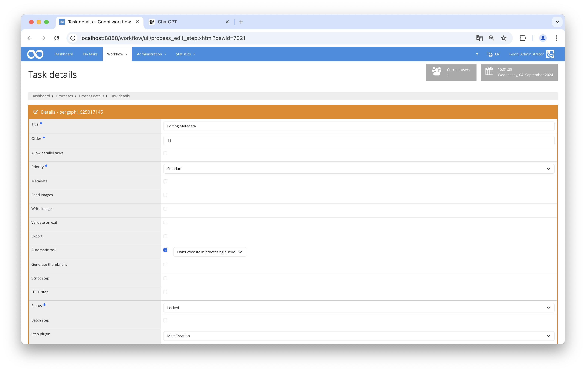

# Automatic METS enrichment with image files and pagination

## Overview

Name                     | Wert
-------------------------|-----------
Identifier               | plugin_intranda_step_mets_creation
Repository               | [https://github.com/intranda/goobi-plugin-step-mets-creation](https://github.com/intranda/goobi-plugin-step-mets-creation)
Licence              | GPL 2.0 or newer 
Last change    | 04.09.2024 20:59:25


## Introduction
This documentation explains how METS files are loaded, enriched and then saved using several plugins. 

## Installation
In order to use the plugin, the following files must be installed:

```bash
/opt/digiverso/goobi/plugins/step/plugin-step-mets-creation-base.jar
```

After installing the plugin, it can be selected within the workflow for the respective workflow steps and thus executed automatically.

To use the plugin, it must be selected in a workflow step:




## Overview and functionality
When selecting the plugin within the work step, one of these plugins can be selected: `METSCreation`, `METSCreatePagination` or `MapMETSCreation`.

When the `METSCreation` plugin is executed, it opens the METS file of the process, enriches it with the available images of the master or derivative directory and then saves it again. 

The plugin `METSCreatePagination` also opens the METS file of the process when it is executed and then checks whether a valid path to the image files is entered there. If this is not the case, it is added. The image files are then read from the file system to add pagination. Finally, the METS file is saved.

If the `MapMETSCreation` plugin is executed, it opens the METS file and checks whether the metadata `singleDigCollection` exists. If this is not the case, the value `Karten` (German for `Maps`) is assigned to it. It then checks whether there is a valid file path and, if this does not exist, it is added. The image files are then read from the file system in order to add pagination. Finally, the METS file is saved.

## Configuration
This plugin does not have a configuration file and therefore does not require any special settings.