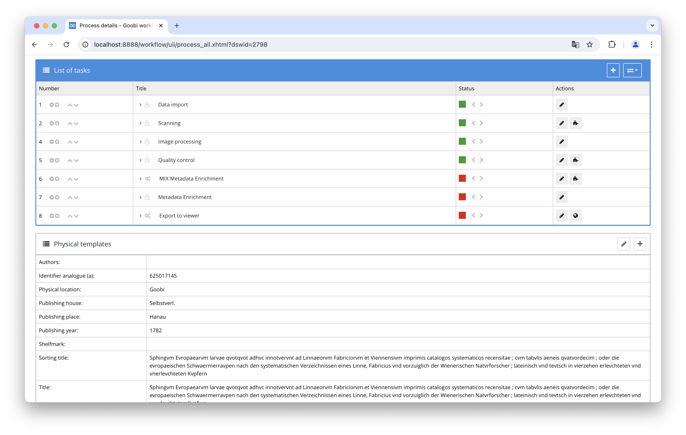
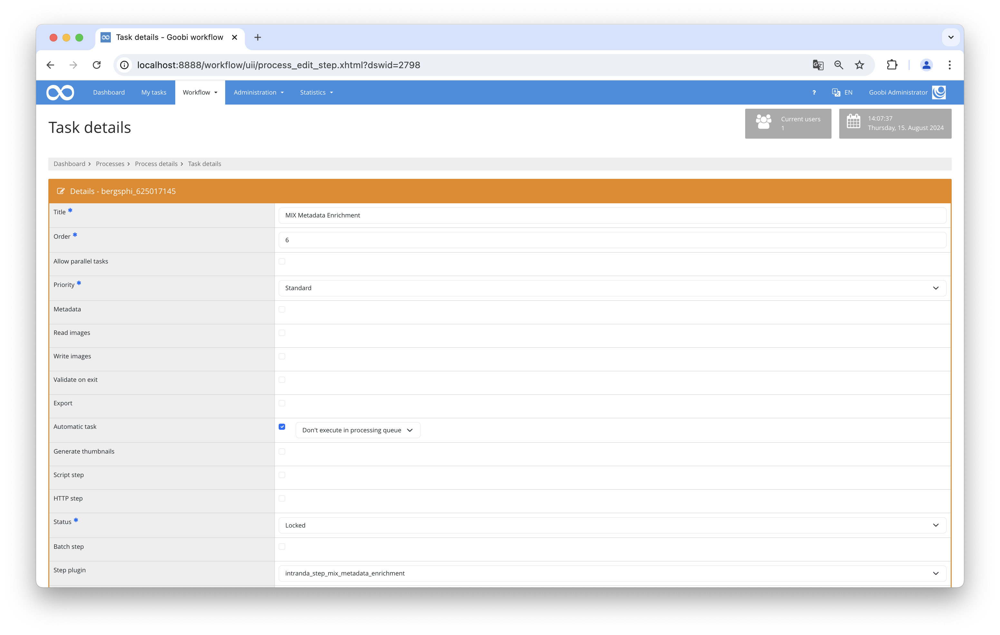

# MIX Metadata Enrichment Plugin

## Overview

Name                     | Wert
-------------------------|-----------
Identifier               | intranda_step_mix_metadata_enrichment
Repository               | [https://github.com/intranda/goobi-plugin-step-mix-metadata-enrichment](https://github.com/intranda/goobi-plugin-step-mix-metadata-enrichment)
Licence              | GPL 2.0 or newer 
Last change    | 14.10.2024 10:52:57


## Introduction
This documentation explains the plugin for enriching MIX Metadata.

## Installation
To be able to use the plugin, the following files must be installed:

```bash
/opt/digiverso/goobi/plugins/step/plugin-step-mix-metadata-enrichment-base.jar
/opt/digiverso/goobi/config/plugin_intranda_step_mix_metadata_enrichment.xml
/opt/digiverso/goobi/config/jhove/jhove.conf
```

Once the plugin has been installed, it can be selected within the workflow for the respective work steps and thus executed automatically. A workflow could look like the following example:



To use the plugin, it must be selected in a workflow step:




## Overview and functionality
When the plugin is executed, all image files in the configured folders are analyzed with JHove and the technical metadata is extracted in MIX format.
This technical metadata is then added to the Mets file of the process and linked there to the respective image files.


## Configuration
The plugin is configured in the file `plugin_intranda_step_mix_metadata_enrichment.xml` as shown here:

```xml
<config_plugin>
    <!--
        order of configuration is:
          1.) project name and step name matches
          2.) step name matches and project is *
          3.) project name matches and step name is *
          4.) project name and step name are *
	-->

    <config>
        <!-- which projects to use for (can be more then one, otherwise use *) -->
        <project>*</project>
        <step>*</step>
        <!-- which folder should be used for technical metadata extraction (results are also saved to derivatives in mets) -->
        <folder>master</folder>

        <!-- jhove configuration file path -->
        <jhoveConfig>/opt/digiverso/goobi/config/jhove/jhove.conf</jhoveConfig>
        <renameMappings>
            <value from="ImageCaptureMetadata/ScannerCapture/scannerManufacturer" to="ImageCaptureMetadata/DigitalCameraCapture/digitalCameraManufacturer" removeEmptyParents="true"/>
            <value from="ImageCaptureMetadata/ScannerCapture/ScannerModel/scannerModelName" to="ImageCaptureMetadata/DigitalCameraCapture/DigitalCameraModel/digitalCameraModelName" removeEmptyParents="true"/>
            <value from="ImageCaptureMetadata/ScannerCapture/ScannerModel/scannerModelNumber" to="ImageCaptureMetadata/DigitalCameraCapture/DigitalCameraModel/digitalCameraModelNumber" removeEmptyParents="true"/>
            <value from="ImageCaptureMetadata/ScannerCapture/ScannerModel/scannerModelSerialNo" to="ImageCaptureMetadata/DigitalCameraCapture/DigitalCameraModel/digitalCameraModelSerialNo" removeEmptyParents="true"/>
        </renameMappings>
        <extraMappings>
            <value source="//jhove:property[jhove:name='FNumber']//jhove:value[1]" target="ImageCaptureMetadata/DigitalCameraCapture/CameraCaptureSettings/ImageData/fNumber" transform="rational2real"/>
            <value source="//jhove:property[jhove:name='ExposureTime']//jhove:value[1]" target="ImageCaptureMetadata/DigitalCameraCapture/CameraCaptureSettings/ImageData/exposureTime" transform="rational2real"/>
            <value source="//jhove:property[jhove:name='ISOSpeedRatings']//jhove:value[1]" target="ImageCaptureMetadata/DigitalCameraCapture/CameraCaptureSettings/ImageData/isoSpeedRatings"/>
            <value source="//jhove:property[jhove:name='ShutterSpeedValue']//jhove:value[1]" target="ImageCaptureMetadata/DigitalCameraCapture/CameraCaptureSettings/ImageData/shutterSpeedValue" transform="rational2rationalType"/>
            <value source="//jhove:property[jhove:name='ApertureValue']//jhove:value[1]" target="ImageCaptureMetadata/DigitalCameraCapture/CameraCaptureSettings/ImageData/apertureValue" transform="rational2rationalType"/>
            <value source="//jhove:property[jhove:name='ExposureBiasValue']//jhove:value[1]" target="ImageCaptureMetadata/DigitalCameraCapture/CameraCaptureSettings/ImageData/exposureBiasValue" transform="rational2rationalType"/>
            <value source="//jhove:property[jhove:name='MaxApertureValue']//jhove:value[1]" target="ImageCaptureMetadata/DigitalCameraCapture/CameraCaptureSettings/ImageData/maxApertureValue" transform="rational2rationalType"/>
        </extraMappings>
    </config>

    <config>
        <project>*</project>
        <step>Custom Step</step>
        <folder>custom_folder</folder>

        <jhoveConfig>/opt/digiverso/goobi/config/jhove/jhove.conf</jhoveConfig>
    </config>

</config_plugin>

```

### General parameters 
The `<config>` block can occur repeatedly for different projects or work steps in order to be able to perform different actions within different workflows. The other parameters within this configuration file have the following meanings: 

| Parameter | Explanation | 
| :-------- | :---------- | 
| `project` | This parameter defines which project the current block `<config>` should apply to. The name of the project is used here. This parameter can occur several times per `<config>` block. | 
| `step` | This parameter controls which work steps the `<config>` block should apply to. The name of the work step is used here. This parameter can occur several times per `<config>` block. | 


### Further parameters 
In addition to these general parameters, the following parameters are available for further configuration: 


Parameter               | Explanation
------------------------|------------------------------------
`folder`                | Specifies the folder to be analyzed by JHove to extract technical metadata. <br /><br />The configured folder is used to store the technical metadata in Mets. It is perfectly possible to analyze `master` images and then add technical metadata to derivatives.
`jhoveConfig`           | The path to the JHove configuration file. A sample configuration is included with the plugin.
`renameMappings`        | Any number of renames can be defined in MIX in this element. The child elements must have the following form: `<value from=“a/b/c” to=“d/e” removeEmptyParents=“true\|false”/>` The element `c`, which is in the hierarchy `a/b/c` in MIX, is renamed to `e` as a child element of `d`. If `removeEmptyParents` is set to `true`, both `b` and `a` are removed if they have no further child elements. This can be useful, for example, if data in MIX is predictably in the wrong fields (camera is recognized as a scanner): `<value from=“ImageCaptureMetadata/ScannerCapture/scannerManufacturer” to=“ImageCaptureMetadata/DigitalCameraCapture/digitalCameraManufacturer” removeEmptyParents=“true”/>`. 
`extraMappings`         | Any number of additional MIX fields can be defined in this element, which are not automatically recognized correctly by JHove.<br /><br />The child elements must have the following form: `<value source=“//some/xpath” target=“a/b/c” transform=“TRANSFORM”/>`. `source` contains an XPath expression for a value that can be found in the JHove result. `target` contains the path in MIX where the value is to be stored. `transform` can optionally be specified if a value conversion is required. There are currently two possible conversions: `rational2real` and `rational2rationalType`. `rational2real` converts fractions into numbers with a dot. `rational2rationalType` converts fractions into a special MIX type for fractions. To additionally save the aperture, you could configure something like this: `<value source=“//jhove:property[jhove:name=‘FNumber’]//jhove:value[1]” target=“ImageCaptureMetadata/DigitalCameraCapture/CameraCaptureSettings/ImageData/fNumber” transform=“rational2real”/>`.