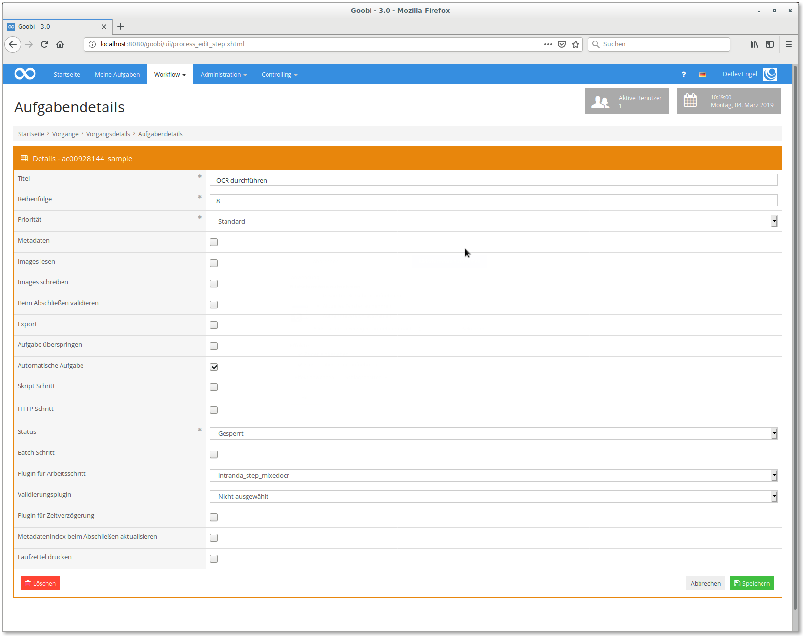

# OCR execution with mixed fonts

## Overview

Name                     | Wert
-------------------------|-----------
Identifier               | intranda_step_mixedocr
Repository               | [https://github.com/intranda/goobi-plugin-step-mixed-ocr](https://github.com/intranda/goobi-plugin-step-mixed-ocr)
Licence              | GPL 2.0 or newer 
Last change    | 25.07.2024 11:56:35


## Introduction
This documentation describes the installation, configuration and use of a plug-in for OCR with mixed fonts. This plugin is only useful in combination with the plugin "OCR Page Selection".


## Installation
The following files must be installed to use the plugin:

```bash
/opt/digiverso/goobi/plugins/step/plugin_intranda_step_mixedocr-base.jar
/opt/digiverso/goobi/config/plugin_intranda_step_mixedocr.xml
```

The first file contains the actual plugin. The second file is the configuration file of the plugin.

The precondition for using the plugin is the correct installation and configuration of the plugin as well as the correct integration of the plugin into the desired workflow steps. In addition, the plugin for the manual selection of the pages is required (`intranda_step_ocrselector`).


## Overview and functionality
After the plugin has been installed and configured, it must be added to a workflow step in Goobi workflow.



The plugin is usually executed automatically, so you should check the box `Automatic task`. The plugin `intranda_step_mixedocr` must also be selected under `Plugin for step`.


## Configuration
The content of the configuration file `plugin_intranda_step_mixedocr.xml` must be structured as follows:

```xml
<config_plugin>
<!--
        order of configuration is:
          1.) project name and step name matches
          2.) step name matches and project is *
          3.) project name matches and step name is *
          4.) project name and step name are *
-->
    <config>
        <!-- which projects to use for (can be more then one, otherwise use *) -->
        <project>*</project>
        <step>*</step>

        <template>template.xml</template>
        <itmUrl>http://localhost:8080/itm/service</itmUrl>
        <!--  this must be without a trailing slash -->
        <callbackBaseUrl>http://localhost:8080/goobi</callbackBaseUrl>
        <useOrigDir>false</useOrigDir>
        <serverType>intranda-tesseract</serverType>
    </config>

    <config>
        <!-- which projects to use for (can be more then one, otherwise use *) -->
        <project>My special project</project>
        <project>Archive_Project</project>
        <step>OCR</step>

        <template>template_pdfonly.xml</template>
        <itmUrl>https://itm.mydomain.tld/itm/service</itmUrl>
        <callbackBaseUrl>https://goobi.mydomain.tld/goobi</callbackBaseUrl>
        <useOrigDir>true</useOrigDir>
        <serverType>intranda-tesseract</serverType>
    </config>
```

Several configurations for different projects and sections are possible. These are defined by `project` and `step`. It is also possible to use the wildcard `*` for all steps and projects. The actual configuration then takes place within the `config` elements.

The `template` is the template that the TaskManager should use, the `itmUrl` is the URL to the endpoint of the TaskManager that accepts new jobs. The `callbackBaseUrl` must be a URL that can be reached from the TaskManager and points to the Goobi installation where the plugin is installed. It is needed to close the step after successful OCR. The element `useOrigDir` determines whether the master images or the derivatives should be used for the OCR. The entry `serverType` is the value entered in the intranda license server for the server that is to be used for the OCR. This value can be requested from intranda or omitted when using another OCR provider.

In addition to this plugin-specific configuration, the file `/opt/digiverso/goobi/config/goobi_rest.xml` must be released so that the TaskManager can report the successful processing of the jobs to the plugin:

```xml
<endpoint path="/plugins/ocr.*">
    <method name="post">
        <allow netmask="127.0.0.0/8" token="mytoken"/>
    </method>
</endpoint>
```