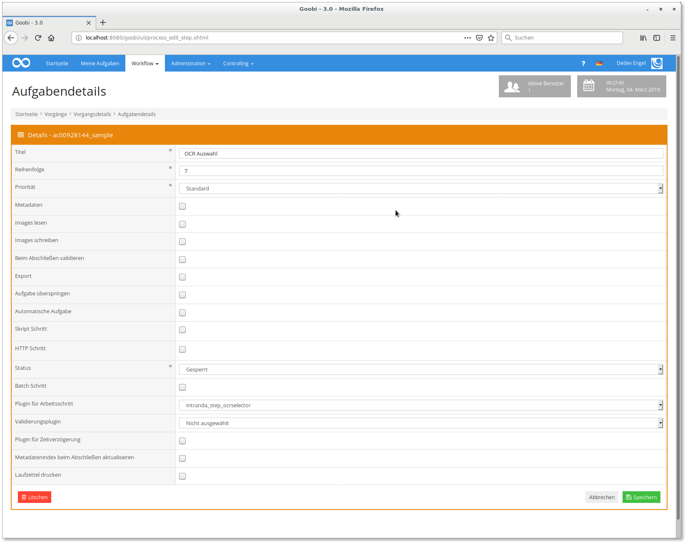
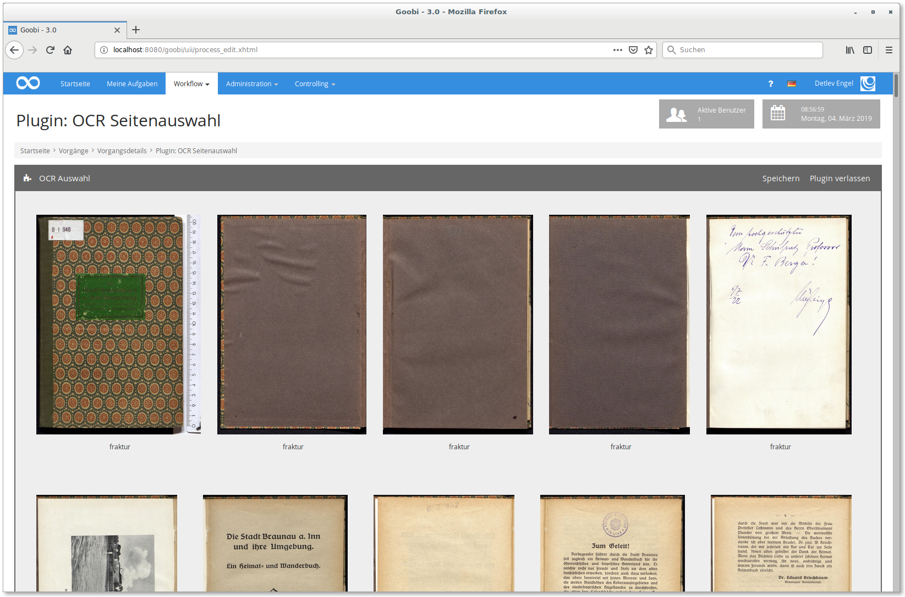
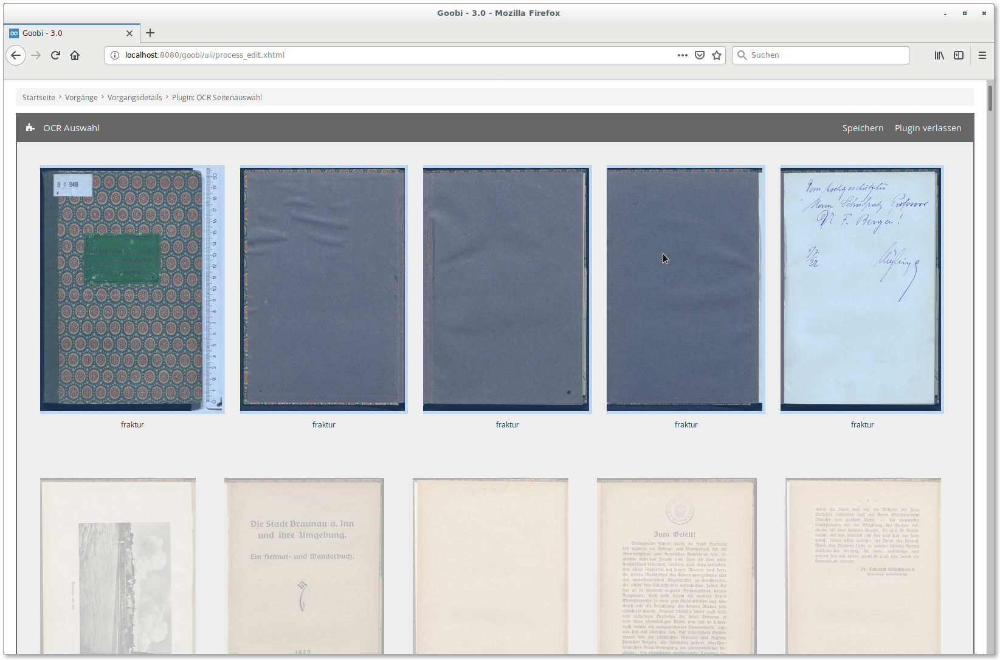
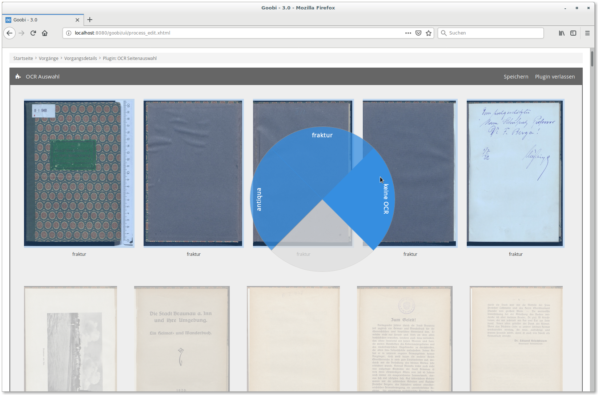
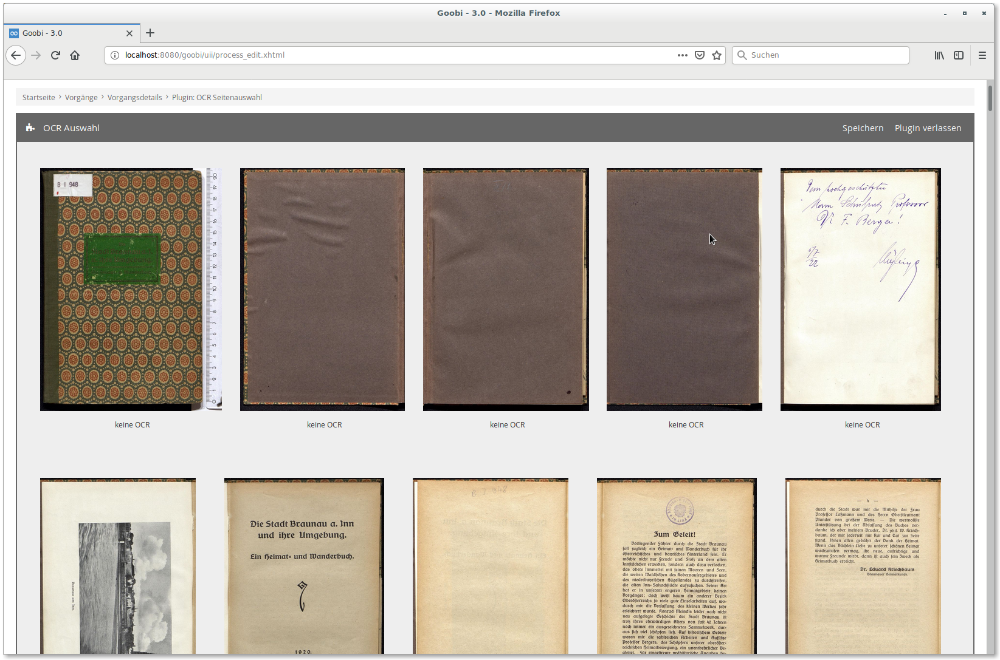

# OCR page selection

## Overview

Name                     | Wert
-------------------------|-----------
Identifier               | intranda_step_ocrselector
Repository               | [https://github.com/intranda/goobi-plugin-step-ocr-selector](https://github.com/intranda/goobi-plugin-step-ocr-selector)
Licence              | GPL 2.0 or newer 
Last change    | 25.07.2024 11:56:26


## Introduction
This documentation describes the installation, configuration and use of a page selection plugin for downstream OCR processing. This plugin can be used to determine on a single-page basis which images from a process are sent to OCR with which font. ​


## Installation
The following files must be installed to use the plugin: ​

```bash
/opt/digiverso/goobi/plugins/step/plugin_intranda_step_ocrselector-base.jar
/opt/digiverso/goobi/static_assets/plugins/intranda_step_ocrselector/css/style.css
/opt/digiverso/goobi/static_assets/plugins/intranda_step_ocrselector/js/app.js
/opt/digiverso/goobi/static_assets/plugins/intranda_step_ocrselector/js/riot.min.js
/opt/digiverso/goobi/static_assets/plugins/intranda_step_ocrselector/js/tags.js
/opt/digiverso/goobi/static_assets/plugins/intranda_step_ocrselector/js/ugh.js
```

The first file is the Java part of the plugin, all following files are needed for the graphical display. The plugin does not have its own configuration, but reads the default value for all pages from the metadata of the process. ​

In addition, a plugin for the actual execution of the OCR and merging of the results is required (`intranda_step_mixedocr`).


## Overview and functionality
After the plugin has been installed, it can be configured in the user interface in a workflow step.

 ​

​If the corresponding task was opened by the respective user within which the plugin was configured, the plugin is displayed to the user in the task. After the plugin has been entered, a new view opens in which all images belonging to the process are displayed.



The current selection (antiqua, fracture, no OCR) is displayed below each image. The preselection is read from the `Font Type` process property.

Individual images can now be selected here by left-clicking. Multiple selection is possible by `Ctrl + click` for individual pages and `Shift + click` for a range of pages. With `Ctrl + a` all images can be selected, `Ctrl + Shift + a` deselects all images. Alternatively the checkbox on the left side above the image overview can be used.

 

If one or more pages are selected, a context menu can be opened by right-clicking on one of the selected pages.



Here you can choose between the three options `antiqua`, `fracture` and `no OCR`. Click on one of the three options to apply it to all selected pages.



The plugin can be exited by clicking on `Exit plugin` after successful selection. The plugin will automatically be saved again. The `Save` button can be used for temporary saving.