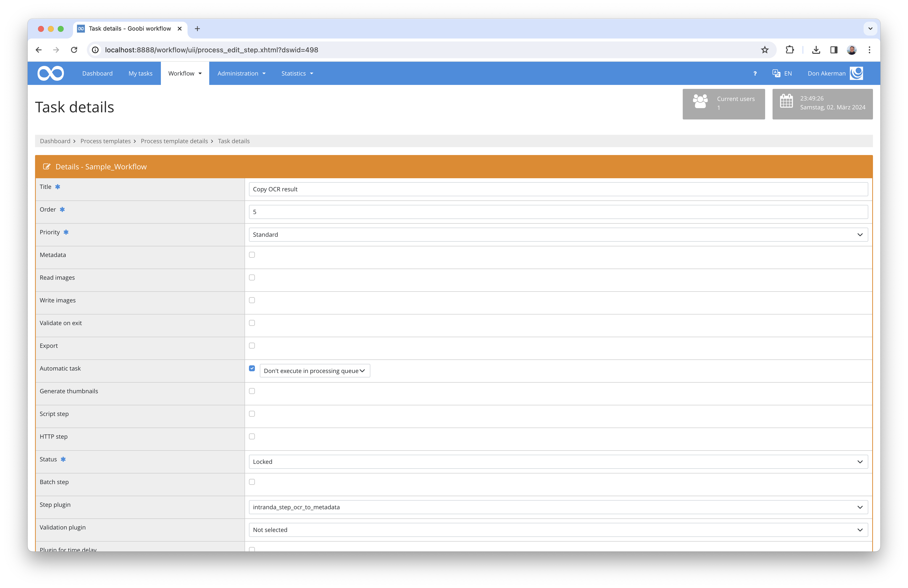

# Transfer OCR result to metadata field

## Overview

Name                     | Wert
-------------------------|-----------
Identifier               | intranda_step_ocr_to_metadata
Repository               | [https://github.com/intranda/goobi-plugin-step-ocr-to-metadata](https://github.com/intranda/goobi-plugin-step-ocr-to-metadata)
Licence              | GPL 2.0 or newer 
Last change    | 25.07.2024 11:56:17


## Introduction
This step plug-in for Goobi Workflow automatically reads the OCR results of all associated files, combines them and then saves them in a configurable metadata field within the METS file.


## Installation
The plugin consists of the following files:

```bash
plugin_intranda_step_ocr_to_metadata-base.jar
plugin_intranda_step_ocr_to_metadata.xml
```

The file `goobi_plugin_step_ocr_to_metadata-base.jar` must be installed in the correct directory so that it is available at the following path after installation:

```bash
/opt/digiverso/goobi/plugins/step/plugin_intranda_step_ocr_to_metadata-base.jar
```

In addition, there is a configuration file that must be located in the following place:

```bash
/opt/digiverso/goobi/config/plugin_intranda_step_ocr_to_metadata.xml
```


## Overview and functionality
This plugin is integrated into the workflow in such a way that it is executed automatically. Manual interaction with the plugin is not necessary. For use within a workflow step, it should be configured into the workflow as shown in the screenshot below.



The plugin first checks whether the directory with OCR results in TXT or ALTO format already exists. If these exist, the content of the files available there is read in and combined into a complete full text. Finally, this combined full text is saved in the metadata field of the METS file that was defined in the configuration file. Any existing content of the metadata field is overwritten with the full text. 


## Configuration
The configuration of the plugin is done via the configuration file `plugin_intranda_step_ocr_to_metadata.xml` and can be adjusted during operation. The following is an example configuration file:

```xml
<?xml version="1.0" encoding="UTF-8"?>
<config_plugin>
    <!--
        order of configuration is:
          1.) project name and step name matches
          2.) step name matches and project is *
          3.) project name matches and step name is *
          4.) project name and step name are *
    -->
    
    <config>
        <!-- which projects to use for (can be more then one, otherwise use *) -->
        <project>*</project>
        <step>*</step>
        
        <!-- Name of the field where to store the OCR result -->
        <metadataField>AdditionalInformation</metadataField>
    </config>

</config_plugin>
```

| Parameter | Explanation |
| :--- | :--- |
| `project` | This parameter determines the project for which the current block `<config>` is to apply. The name of the project is used here. This parameter can occur several times per `<config>` block. |
| `step` | This parameter controls for which workflow steps the block `<config>` is to apply. The name of the step is used here. This parameter can occur several times per `<config>` block. |
| `metadataField` | This parameter defines the typecof the metadata field that should be used to store the OCR result.  |