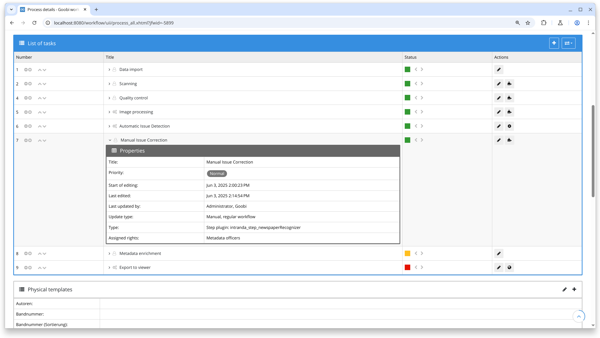
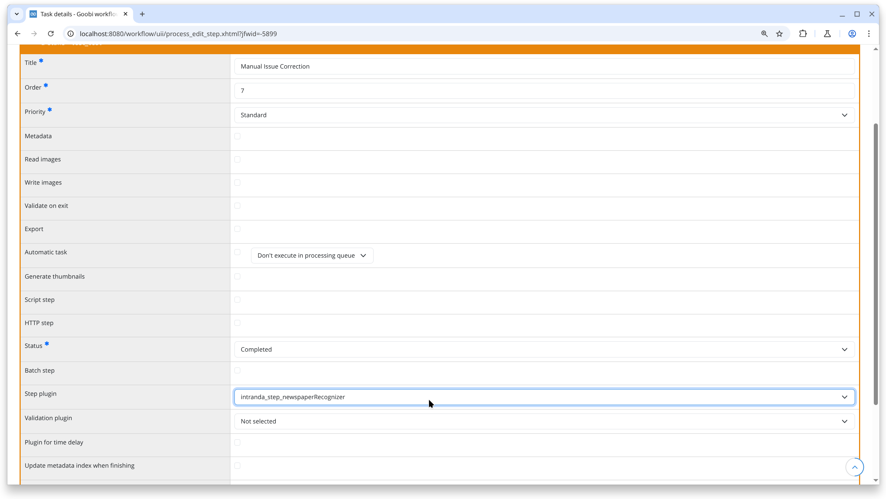
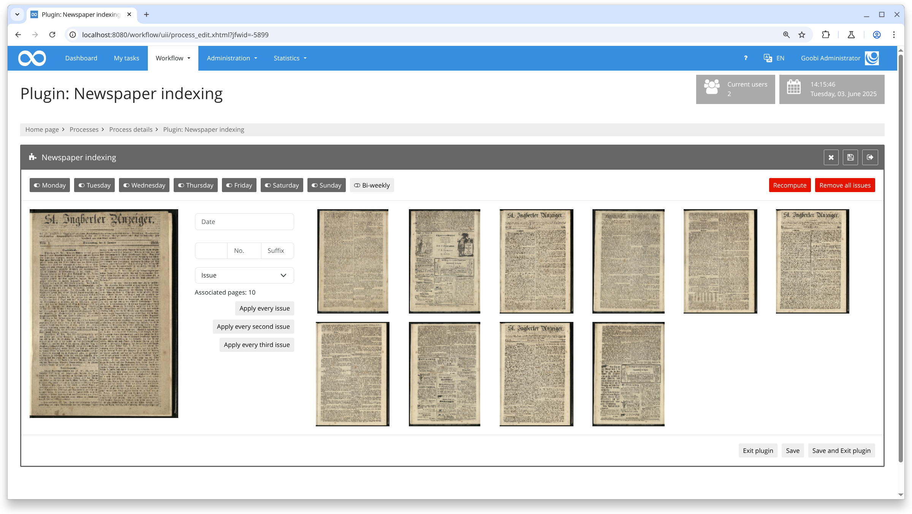
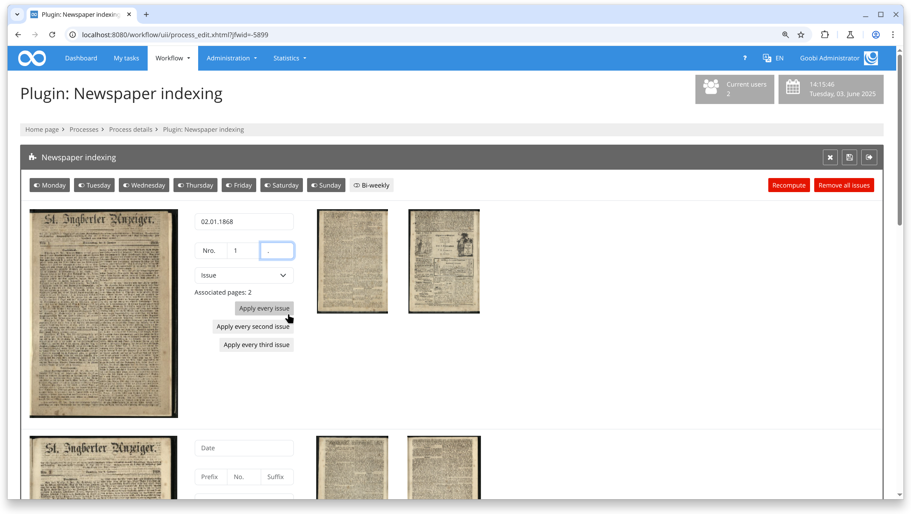
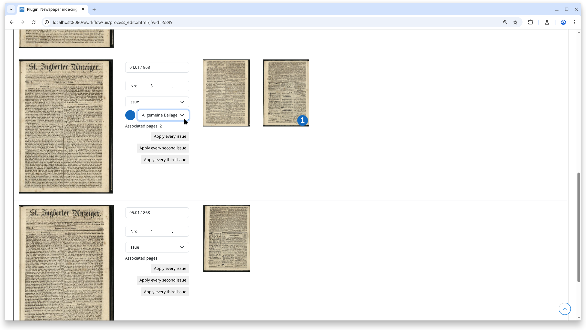

# Control of Issue Recognition within Newspapers

## Overview

Name                     | Wert
-------------------------|-----------
Identifier               | intranda_step_newspaperRecognizer
Repository               | [https://github.com/intranda/goobi-plugin-step-olr-newspaper-recognizer](https://github.com/intranda/goobi-plugin-step-olr-newspaper-recognizer)
Licence              | GPL 2.0 or newer 
Last change    | 10.06.2025 13:34:54


## Introduction

This documentation explains the plugin for manual issue control. This step plugin for Goobi workflow allows users to enrich METS files for newspaper volumes, enabling convenient definition of date and issue information for numerous issues within a volume. The plugin automatically creates structural elements for each newspaper issue along with metadata in standardized and user-friendly formats, including pagination information.

## Installation

To use the plugin, the following files need to be installed:

```bash
/opt/digiverso/goobi/plugins/step/plugin-step-olr-newspaper-recognizer-base.jar
/opt/digiverso/goobi/plugins/GUI/plugin-step-olr-newspaper-recognizer-gui.jar
/opt/digiverso/goobi/config/plugin_intranda_step_newspaperRecognizer.xml
```

After installing the plugin, it can be selected within the workflow for respective operations and executed automatically. A sample workflow setup could look like this:



To use the plugin, it must be selected in a workflow step:



## Overview and Functionality

Upon entering the plugin, all images of an issue are assigned. The first image represents the first page of the issue and is displayed slightly larger. Subsequent pages to the right are considered continuation pages of the issue and are displayed smaller:



Clicking on a continuation page designates it as a new issue page. Subsequent pages become continuation pages of the new issue. Clicking on the first page of an issue on the left makes it a continuation page of the previous issue. This process converts all issue pages into issues by clicking on respective pages.

Hovering over a page while holding down the `SHIFT` key enlarges the page for better readability of issue date or number details. These details are entered into fields labeled `Prefix`, `No.`, and `Suffix`. Additionally, the issue type can be selected:


Depending on which weekdays are activated in the upper section of the plugin, clicking `Apply to all issues` calculates date and numbering information for all subsequent issues:



Clicking on a continuation page while holding down the `CTRL` or `ALT` key designates this page and all following pages as supplements. Supplements are represented by a colored circle and a numeral. An additional selection menu for supplement type appears below issue information. Each supplement can be individually categorized:



After saving and exiting the plugin, metadata is updated to include appropriate structural elements for each issue and supplement, along with respective page assignments and metadata.

## Configuration

Plugin configuration is done in the file `plugin_intranda_step_newspaperRecognizer.xml` as shown here:

```xml
<config_plugin>
	<loadAllImages>true</loadAllImages>
    <showDeletePageButton>false</showDeletePageButton>
	<dateFormat>dd.MM.yyyy</dateFormat>
	<!-- The previous "writePageTitle" configuration option is not present anymore. It is replaced with "metadata" child elements in the "issue" and "supplement" elements. If no title metadata is written, there is no title generation. -->
    
    <!-- configurations related to pagination settings -->
	<pagination>
		<!-- whether or not to create a new pagination, if false then the old pagination will be used. DEFAULT true. -->
		<createNewPagination>true</createNewPagination>
		<!-- type of the fake paginations, acceptable values are -, 1, i, I. DEFAULT 1. -->
		<!--
		 (1) - means no paginations are wanted
		 (2) 1 means all paginations should be formated as Arabic numbers 1, 2, 3, ... 
		 (3) i means all paginations should be formated as Roman numerals i, ii, iii, ...
		 (4) I means all paginations should be formated as capitalized Roman numerals I, II, III, ... 
		 (5) Any other settings will just result in Arabic numbers
		--> 
		<type>1</type>
		<!-- whether or not to use the fake pagination, if true then use [N] where N is a properly formatted number, otherwise use the bare N itself. DEFAULT false. -->
		<useFakePagination>false</useFakePagination>
	</pagination>

	<!-- The "label" can be any constant text as well as a message identifier. If the "label" is present in the translations, it will be translated to the current language. -->
	<issue type="NewspaperIssue" label="plugin_intranda_step_newspaperRecognizer_issueType_issue">
		<metadata key="TitleDocMain" value="Ausgabe {partNo} vom {date:dd.MM.yyyy}" />
		<metadata key="MainTitle" value="Ausgabe {partNo} vom {date:dd.MM.yyyy}" />
	</issue>
	<issue type="NewspaperIssue" label="plugin_intranda_step_newspaperRecognizer_issueType_morningIssue">
		<metadata key="TitleDocMain" value="Morgenausgabe {partNo} vom {date:dd.MM.yyyy}" />
		<metadata key="MainTitle" value="Morgenausgabe {partNo} vom {date:dd.MM.yyyy}" />
	</issue>
	<issue type="NewspaperIssue" label="plugin_intranda_step_newspaperRecognizer_issueType_eveningIssue">
		<metadata key="TitleDocMain" value="Abendausgabe {partNo} vom {date:dd.MM.yyyy}" />
		<metadata key="MainTitle" value="Abendausgabe {partNo} vom {date:dd.MM.yyyy}" />
	</issue>

	<supplement type="NewspaperSupplement" label="Allgemeine Beilage">
		<metadata key="TitleDocMain" value="Beilage zur {no}. Ausgabe vom {date:dd.MM.yyyy}" />
		<metadata key="MainTitle" value="Beilage zur {no}. Ausgabe vom {date:dd.MM.yyyy}" />
	</supplement>
	<supplement type="NewspaperSupplement" label="Kultur">
		<metadata key="TitleDocMain" value="Kulturteil zur {no}. Ausgabe vom {date:dd.MM.yyyy}" />
		<metadata key="MainTitle" value="Kulturteil zur {no}. Ausgabe vom {date:dd.MM.yyyy}" />
	</supplement>
	<supplement type="NewspaperSupplement" label="Sport">
		<metadata key="TitleDocMain" value="Sportteil zur {no}. Ausgabe vom {date:dd.MM.yyyy}" />
		<metadata key="MainTitle" value="Sportteil zur {no}. Ausgabe vom {date:dd.MM.yyyy}" />
	</supplement>
</config_plugin>
```

### General parameters 
The `<config>` block can occur repeatedly for different projects or work steps in order to be able to perform different actions within different workflows. The other parameters within this configuration file have the following meanings: 

| Parameter | Explanation | 
| :-------- | :---------- | 
| `project` | This parameter defines which project the current block `<config>` should apply to. The name of the project is used here. This parameter can occur several times per `<config>` block. | 
| `step` | This parameter controls which work steps the `<config>` block should apply to. The name of the work step is used here. This parameter can occur several times per `<config>` block. | 


### Further parameters 
In addition to these general parameters, the following parameters are available for further configuration: 


Parameter               | Explanation
------------------------|------------------------------------
`loadAllImages`        | This setting determines whether all images should be loaded when the plugin is launched.
`showDeletePageButton` | This setting determines if it should be possible to permanently delete pages within this plugin. `true` enables this function, `false` disables it.    
`dateFormat`           | Specifies the format for entering dates (see https://docs.oracle.com/javase/8/docs/api/java/text/SimpleDateFormat.html).    
`pagination`           | The `pagination` element defines pagination settings. `createNewPagination` controls whether a new pagination should be generated. `type` specifies the format of pagination: `1` for Arabic numerals, `i` for Roman numerals, `I` for uppercase Roman numerals. `useFakePagination` determines if fictitious pagination should be generated.
`issue`                | Each issue type that can be captured with the plugin must be configured here. Each issue type requires an `issue` element. The `type` attribute references a structural element type from the ruleset to be used for an issue of this type. The `label` attribute defines the label of this issue type in the plugin's selection menu. A description that can also be translated in translation files can be used here. The `issue` element can contain any number or no `metadata` elements. A `metadata` element has a `key` and a `value`. The `key` references a metadata from the rule set that must be available in the configured structural element. `value` defines the value of the metadata to be written. Placeholders `{no}`, `{partNo}` and `{date:FORMAT}` can be used to include the issue number, issue number with prefix and suffix, and date in any `FORMAT` in the metadata value. This way, headers for issues can easily be generated.
`supplement`           | Each supplement type that can be captured with the plugin must be configured here. Supplement types are configured analogously to issue types.