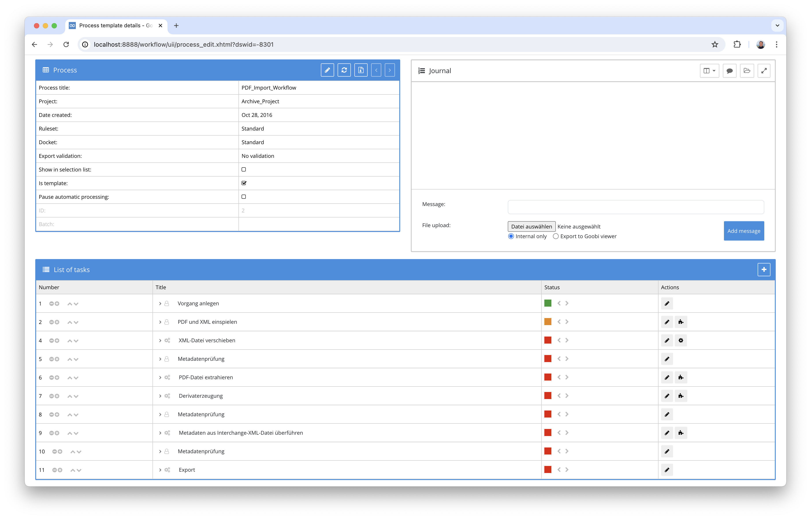
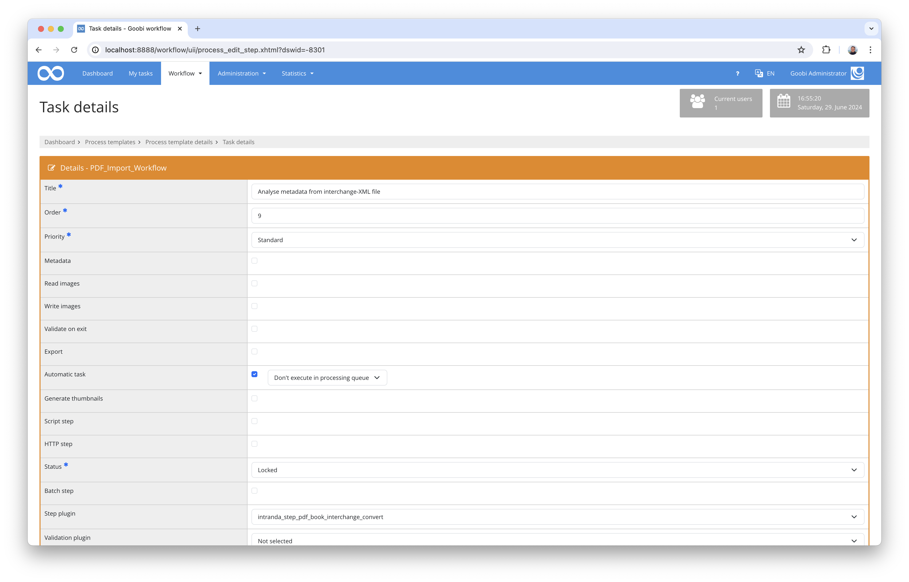

# Data import for Book Interchange files

## Overview

Name                     | Wert
-------------------------|-----------
Identifier               | intranda_step_pdf_book_interchange_convert
Repository               | [https://github.com/intranda/goobi-plugin-step-pdf-book-interchange-convert](https://github.com/intranda/goobi-plugin-step-pdf-book-interchange-convert
Licence              | GPL 2.0 or newer 
Last change    | 13.07.2024 09:56:52


## Introduction
This documentation explains the plugin for importing book interchange data in XML format to enrich the structure and metadata of existing Goobi processes.

## Installation
To be able to use the plugin, the following files must be installed:

```bash
/opt/digiverso/goobi/plugins/step/plugin-step-pdf-book-interchange-convert-base.jar
/opt/digiverso/goobi/config/plugin_intranda_step_pdf_book_interchange_convert.xml
```

Once the plugin has been installed, it can be selected within the workflow for the respective work steps and thus executed automatically. A workflow could look like the following example:



To use the plugin, it must be selected in a workflow step:



## Overview and functionality
In the workflow shown here, a PDF file was first imported together with a book interchange file. The PDF file was converted to images during the workflow, which were saved in the 'master' folder. The PDF file was automatically moved to the 'import' folder in the workflow. The book interchange file was moved to the 'source' folder. The book interchange plugin then enriched the structure data already generated by the PDF extraction plugin, which could be read from the PDF file, with the information from the book interchange file. 


## Configuration
The plugin is configured in the file `plugin_intranda_step_pdf_book_interchange_convert.xml` as shown here:

```xml
<config_plugin>
	<!-- order of configuration is: 1.) project name and step name matches 2.) 
		step name matches and project is * 3.) project name matches and step name 
		is * 4.) project name and step name are * -->
	<config>
		<!-- which projects to use for (can be more then one, otherwise use *) -->
		<project>*</project>
		<step>*</step>

		<!-- type of the structure elements that were created from the pdf table 
			of contents by the pdf-extraction plugin -->
		<structureTypePdf>Chapter</structureTypePdf>

		<!-- type of the structure elements to be created from the Book Interchange 
			Format or Type of the elements that had their metadata updated -->
		<structureTypeBits>Part</structureTypeBits>

		<!-- mapping for the metadata that belongs to the publication aka topstruct 
			(e.g. Monograph or Volume) -->

		<publicationMapping>

			<!-- 'value' defines an xpath expression of the current element; 'field' 
				defines a ruleset element to be created that shall receive the value that 
				was read using xpath -->
			<metadata
				value="./book/book-meta/book-title-group/book-title"
				field="TitleDocMain" />
			<metadata value="./book/book-meta/book-title-group/subtitle"
				field="TitleDocSub1" />
			<metadata value="./book/book-meta/isbn" field="ISBN" />

			<!-- person information is read from xpath expressions in 'firstname' 
				and 'lastname' fields separately; the ruleset type to be used for the person 
				is defined as 'role' -->
			<person
				xpathNode="//book-meta/contrib-group/contrib/name[@content-type='author']"
				firstname="./given-names" lastname="./surname" role="Author" />
			<person
				xpathNode="//book-meta/contrib-group/contrib/name[@content-type='editor']"
				firstname="./given-names" lastname="./surname" role="Editor" />
		</publicationMapping>

		<!-- mapping for the metadata that belongs to the created structure elements 
			the attribute xpathNode should be used to specify the xml-elements that have 
			the wanted metadata in the case of bitsxml-files this could be "book-part-meta". 
			the xpath-expression of the metadata and person elements must 
			be relative to this selected node. This means they have to start with 
			a "." -->

		<elementMapping
			xpathNode="./book/book-body/book-part/book-part-meta">
			<!-- 'value' defines an xpath expression of the current element; 'field' 
				defines a ruleset element to be created that shall receive the value that 
				was read using xpath -->
			<metadata value="./title-group/title" field="TitleDocMain" />
			<metadata value="./title-group/subtitle"
				field="TitleDocSub1" />
			<!-- <metadata value="./abc/def/ghi/jkl" field="DocLanguage" /> -->
			<!-- person information is read from xpath expressions in 'firstname' 
				and 'lastname'. note that the xpath expressions in firstname and lastname 
				are relative to the element selected by the path specified by the attribute 
				xpathNode. the ruleset type to be used for the person is defined by the attribute 'role' -->
			<person xpathNode=".//name[@content-type='author']"
				firstname="./given-names" lastname="./surname" role="Author" />
			<person xpathNode=".//name[@content-type='editor']"
				firstname="./given-names" lastname="./surname" role="Editor" />
			<lpage xpath="./lpage" />
			<fpage xpath="./fpage" />
		</elementMapping>
	</config>
</config_plugin>
```

### General parameters 
The `<config>` block can occur repeatedly for different projects or work steps in order to be able to perform different actions within different workflows. The other parameters within this configuration file have the following meanings: 

| Parameter | Explanation | 
| :-------- | :---------- | 
| `project` | This parameter defines which project the current block `<config>` should apply to. The name of the project is used here. This parameter can occur several times per `<config>` block. | 
| `step` | This parameter controls which work steps the `<config>` block should apply to. The name of the work step is used here. This parameter can occur several times per `<config>` block. | 


### Further parameters 
In addition to these general parameters, the following parameters are available for further configuration: 


Parameter               | Explanation
------------------------|-----------
`structureTypePdf`      | Naming of the structure type of the elements that were created by the plugin previously used in the workflow for PDF extraction.
`structureTypeBits`      | Naming of the structure type for the elements that the book interchange plugin is to generate.
`publicationMapping`      | Area for defining the publication metadata to be enriched within the METS file. In each case, the data from the XML file is specified via a combination using xPath expressions and the metadata type from the ruleset.
`elementMapping`      | Area for defining the structural data that is to be enriched or generated within the METS file. In each case, the data from the XML file is specified via a combination using xPath expressions and the metadata type from the rule set.

For easier commissioning, a file with the name `ruleset.xml` can be found in the `install` folder of the plugin, which serves as a reference ruleset for the configuration file listed here.