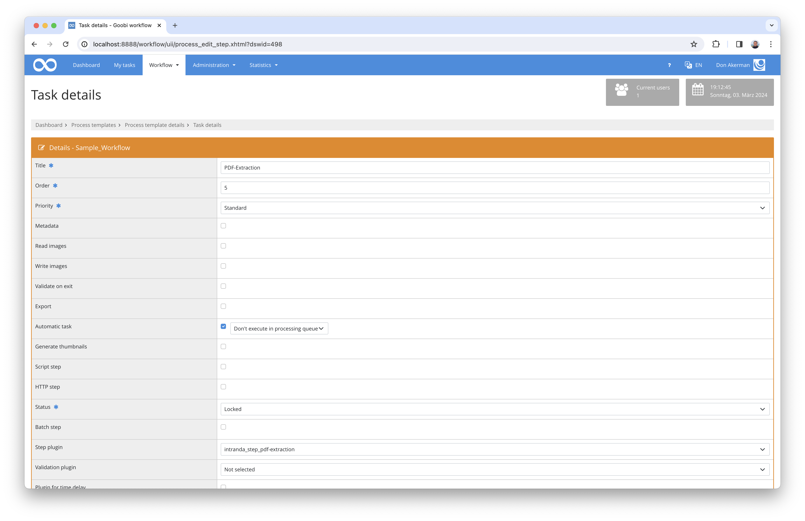

# Split PDFs, extract full text and read table of contents

## Overview

Name                     | Wert
-------------------------|-----------
Identifier               | intranda_step_pdf-extraction
Repository               | [https://github.com/intranda/goobi-plugin-step-pdf-extraction](https://github.com/intranda/goobi-plugin-step-pdf-extraction)
Licence              | GPL 2.0 or newer 
Last change    | 25.07.2024 11:55:57


## Introduction
This documentation describes how to install, configure and use a plugin to extract images, full texts and the table of contents from PDF files. The plugin always extracts only what is present in the PDF and does not write an error message if no full text or table of contents can be found.


## Installation
To use the plugin, it must be copied to the following location:

```bash
/opt/digiverso/goobi/plugins/step/plugin_intranda_step_pdf-extraction-base.jar
```

The configuration of the plugin is expected under the following path:

```bash
/opt/digiverso/goobi/config/plugin_intranda_step_pdf-extraction.xml
```

The command line program `Ghostscript` and/or the tool `pdftoppm` from the package `poppler-utils` will also be required, depending on the configuration of the tag `<generator>`. They can be installed from the system's package sources.


## Overview and functionality
Once the plugin has been installed, it can be configured in the user interface in a workflow step as shown in this screenshot.



To use the plugin, there must be a PDF file in the master folder of the process at the time of execution. This is then automatically split into individual pages. In addition, (if available) the full text is extracted and the table of contents of the PDF file is read in order to be entered as structural elements in the METS file.

It is therefore recommended that the workflow step with this plugin is preceded by another workflow step in which files are loaded into the master folder. This can be done by linking the process folder to the user's home folder or, for example, in the file upload plugin.


## Configuration
An example configuration could look like this:

```xml
<config>

	<project>*</project>
	<step>OCR-Extraktion</step>

	<validation>
		<!-- set to false to skip this step if no PDF files exist in the source folder -->
		<!-- DEFAULT true -->
		<failOnMissingPDF>true</failOnMissingPDF>
	</validation>
	
	<!-- if true then all old data from tifFolder, pdfFolder, textFolder and altoFolder will be deleted, and all file references will be removed if current book is not empty -->
	<!-- DEFAULT true -->
	<overwriteExistingData>true</overwriteExistingData>

	<mets>
		<!-- DEFAULT true -->
		<write>false</write>
		<!-- DEFAULT true -->
		<failOnError>false</failOnError>
		<!-- Settings for writing Mets-Structure -->
		<docType>
			<!-- If this element exists and is not empty then for each imported pdf 
			a new StructElement of the given type is created within the top StructElement. -->
			<parent>Chapter</parent>
			<!-- If this element exists and is not empty then the table-of-content structure of the pdf is
			written into the Mets file. Each structure element of the PDF is written as a StructElement of the given type. -->
			<children>Chapter</children>
		</docType>
	</mets>

	<images>
		<!-- DEFAULT true -->
		<write>false</write>
		<!-- DEFAULT true -->
		<failOnError>true</failOnError>
		<!-- The resolution with which to scan the PDF file. This has a large impact on both image file size and quality. DEFAULT 300. -->
		<resolution>300</resolution>
		<!-- The image format for the image files written. DEFAULT tif. -->
		<!-- Allowed formats for the generator pdftoppm are png, jpg, jpeg, jpegcmyk, tif, tiff.  -->
		<format>tif</format>
		<!-- Select the command line tool which should be used to create the images. Either 'ghostscript' or 'pdftoppm'. -->
		<generator>pdftoppm</generator>						
		<!-- A parameter to add to the generator call. Repeatable -->
		<generatorParameter>-cropbox</generatorParameter>
		<!-- Hardcoded parameters for ghostscript are: -dUseCropBox, -SDEVICE, -r<res>, -sOutputFile, -dNOPAUSE, -dBATCH.
				Useful parameters for configuration are:
				===================================================
				-q                         `quiet`, fewer messages
				...................................................
				-g<width>x<height>          page size in pixels 
				===================================================
		-->
		<!-- Hardcoded parameters for pdftoppm are: -{format}, -r.
				Useful parameters for configuration are:
				======================================================================================================
				-f <int>                           first page to print
				......................................................................................................
				-l <int>                           last page to print
				......................................................................................................
				-o                                 print only odd pages
				......................................................................................................
				-e                                 print only even pages
				......................................................................................................
				-singlefile                        write only the first page and do not add digits
				......................................................................................................
				-scale-dimension-before-rotation   for rotated pdf, resize dimensions before the rotation
				......................................................................................................
				-rx <fp>                           X resolution, in DPI
				......................................................................................................
				-ry <fp>                           Y resolution, in DPI
				......................................................................................................
				-scale-to <int>                    scales each page to fit within scale-to*scale-to pixel box
				......................................................................................................
				-scale-to-x <int>                  scales each page horizontally to fit in scale-to-x pixels
				......................................................................................................
				-scale-to-y <int>                  scales each page vertically to fit in scale-to-y pixels
				......................................................................................................
				-x <int>                           x-coordinate of the crop area top left corner
				......................................................................................................
				-y <int>                           y-coordinate of the crop area top left corner
				......................................................................................................
				-W <int>                           width of crop area in pixels (DEFAULT 0)
				......................................................................................................
				-H <int>                           height of crop area in pixels (DEFAULT 0)
				......................................................................................................
				-sz <int>                          size of crop square in pixels (sets W and H)
				......................................................................................................
				-cropbox                           use the crop box rather than media box
				......................................................................................................
				-hide-annotations                  do not show annotations
				......................................................................................................
				-mono                              generate a monochrome PBM file
				......................................................................................................
				-gray                              generate a grayscale PGM file
				......................................................................................................
				-sep <string>                      single character separator between name and page number (DEFAULT -)
				......................................................................................................
				-forcenum                          force page number even if there is only one page
				......................................................................................................
				-overprint                         enable overprint
				......................................................................................................
				-freetype <string>                 enable FreeType font rasterizer: yes, no
				......................................................................................................
				-thinlinemode <string>             set thin line mode: none, solid, shape. DEFAULT none.
				......................................................................................................
				-aa <string>                       enable font anti-aliasing: yes, no
				......................................................................................................
				-aaVector <string>                 enable vector anti-aliasing: yes, no
				......................................................................................................
				-opw <string>                      owner password (for encrypted files)
				......................................................................................................
				-upw <string>                      user password (for encrypted files)
				......................................................................................................
				-q                                 don't print any messages or errors
				......................................................................................................
				-progress                          print progress info
				......................................................................................................
				-tiffcompression <string>          set TIFF compression: none, packbits, jpeg, lzw, deflate
				======================================================================================================
		-->
	</images>

	<plaintext>
		<!-- DEFAULT true -->
		<write>true</write>
		<!-- DEFAULT true -->
		<failOnError>false</failOnError>
	</plaintext>

	<alto>
		<!-- DEFAULT true -->
		<write>true</write>
		<!-- DEFAULT true -->
		<failOnError>false</failOnError>
	</alto>

	<pagePdfs>
		<!-- DEFAULT true -->
		<write>true</write>
		<!-- DEFAULT true -->
		<failOnError>true</failOnError>
	</pagePdfs>

	<properties>
		<!-- Write this process property after extraction is done. The value depends on whether any ocr files with content have been written. -->
		<!-- If there exist some properties named so, then the first one will be picked up to accept the value.
		Otherwise a new process property will be created for this purpose. ONLY 1 fulltext tag is allowed.  -->
		<fulltext>
			<!-- process property name. If blank, no property will be written -->
			<name>OCRDone</name>
			<!-- property value when there are alto contents or text contents created. DEFAULT TRUE. -->
			<value exists="true">YES</value>
			<!-- property value when there are neither contents nor text contents created. DEFAULT FALSE. -->
			<value exists="false">NO</value>
		</fulltext>
	</properties>

</config>
```

Any number of configurations for projects or work steps with specific names can be defined in the configuration file. Various `<config>` blocks can be used for this purpose, whereby the `<project>` and `<step>` properties must be specified in each one. The `<config>` blocks are applied to a specific step in the following order:

1) `<project>` and `<step>` correspond to the current project and step
2) `<step>` corresponds to the current step and `<project>` is set to `*`
3) `<project>` corresponds to the current project and `<step>` is set to `*`
4) `<project>` and `<step>` are set to `*`

The `<failOnMissingPDF>` element within the `<validation>` element can be set to `true` to issue a warning if no PDF files could be found. Warnings are then written to the journal and the server-internal log files. If this option is deactivated with `false`, the case that no PDF files may exist is ignored.

The `<overwriteExistingData>` element can be used to set globally for this plugin whether existing PDF files may be overwritten.

The `<docType>` controls which structure types the entries extracted from the PDF content directory are given in the METS file. The `<parent>` element is the main element in which all other table of contents entries are stored. If it is omitted, all entries are entered directly in the main element of the METS file. The `<children>` element is used to specify the structure type of the sub-elements of the entry extracted from the PDF table of contents.

The `<pagePdfs>`, `<alto>`, `<plaintext>`, `<images>` and `<mets>` elements each have a `<write>` and `<failOnError>` property. In accordance with the XML element for PDF files, ALTO files, TXT files, general image files and the METS file, this allows you to set whether files of these types should be written or overwritten and whether an error message should be issued and further execution cancelled if they could not be written.

In the `<images>` element, some further settings for image files are possible. The values in `<resolution>` and `<format>` can be used to specify the image resolution (in DPI) and the output file format for the extracted images.

The sub-element `<generator>` within `<images>` specifies which executable programme is to be used on the server to extract the images. Valid values are usually `pdftoppm` and `ghostscript`. The element `<generatorParameter>` can be used multiple times and contains a command line parameter for the programme specified in `<generator>`.

The `<mets>` element controls the generation of METS files and allows various configurations. For example, `<docType>` can be used to control which structure types are to be generated for the entries extracted from the PDF content directory. The `<parent>` element is the main element in which all other table of contents entries are stored. If it is omitted, all entries are entered directly in the main element of the METS file.

The elements `<plaintext>`, `<alto>` and `<pagePdfs>` control the generation of the text files, the alto files and the Pdf files of all individual pages.

Process properties are written with `<properties>` depending on the result of the extraction. The configuration used here as an example writes the process property `OCRDone` with the value `YES` if full text was found within the PDF file and the value `NO` if there was no full text in the PDF file. This is particularly helpful if the workflow is to be changed retrospectively, for example to omit an OCR step if full text already exists.