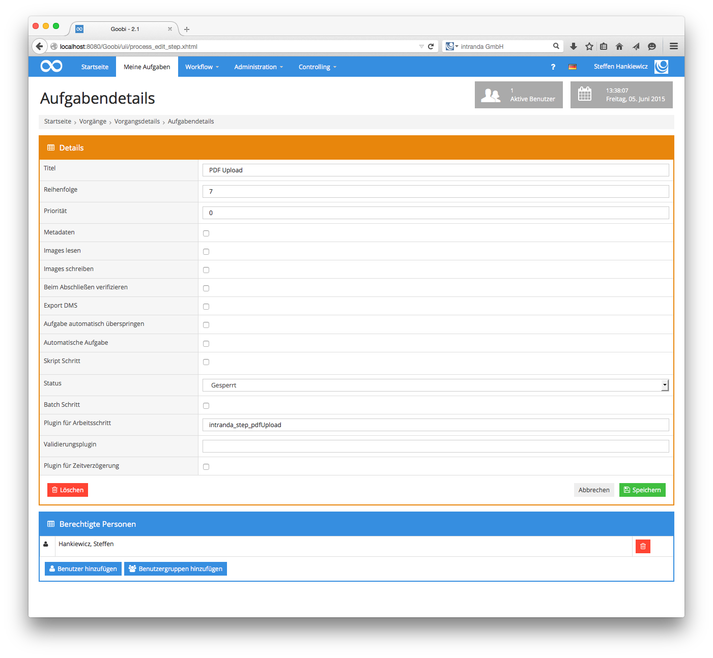
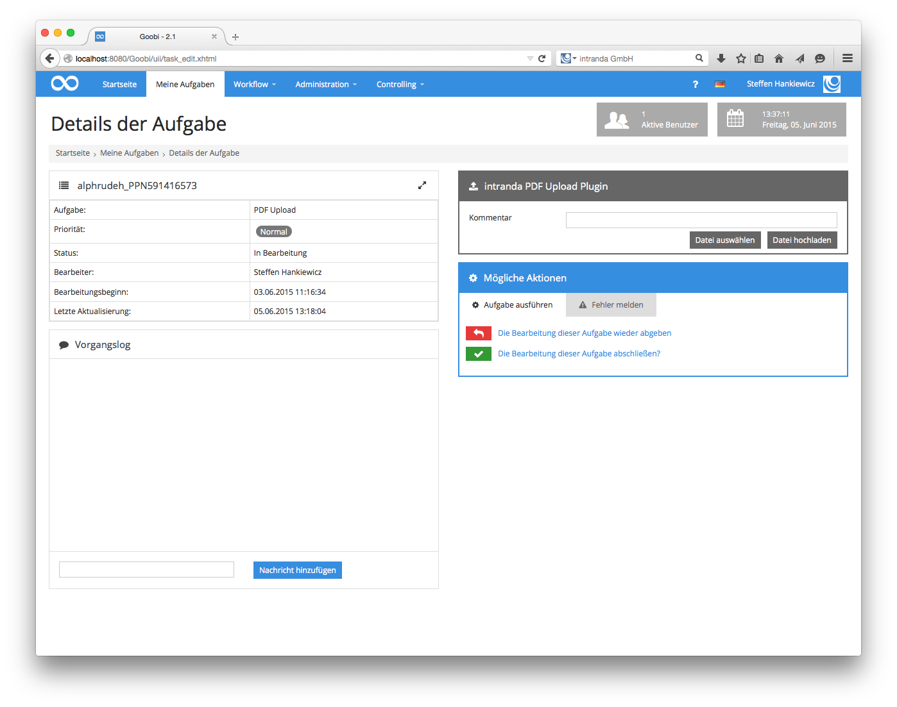
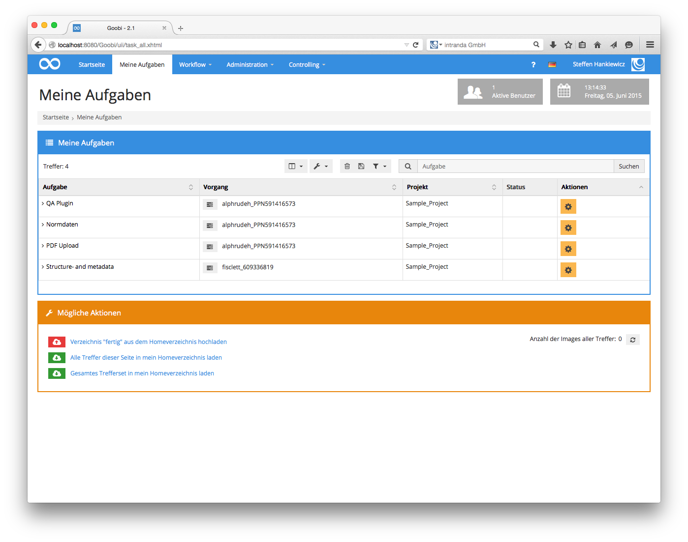

# Electronic Publications

## Overview

Name                     | Wert
-------------------------|-----------
Identifier               | intranda_step_pdfUpload
Repository               | [https://github.com/intranda/goobi-plugin-step-pdf-upload](https://github.com/intranda/goobi-plugin-step-pdf-upload)
Licence              | GPL 2.0 or newer 
Last change    | 25.07.2024 11:55:49


## Introduction
This documentation describes how to install, configure and use a plug-in to upload documents to Goobi. With the help of this plug-in, born-digital documents such as PDF files can be uploaded and managed directly in Goobi.


## Installation and Configuration
The following three files must be installed to use the plugin:

```bash
/opt/digiverso/goobi/plugins/step/plugin_intranda_step_pdfUpload-base.jar
/opt/digiverso/goobi/plugins/GUI/plugin_intranda_step_pdfUpload-gui.jar
/opt/digiverso/goobi/config/plugin_PdfUploadPlugin.xml
```

The first file contains the actual program logic, the second file provides the graphical user interface for the display and the third file is used to configure the plugin.

The content of the configuration file `plugin_PdfUploadPlugin.xml` must be structured as follows:

```xml
<config_plugin>
 <!-- allowed values: master, source, derivate -->
    <folder>derivate</folder>
    <extensions>
        <extension>pdf</extension>
        <extension>PDF</extension>
    </extensions>
</config_plugin>
```

`folder` specifies the folder in which the uploaded files are stored. The values `master`, `source` and `derivate` can be used. Afterwards the allowed file extensions have to be configured. Please make sure that the check is case sensitive. If you want to allow upper and lower case, both spellings must be defined.

Then the allowed file extensions have to be configured. Here you have to make sure that the check is case sensitive. If you want to allow upper and lower case, both spellings must be defined.


## Overview and functionality
Once the plugin has been installed and configured, it can be used within Goobi's new user interface.

To do this, the plugin for the `intranda_step_pdfUpload` step must be entered within the desired task.



If the corresponding step has been opened by the respective user within which the plugin was configured, a new area for uploading files is available.



Using the `Select file` button, you can now select a file which is then transferred to the server using the `Upload file` button. You can optionally enter a comment.

The uploaded file is then listed with some information. There you can also delete the file.



Only files whose file extension was previously entered in the list of permitted extensions are accepted. In addition, the file name may only consist of the characters `A-Za-z0-9äöüß-_`. `Spaces` are automatically replaced by `underscores`.

If a file is uploaded, the information is stored in the METS file.

```xml
<mets:fileGrp USE="LOCAL">
    <mets:file ID="FILE_0001" MIMETYPE="">
        <mets:FLocat LOCTYPE="URL"
 xlink:href="/opt/digiverso/goobi/metadata/6212/images/myFolder/AC03719978.pdf"
 xmlns:xlink="http://www.w3.org/1999/xlink" />
    </mets:file>
</mets:fileGrp>

[...]

<mets:structMap TYPE="PHYSICAL">
    <mets:div DMDID="DMDPHYS_0000" ID="PHYS_0000" TYPE="BoundBook">
        <mets:div ID="PHYS_0001" ORDER="1" TYPE="page" ORDERLABEL="Kommentar">
            <mets:fptr FILEID="FILE_0001" />
        </mets:div>
    </mets:div>
</mets:structMap>
```

The transfer to the METS file ensures that the order of the uploaded files is saved persistently.

If the task is then opened again, the information about the uploaded files is taken from the METS file and also displayed.