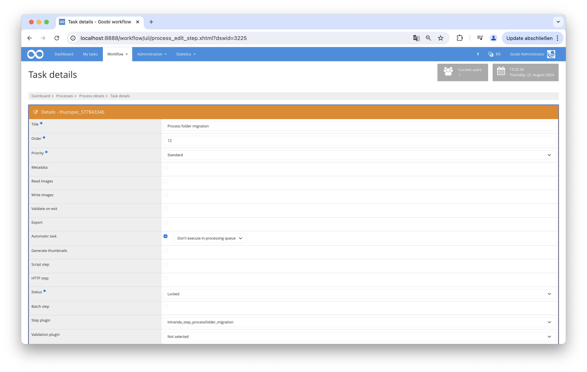

# Process folder migration

## Overview

Name                     | Wert
-------------------------|-----------
Identifier               | intranda_step_processfolder_migration
Repository               | [https://github.com/intranda/goobi-plugin-step-process-folder-migration](https://github.com/intranda/goobi-plugin-step-process-folder-migration)
Licence              | GPL 2.0 or newer 
Last change    | 24.08.2024 15:14:50


## Introduction
This documentation explains how this plugin can be used to perform file or directory operations.

## Installation
To be able to use the plugin, the following files must be installed:

```bash
/opt/digiverso/goobi/plugins/step/plugin_intranda_step_processfolder_migration.jar
/opt/digiverso/goobi/config/plugin_intranda_step_processfolder_migration.xml
```

After the plugin is installed, it can be selected within the workflow for the respective tasks and thus executed automatically.




## Overview and functionality
This plugin performs automated file and directory manipulations. Various rules can be defined in the configuration file to specify which actions should be applied to which files or directories.


## Configuration
The plugin is configured in the file `plugin_intranda_step_processfolder_migration.xml` as shown here:

```xml
<config_plugin>
    <!--
        order of configuration is:
          1.) project name and step name matches
          2.) step name matches and project is *
          3.) project name matches and step name is *
          4.) project name and step name are *
	-->
    
    <config>
        <!-- which projects to use for (can be more then one, otherwise use *) -->
        <project>*</project>
        <step>*</step>
        
        <!-- a rule specifies what shall happen inside of the process folder
        	- `action` defines what shall be done:
        		- `move`: renaming of the source path to a new target path
        		- `delete`: deleting the folder or file
        		- `create`: create a folder under the given source path
        		- `copy`: renaming of the source path to a new target path
        	- `source` is the relative path inside of the process folder that is to be adapted
        	- `target`: is the new name that shall be given to the source path if this is available, 
        				a wildcard is only allowed for the part of the path if action is 'delete'
        	
        	Please notice that the rules are executed in the order they are listed here.
		 -->
        <rule action="move" source="images/master_{processtitle}_media" target="images/orig_{processtitle}_tif" />
        <rule action="move" source="images/{processtitle}_media" target="images/{processtitle}_tif" />
        <rule action="create" source="trallala/" />
        <rule action="copy" source="thumbs/master_{processtitle}_media_400" target="trallala/ich_war_hier_{processtitle}_tif_400" />
        <rule action="move" source="thumbs/master_{processtitle}_media_400" target="thumbs/orig_{processtitle}_tif_400" />
        <rule action="move" source="thumbs/master_{processtitle}_media_800" target="thumbs/orig_{processtitle}_tif_800" />
        <!-- 
        <rule action="delete" source="images/layoutWizzard-temp" />
        -->
        <rule action="delete" source="taskmanager" />
        <rule action="delete" source="ocr1" />
        <rule action="create" source="bla/blu/" />
        <rule action="delete" source="thumbs/orig_{processtitle}_tif_400" />
        <!-- 
        <rule action="delete" source="images/layoutWizzard-temp/analysis/0000000.?.tif" />
        <rule action="delete" source="images/layoutWizzard-temp/analysis/000000.?.?.tif" />
        <rule action="delete" source="images/layoutWizzard-temp/analysis/00000.*.tif" />
        <rule action="delete" source="images/layoutWizzard-temp/analysis/00000.*" />
        <rule action="delete" source="imageData.xml..*" />
        -->
        <rule action="delete" source="images/layoutWizzard-temp/analysis/000000.?.?.tif" />
        <rule action="delete" source="imageData.xml..*" />
        <rule action="delete" source="meta.xml..*" />
        <rule action="delete" source="meta_anchor.xml..*" />
        <rule action="delete" source=".*_db_export.xml" />
    </config>

</config_plugin>

```

### General parameters 
The `<config>` block can occur repeatedly for different projects or work steps in order to be able to perform different actions within different workflows. The other parameters within this configuration file have the following meanings: 

| Parameter | Explanation | 
| :-------- | :---------- | 
| `project` | This parameter defines which project the current block `<config>` should apply to. The name of the project is used here. This parameter can occur several times per `<config>` block. | 
| `step` | This parameter controls which work steps the `<config>` block should apply to. The name of the work step is used here. This parameter can occur several times per `<config>` block. | 


### Further parameters 
In addition to these general parameters, the following parameters are available for further configuration: 


| Parameter | Explanation |
|------------------------|------------------------------------|
| `action`                | This is the parameter that determines which action will be performed on the specified directory or file. The possible values are: `delete`, `create`, `move`, or `copy`. |
| `delete`                | This action deletes a folder or directory. |
| `create`                | This action creates a new folder or directory. |
| `move`                  | This action moves a folder or directory from the current location to the destination location. |
| `copy`                  | This action copies a folder or directory and inserts it at the destination location. |
| `source`                | This is the folder or directory from which an action should be performed, for example, copying a file from this folder. |
| `target`                | This parameter defines the directory to which an action should be performed (for example, copying a file to this folder). |