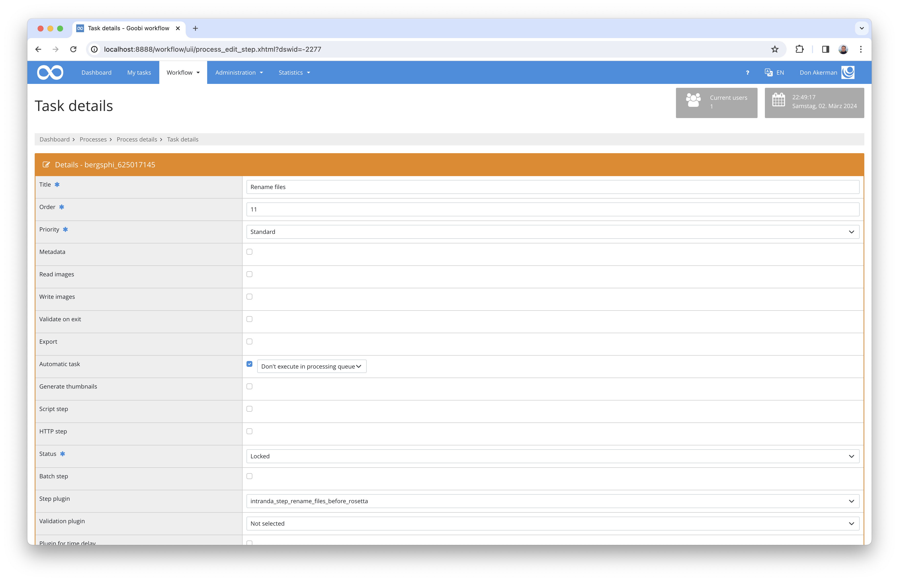

# Renaming files before the Rosetta ingest

## Overview

Name                     | Wert
-------------------------|-----------
Identifier               | intranda_step_rename_files_before_rosetta
Repository               | [https://github.com/intranda/goobi-plugin-step-rename-files-before-rosetta](https://github.com/intranda/goobi-plugin-step-rename-files-before-rosetta)
Licence              | GPL 2.0 or newer 
Last change    | 25.07.2024 11:55:22


## Introduction
This plugin is used to conditionally rename files within the media and ocr folders of an operation of Goobi workflow. The naming is dependent on the process title and a configurable format.


## Installation
To install the plugin, the following file must be installed:

```bash
/opt/digiverso/goobi/plugins/step/plugin_intranda_step_rename_files_before_rosetta-base.jar
```

To configure how the plugin should behave, different values can be adjusted in the configuration file. The configuration file is usually located here:

```bash
/opt/digiverso/goobi/config/plugin_intranda_step_rename_files_before_rosetta.xml
```

As an example, the content of this configuration file looks like this:

```xml
<config_plugin>
    <!--
        order of configuration is:
          1.) project name and step name matches
          2.) step name matches and project is *
          3.) project name matches and step name is *
          4.) project name and step name are *
	-->
    
    <config>
        <!-- which projects to use for (can be more then one, otherwise use *) -->
        <project>*</project>
        <step>*</step>
        
        <!-- format that should be used to create new names -->
        <!-- expected here is a string consisting of only 0s, and if it's not set, then the DEFAULT setting 0000 will be used-->
        <format>0000</format>
    </config>

</config_plugin>
```

This plugin is integrated into the workflow in such a way that it is executed automatically. Manual interaction with the plugin is not necessary. For use within a step of the workflow it should be configured as shown in the following screenshot.




## Overview and functionality
The plugin is usually executed fully automatically within the workflow: 

It first determines whether there is a block within the configuration file that has been configured for the current workflow with regard to project name and workflow step. 

If this is the case, the plugin will rename all files from the relavant folders using the formula `{tail of process_title after the first _ }_{formatted order of the file in this folder}`. 

After that it will update the METS file to assure that Goobi workflow and Rosetta are still able to work with the updated information.

The plugin considers the files within the following subdirectories for naming:

* media
* alto
* pdf
* txt
* xml


## Configuration 
The configuration of the plugin is done within the already mentioned configuration file. There you can configure various parameters. The block `<config>` can occur repeatedly for different projects or work steps in order to be able to perform different actions within different workflows. The elements `<format>` are decisive for the generation of the file names.

| Value | Description |
| :--- | :--- |
| `project` | This parameter determines the project for which the current block `<config>` is to apply. The name of the project is used here. This parameter can occur several times per `<config>` block. |
| `step` | This parameter controls for which work steps the block `<config>` should apply. The name of the workflow step is used here. This parameter can occur several times per `<config>` block. |
| `format` | This parameter allows the user to set the number of digits that should be used to format file's order among all files as part of its new name. If this parameter is not set or absent, then `0000` will be used by default. |