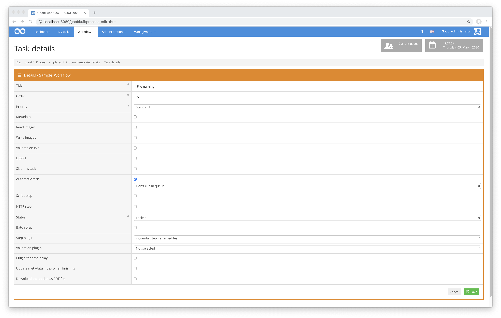

# Renaming files

## Overview

Name                     | Wert
-------------------------|-----------
Identifier               | intranda_step_rename-files
Repository               | [https://github.com/intranda/goobi-plugin-step-rename-files](https://github.com/intranda/goobi-plugin-step-rename-files)
Licence              | GPL 2.0 or newer 
Last change    | 06.05.2025 13:48:06


## Introduction
This plugin is used to conditionally rename files within the different folders of an operation of Goobi workflow. The naming is dependent on a configuration file, which may be structured differently for different workflows.


## Installation
To install the plugin, the following file must be installed:

```bash
/opt/digiverso/goobi/plugins/step/plugin_intranda_step_rename-files-base.jar
```

To configure how the plugin should behave, different values can be adjusted in the configuration file. The configuration file is usually located here:

```bash
/opt/digiverso/goobi/config/plugin_intranda_step_rename-files.xml
```

As an example, the content of this configuration file looks like this:

```xml
<config_plugin>
    <config>
        <project>Manuscript_Project</project>
        <step>*</step>
        <folder>greyscale</folder>
        <!-- don't touch mets file after renaming -->
        <updateMetsFile>false</updateMetsFile>
        <startValue>2</startValue>
        <!-- Replacement removed anything in the process title before and including the '_' -->
        <namepart type="variable">
            {processtitle}
            <replace regex="^.*?_" replacement=""/>
            <condition value="{meta._imageFilePrefix}" matches="^$"/>
        </namepart>
        <namepart type="static">_</namepart>
        <namepart type="metadata" level="Newspaper">
            TitleDocMain
            <replace regex="\s+" replacement=""/>
        </namepart>
        <namepart type="static">_</namepart>
        <namepart type="counter">00000</namepart>
    </config>

    <config>
        <project>Archive_Project</project>
        <step>*</step>
        <folder>*</folder>
        <namepart type="originalfilename" />
        <namepart type="static">_ARCHIVE</namepart>
    </config>

    <config>
        <project>*</project>
        <step>*</step>
        <folder>*</folder>
        <startValue>0</startValue>
        <namepart type="variable">{processtitle}</namepart>
        <namepart type="static">_</namepart>
        <!-- Conditional name parts (mimic old barcode feature) -->
        <namepart type="counter">
            0000
            <condition value="{originalfilename}" matches="^(?!.*barcode).*$" />
        </namepart>
        <namepart type="static">
            0000
            <condition value="{originalfilename}" matches="^.*barcode.*$" />
        </namepart>
    </config>
</config_plugin>
```

This plugin is integrated into the workflow in such a way that it is executed automatically. Manual interaction with the plugin is not necessary. For use within a step of the workflow it should be configured as shown in the following screenshot.




## Overview and functionality
The plugin is usually executed fully automatically within the workflow. It first determines whether there is a block within the configuration file that has been configured for the current workflow with regard to project name and work step. If this is the case, the individual elements `<namepart>` are evaluated, assigned the appropriate values for the counter and variables from Goobi workflow and then linked together. The file names created in this way are now applied to all the relevant directories in the Goobi process and are supplemented with the correct file name extensions (e.g. `.tif`).

To ensure correct renaming, that is based on the original file name, the plugin saves the original filename for every file in a process property called `plugin_intranda_step_rename_files`. This property ensures, that multiple executions of this plugin, with possible changes in the configuration, will still resolve the `originalfilename` namepart correctly.

Details of the Goobi workflow variables that can be used in this plugin can be found [in this documentation](https://docs.intranda.com/goobi-workflow-en/manager/8).

The plugin considers by default the files within the following subdirectories for naming:

* master
* media
* jpeg
* alto
* pdf
* txt
* xml


## Migration
This section describes required steps to migrate from older plugin versions.

Previously, the plugin contained the following feature:
> If a file is found within the file that contains `barcode` within the file name, it will also be named according to the naming scheme. However, the value `0` is set as counter here.

This feature was removed from the current version of the plugin. Due to the introduction of `<condition>`s in `<namepart>` elements, this feature can be configured more flexible now, if required.

The barcode feature was always applied to nameparts of the type `counter` and replaced the counter value with `0`, if the filename contained the word `barcode`. This behavior can now be explicitly forced. We show an example configuration for a `counter` namepart with four digits:

```xml
        <namepart type="counter">
            0000
            <condition value="{originalfilename}" matches="^(?!.*barcode).*$" />
        </namepart>
        <namepart type="static">
            0000
            <condition value="{originalfilename}" matches="^.*barcode.*$" />
        </namepart>
```

This snippet contains two `<namepart>` configurations that can not be both active at the same time. The first `<namepart>` is a counter and activates, if the `{originalfilename}` variable (which resolves to the original file name) does not contain the word `barcode`. The second `<namepart>` configuration is a static `0000` that is only active, if the `{originalfilename}` contains the word `barcode`.

It is exactly the same behavior as before. Now, the user can decide on his own to use this feature or to tweak the configuration if desired.


## Configuration
The configuration of the plugin is done within the already mentioned configuration file. There you can configure various parameters. The block `<config>` can occur repeatedly for different projects or work steps in order to be able to perform different actions within different workflows. The elements `<namepart>` are decisive for the generation of the file names.

| Value | Description                                                                                                                                                                                                                                                                                                                                                                                                                                                                                                                                                                                                                                                                                                                                                                                                                                                                                                                                                                                                                                                                                                                                                                 |
| :--- |:----------------------------------------------------------------------------------------------------------------------------------------------------------------------------------------------------------------------------------------------------------------------------------------------------------------------------------------------------------------------------------------------------------------------------------------------------------------------------------------------------------------------------------------------------------------------------------------------------------------------------------------------------------------------------------------------------------------------------------------------------------------------------------------------------------------------------------------------------------------------------------------------------------------------------------------------------------------------------------------------------------------------------------------------------------------------------------------------------------------------------------------------------------------------------|
| `project` | This parameter determines the project for which the current block `<config>` is to apply. The name of the project is used here. This parameter can occur several times per `<config>` block.                                                                                                                                                                                                                                                                                                                                                                                                                                                                                                                                                                                                                                                                                                                                                                                                                                                                                                                                                                                |
| `step` | This parameter controls for which work steps the block `<config>` should apply. The name of the workflow step is used here. This parameter can occur several times per `<config>` block.                                                                                                                                                                                                                                                                                                                                                                                                                                                                                                                                                                                                                                                                                                                                                                                                                                                                                                                                                                                    |
| `folder`  | This parameter allows the user to control which directories are to be considered for renaming. If the value `*` is specified here, the parameter is missing or the value is not configured, the default settings are used.                                                                                                                                                                                                                                                                                                                                                                                                                                                                                                                                                                                                                                                                                                                                                                                                                                                                                                                                                  |
 | `updateMetsFile` | This parameter allows users to control whether the file references in the METS file should be updated after renaming. If nothing is specified, this function is enabled by default.                                                                                                                                                                                                                                                                                                                                                                                                                                                                                                                                                                                                                                                                                                                                                                                                                                                                                                                                                                                         |
| `startValue` | This value controls with which start value the incrementing `counter` should start.                                                                                                                                                                                                                                                                                                                                                                                                                                                                                                                                                                                                                                                                                                                                                                                                                                                                                                                                                                                                                                                                                         |
| `namepart` | This reusable parameter also controls the generation of file names. It can include static elements (`static`), use the original file name (`originalfilename`), access variables from Goobi (`variable`), use metadata (`metadata`), or generate a counter (`counter`). The parameter `originalfilename` refers to the original name of the file before the plugin is executed for the first time. For metadata, the name of the metadata type is specified (for example, `TitleDocMain`). For the `metadata` type, the attribute `level` can also be defined. This indicates in which structural element the metadata should be searched (for example, at the issue level `NewspaperIssue` in newspapers). The generation of the counter depends on how many digits are defined. For instance, the value `00000` would generate five-digit numbers with leading zeros if necessary. A counter can also include the additional attribute `level`. In this case, the counter is local to each structural element of the defined `level` type. This allows, for example, the implementation of per-issue page counters in newspapers when `level` is set to `NewspaperIssue`. |

In addition, `<namepart>` elements can contain multiple `<condition>` and `<replace>` elements.

Condition elements have the form
```xml
<condition value="{VARIABLE}" matches="REGEX" />
```
and can match any `VARIABLE` against the specified regular expression `REGEX`. If multiple conditions are specified, all must match in order to activate the corresponding `<namepart>`.

Replace elements have the form
```xml
<replace regex="REGEX" replacement="REPLACEMENT"/>
```
and can replace anything the regular expression `REGEX` evaluates to in the `<namepart>` value with the `REPLACEMENT` (which can also be empty). If multiple replacements are specified, all are processed in the order they are defined to form the final `<namepart>` value.