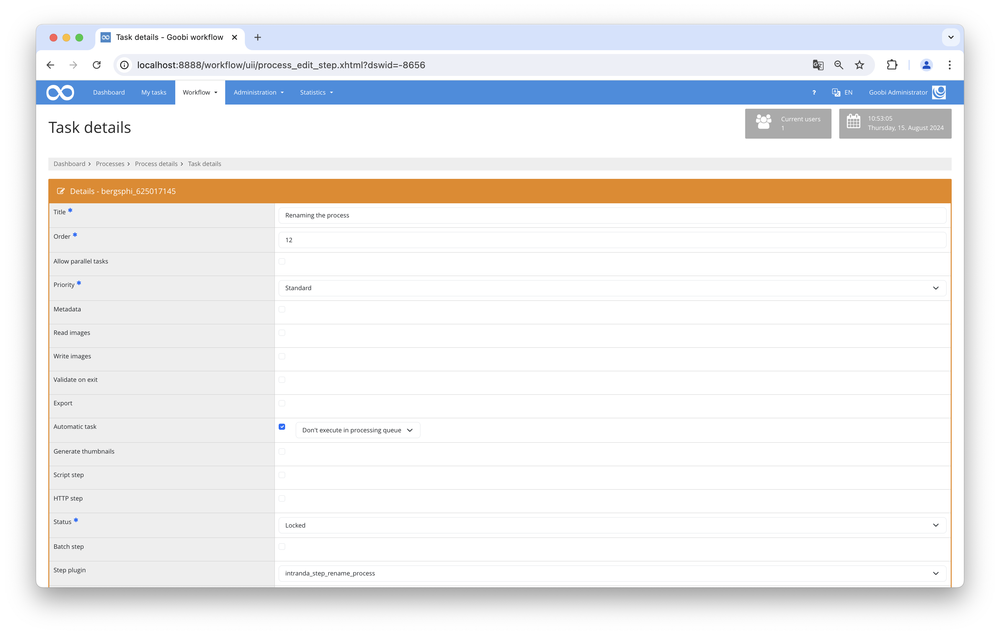

# Renaming Processes

## Overview

Name                     | Wert
-------------------------|-----------
Identifier               | intranda_step_rename_process
Repository               | [https://github.com/intranda/goobi-plugin-step-rename-process](https://github.com/intranda/goobi-plugin-step-rename-process)
Licence              | GPL 2.0 or newer 
Last change    | 14.08.2024 19:02:14


## Introduction
This step plugin for Goobi workflow renames the process with the name specified in the configuration. You can also use variables from the Variable Replacer to define the renaming of processes.


## Installation
The plugin consists of the following file:

```bash
plugin_intranda_step_rename_process-base.jar
```

This file must be installed in the correct directory so that it is available at the following path after installation:

```bash
/opt/digiverso/goobi/plugins/step/plugin_intranda_step_rename_process-base.jar
```

In addition, there is a configuration file that must be located in the following place:

```bash
/opt/digiverso/goobi/config/plugin_intranda_step_rename_process.xml
```


## Overview and functionality
To commission the plugin, it must be activated for one or more desired automatic tasks in the workflow. This is done by selecting the `intranda_step_rename_process` plugin from the list of installed plugins within the step configuration of the workflow.



## Configuration
The configuration of the plugin is done via the configuration file `plugin_intranda_step_rename_process.xml` and can be adjusted during operation. The following is an example configuration file:

```xml
<?xml version="1.0" encoding="UTF-8"?>
<config_plugin>
    <!--
        order of configuration is:
          1.) project name and step name matches
          2.) step name matches and project is *
          3.) project name matches and step name is *
          4.) project name and step name are *
	-->

    <config>
        <project>*</project>
        <step>*</step>

        <!-- The process title is generated based on the following configuration. You can use
             Goobi variables here as well as the characters underscore _ and minus -
             Empty properties are skipped. Spaces are trimmed.

             Example:
               {processproperty.Institution} = Public Library of Example City
               {processproperty.Font} =
               {meta.CatalogIDDigitalLocalCatalogue} = ID123456789

               config = {processproperty.Institution}_{processproperty.Font}_{meta.CatalogIDDigitalLocalCatalogue}

               result: PublicLibraryofExampleCity__ID123456789
         -->

        <newProcessTitle>{process.Institution}_{meta.CatalogIDDigitalLocalCatalogue}</newProcessTitle>
    </config>

    <config>
    	<project>Archive_Project</project>
    	<step>*</step>
    	<newProcessTitle>{process.CreatorsAllOrigin}_{meta.PublicationYear}</newProcessTitle>
    </config>

    <config>
    	<project>*</project>
    	<step>STEP_NAME</step>
    	<newProcessTitle>{product.DocType}-{process.Creator of digital edition}-{process.Template}</newProcessTitle>
    </config>

    <config>
    	<project>PROJECT_NAME</project>
    	<step>STEP_NAME</step>
    	<newProcessTitle>Some Title</newProcessTitle>
    </config>

</config_plugin>
```