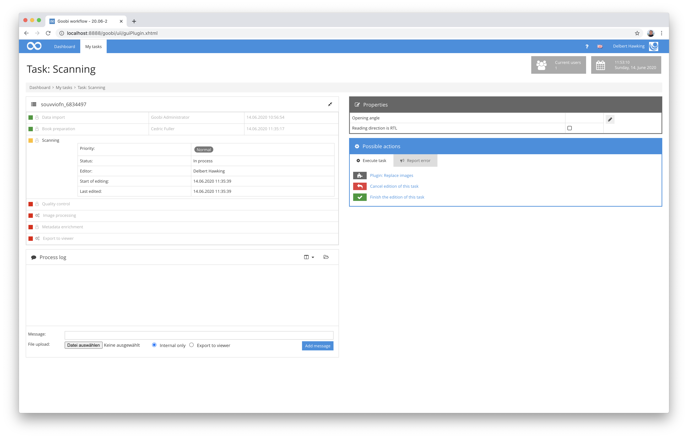
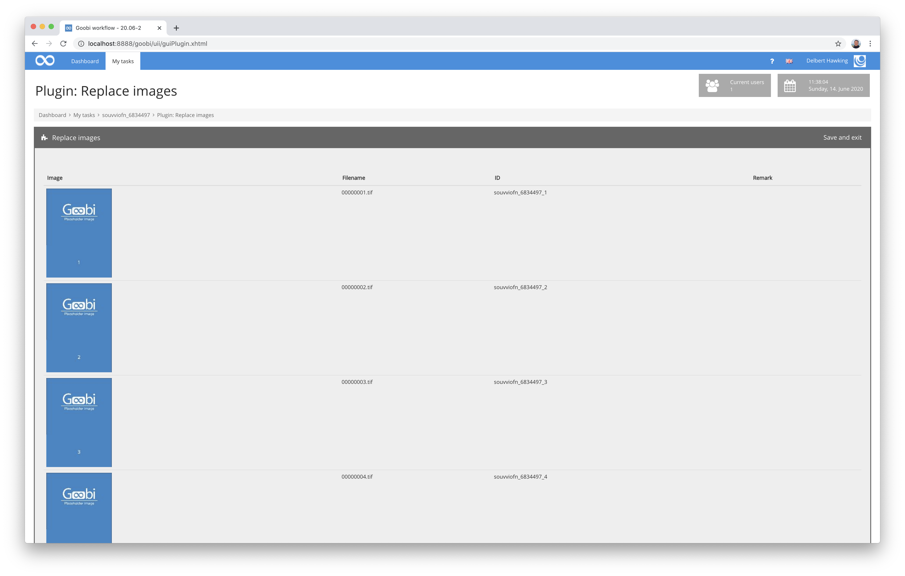

# Replace images

## Overview

Name                     | Wert
-------------------------|-----------
Identifier               | intranda_step_replace-images
Repository               | [https://github.com/intranda/goobi-plugin-step-replace-images](https://github.com/intranda/goobi-plugin-step-replace-images)
Licence              | GPL 2.0 or newer 
Last change    | 25.07.2024 11:54:54


## Introduction
This plugin is used to replace previously imported placeholder images within the master folder of a Goobi workflow process with the actual master images. The plugin is operated by simply dragging and dropping the required files into the plugin's user interface.


## Installation
This plugin is delivered as a `tar` archive. To install it, unpack the `plugin_intranda_step_replace-images.tar` archive into the Goobi folder:

```bash
tar -C /opt/digiverso/goobi/ -xf plugin-intranda-step-replace-images.tar --exclude="pom.xml"
```

This plug-in also has a configuration file with the name `plugin_intranda_step_replace-images.xml`. It must be stored under the following path:

```bash
/opt/digiverso/goobi/config/plugin_intranda_step_replace-images.xml
```

The configuration file has the following structure:

```xml
<config_plugin>
    <config>
        <project>*</project>
        <step>*</step>

        <imageFolder>master</imageFolder>
        <imageFolder>media</imageFolder>
    </config>
</config_plugin>
```

The block `<config>` can occur repeatedly for different projects or work steps in order to be able to perform different actions within different workflows. The other parameters within this configuration file have the following meanings:

| Value | Description |
| :--- | :--- |
| `project` | This parameter determines for which project the current block `<config>` should apply. The name of the project is used here. This parameter can occur several times per `<config>` block. |
| `step` | This parameter controls for which work steps the block `<config>` should apply. The name of the work step is used here. This parameter can occur several times per `<config>` block. |
| `imagefolder` | This parameter specifies the directory for which a replacement of images should be possible. This parameter is repeatable. Possible values for this are e.g. `master`, `media` or also individual folders such as `photos` and `scans`. |


## Overview and functionality
This plugin is integrated into the workflow so that it is available for a selected task. After accepting the task, the user can enter the plugin.



This gives the user access to the plugin's user interface, where the current content of the master folder is listed. Here, single or many images can be copied by Drag & Drop to the place where the images to be inserted should replace the existing placeholder images. The plugin also ensures during the upload that the newly uploaded files are renamed correctly.

