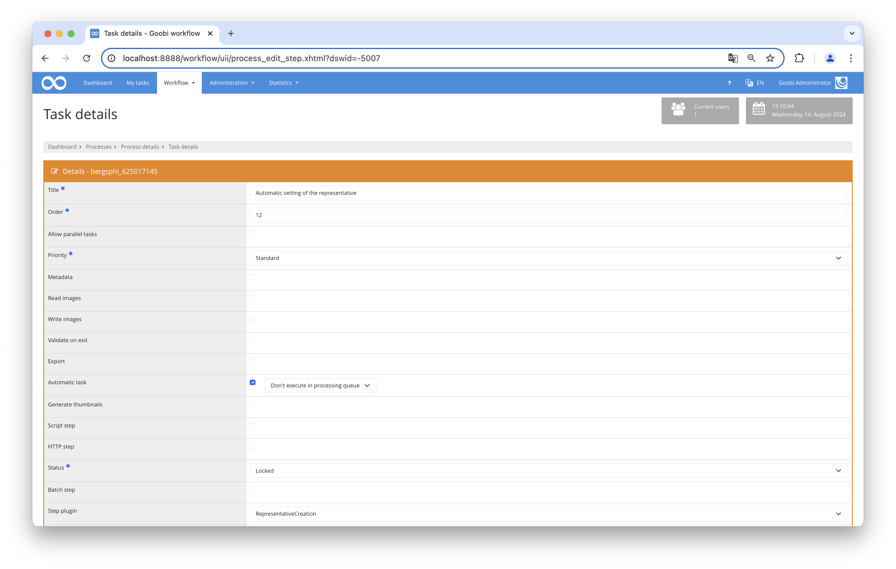

# Automatic setting of the representative

## Overview

Name                     | Wert
-------------------------|-----------
Identifier               | RepresentativeCreation
Repository               | [https://github.com/intranda/goobi-plugin-step-representative-creation](https://github.com/intranda/goobi-plugin-step-representative-creation)
Licence              | GPL 2.0 or newer 
Last change    | 15.08.2024 10:58:54


## Introduction
This documentation describes how to install, configure and use a plug-in to set the representative within METS files in Goobi.

This plugin can be used to automatically prepare METS files and set the representative of a work.


## Installation und Configuration
The plugin consists of two files:

```bash
plugin-intranda-step-representative-creator-base.jar
plugin_RepresentativeCreationPlugin.xml
```

The file `plugin-intranda-step-representative-creator-base.jar` contains the program logic and must be installed in the following directory so that the tomcat user can read it:

```bash
/opt/digiverso/goobi/plugins/step/
```

The file `plugin_RepresentativeCreationPlugin.xml` must also be readable by the tomcat user and installed into the following directory:

```bash
/opt/digiverso/goobi/config/
```

The following file is used to configure the plugin and must be structured as follows:

```xml
<config_plugin>
    <RepresentativeStructureElement>TitlePage</RepresentativeStructureElement>
    <ErrorMessage>Strukturelement zum setzen des Repräsentanten konnte nicht gefunden werden.</ErrorMessage>
    <StepName>Bibliographic import</StepName>
</config_plugin>
```

The element `RepresentativeStructureElement` can be used to define the structural element whose first page is to be used as a representative. This is the internal name of the `DocStrctType` element defined in the rule set.

The text from `ErrorMessage` is written to the process log if no structure element with this name was found in the METS file. If the element is missing or empty, no entry is made.

With `StepName` you can define to which step the operation is to be reversed if the defined structure element is missing. If the element is missing or empty, the error handling functionality can be deactivated. Then there is no correction within the process and the first image of the process is used as a representative in the Goobi viewer. If a step has been defined that does not exist in the process, the plugin remains in the current process.


## Overview and functionality
Once the plugin has been installed and configured, it can be used by Goobi within a workflow step.

To do this, the `RepresentativeCreation` plugin must be entered within the desired task. The `Automatic task` checkbox must also be set.



The way the plugin works within the correctly configured workflow is as follows.

1. If the plugin was called within the workflow, it opens the METS file and first checks whether a representative has already been defined.
2. If this is the case, the step is completed.
3. If this is not the case, the system searches for the first structural element that corresponds to the configured name.
4. The first assigned image of this element is set as the representative.
5. If no structural element with this name is found or the data record does not contain any structural elements, an error message can be written to the process log and the workflow can be reset to a previous work step.
6. However, this is only possible if a text has been configured for the error message and the name of the step.