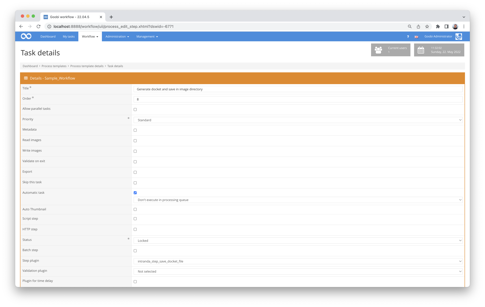

# Generation of docket files

## Overview

Name                     | Wert
-------------------------|-----------
Identifier               | intranda_step_save_docket_file
Repository               | [https://github.com/intranda/goobi-plugin-step-save-docket-file](https://github.com/intranda/goobi-plugin-step-save-docket-file)
Licence              | GPL 2.0 or newer 
Last change    | 25.07.2024 11:20:26


## Introduction
This plugin can be used in any task to automatically generate and save a docket when the task is processed. The plugin supports PDF and TIFF files.

## Installation
The following file must be present to install the plugin:

```bash
/opt/digiverso/goobi/plugins/step/plugin-intranda-step-save-docket-file-base.jar
```

To configure how the plugin should behave, various values can be adjusted in the configuration file. The configuration file is usually located here:

```bash
/opt/digiverso/goobi/config/plugin_intranda_step_save_docket_file.xml
```


## Overview and functionality
In case of an automatic task, the plugin will be executed automatically as soon as the corresponding task is executed. There is an additional button at the corresponding task in the task details, with which the docket can be generated manually at any time.

This plugin can also be integrated into the workflow in such a way that it is executed automatically. Manual interaction with the plugin is not necessary. For use within a work step of the workflow, it should be configured as shown in the screenshot below.




## Configuration

### Configuration of the plugin
The configuration of the plugin is as follows:

```xml
<config_plugin>
    <!--
        order of configuration is:
          1.) project name and step name matches
          2.) step name matches and project is *
          3.) project name matches and step name is *
          4.) project name and step name are *
    -->
    <config>
        <!-- which projects to use for (can be more then one, otherwise use *) -->
        <project>*</project>
        <step>*</step>

        <template file="/opt/digiverso/goobi/xslt/docket.xsl" />


        <!-- mimeType: image/tiff or application/pdf -->
        <!-- filename: name of the output file-->
        <!-- folder: name of the output folder, e.g. 'master' or 'media' -->

        <!--
        In the filename parameter, following variables can be used:
            {process} - inserts the whole process title
            {process_suffix} - inserts the suffix of the process title behind the first underscore

        Examples:
            process title: "media_abc_def"
            EPN_{process}_0000.tif -> EPN_media_abc_def_0000.tif
            EPN_{process_suffix}_0000.tif -> EPN_abc_def_0000.tif
        -->
        <output mimeType="image/tiff" filename="EPN_{process}_0000.tif" folder="master" />

        <!-- Set the number of dots per inch for the output file here. Common values are 300 or 600 -->
        <dotsPerInch>150</dotsPerInch>

    </config>
</config_plugin>
```

| Value | Description |
| :--- | :--- |
| `project` |  This parameter specifies for which project the current `<config>` block should apply. The name of the project is used here. This parameter can occur multiple times per `<config>` block. If the value is set to `*`, all projects will be considered. |
| `step` | This parameter defines for which work steps the `<config>` block should apply. The name of the step is used here. This parameter can occur several times per `<config>` block. If the value is set to `*`, all work steps will be considered. |
| `template` | This element specifies which docket template should be used for generation. The `file` parameter specifies an absolute file path to an existing `.xsl` file. |
| `output` | This element specifies where and how the destination file should be stored. The `folder` parameter specifies the corresponding subfolder within the `images` folder of a project. For example, `master` or `media` can be selected here. The `filename` parameter specifies the file name. The file extension must match the specified MimeType. This is configured with the `mimeType` parameter and can be set to either `image/tiff` or `application/pdf`. The `filename` parameter also allows variables. They are described in more detail below. |
| `dotsPerInch` | This value specifies the resolution of the exported document. The unit is pixels per inch. The default value is 150 DPI. |


### Output file name
The file name of the generated docket file can optionally be specified individually with the following parameters.

| Variable | Description |
| :--- | :--- |
| `{process}` | Inserts the entire associated process title into the file name at this position. |
| `{process_suffix}` | Inserts the part after the first underscore (`_`) of the associated process title at this position in the file name. |

If a process title does not contain an underscore and `{process_suffix}` is used anyway, the entire process title will be inserted instead.

Examples:

| Value in `filename=""` | Process title | Output file name |
| :--- | :--- | :--- |
| `{process}_0000.tif` | `book_hertzbiography` | `book_hertzbiography_0000.tif` |
| `{process_suffix}_0000.tif` | `book_hertzbiography` | `hertzbiography_0000.tif` |
| `EPN_{process}_0000.tif` | `book_hertzbiography` | `EPN_book_hertzbiography_0000.tif` |
| `EPN_{process_suffix}_0000.tif` | `book_hertzbiography` | `EPN_hertzbiography_0000.tif` |
| `EPN_{process}_0000.tif` | `hertzbiography` | `EPN_hertzbiography_0000.tif` |
| `EPN_{process_suffix}_0000.tif` | `hertzbiography` | `EPN_hertzbiography_0000.tif` |