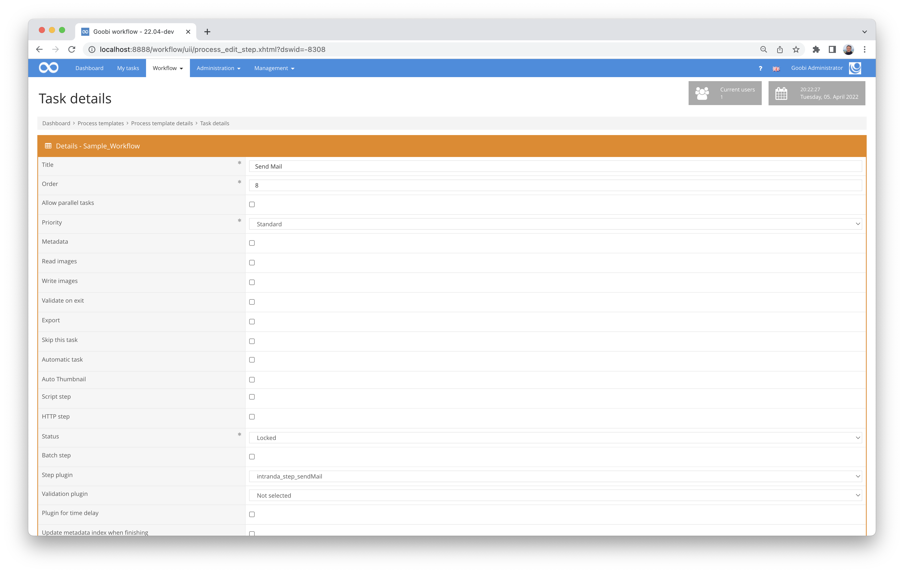

# Sending emails

## Overview

Name                     | Wert
-------------------------|-----------
Identifier               | intranda_step_sendMail
Repository               | [https://github.com/intranda/goobi-plugin-step-send-mail](https://github.com/intranda/goobi-plugin-step-send-mail)
Licence              | GPL 2.0 or newer 
Last change    | 21.03.2025 15:09:37


## Introduction
This documentation describes the installation, configuration and use of the Step Plugin for sending emails within a task in Goobi workflow. The list of recipients and the text can be configured individually for different steps. All fields from the VariableReplacer are also available. This means that metadata or information on the task, step or project can also be accessed.


## Installation
The plugin consists in total of the following files to be installed:

```bash
plugin-intranda-step-sendMail-base.jar
plugin_intranda_step_sendMail.xml
```

The first file must be installed in the following directory:

```bash
/opt/digiverso/goobi/plugins/step/plugin-intranda-step-sendMail-base.jar
```

In addition, there is a configuration file that must be located in the following place:

```bash
/opt/digiverso/goobi/plugins/config/plugin_intranda_step_sendMail.xml
```


## Overview and functionality
The plugin is usually executed fully automatically within the workflow. It first determines whether there is a block in the configuration file that has been configured for the current workflow with regard to the project name and work step. If this is the case, the mail is generated and sent to the configured recipients.

This plugin is integrated into the workflow in such a way that it is executed automatically. Manual interaction with the plugin is not necessary. For use within a workflow step, it should be configured as shown in the screenshot below.



 
## Configuration
The configuration of the plugin is done via the configuration file `plugin_intranda_step_sendMail.xml` and can be adjusted during operation.

```xml
<config_plugin>
    <!--
        order of configuration is:
        1.) project name and step name matches
        2.) step name matches and project is *
        3.) project name matches and step name is *
        4.) project name and step name are *
    -->
    <config>
        <!-- which projects to use for (can be more then one, otherwise use *) -->
        <project>*</project>
        <step>*</step>
        
        <!-- mail account -->
        <smtpUser>test@example.com</smtpUser>
        <smtpPassword>password</smtpPassword>

        <!-- server configuration -->
        <smtpServer>example.com</smtpServer>
        <smtpUseStartTls>false</smtpUseStartTls>
        <smtpUseSsl>true</smtpUseSsl>

        <!-- displayed sender address -->
        <smtpSenderAddress>do-not-reply@example.com</smtpSenderAddress>

        <!-- receiver, can be repeated, can use variables -->
        <receiver>user@example.com</receiver>
        <receiver>second-user@example.com</receiver>
        
        <!-- message, can use variables -->
        <messageSubject>subject text for {processtitle}</messageSubject>
        <messageBody>body &lt;br /&gt; &lt;h1&gt;with html&lt;/h1&gt;</messageBody>
        
        <!-- path to attachment, leave it empty to send mail without attached file, can use variables -->
        <attachment>{processpath}/ocr/{processtitle}_txt/00000001.txt</attachment>
        
    </config>
</config_plugin>
```

### General parameters 
The `<config>` block can occur repeatedly for different projects or work steps in order to be able to perform different actions within different workflows. The other parameters within this configuration file have the following meanings: 

| Parameter | Explanation | 
| :-------- | :---------- | 
| `project` | This parameter defines which project the current block `<config>` should apply to. The name of the project is used here. This parameter can occur several times per `<config>` block. | 
| `step` | This parameter controls which work steps the `<config>` block should apply to. The name of the work step is used here. This parameter can occur several times per `<config>` block. | 


### Further parameters 
In addition to these general parameters, the following parameters are available for further configuration: 


| Parameter | Explanation |
| :--- | :--- |
| `<smtpServer>` | This parameter sets the SMTP server. |
| `<smtpUseStartTls>` | This parameter controls whether the access should run like TLS. |
| `<smtpUseSsl>` | This sets whether communication should be encrypted via SSL. |
| `<smtpUser>` | Dieser Parameter legt den Nutzernamen fest. |
| `<smtpPassword>` | This defines the password to be used. |
| `<smtpSenderAddress>` | The field `<smtpSenderAddress>` defines the displayed sender, which can also be different from the user name. |
| `<receiver>` | The field `<receiver>` can be used multiple times and contains the email addresses of the recipients. The use of variables is possible here. |
| `<messageSubject>` | This parameter allows the subject to be defined. The use of variables is possible here. |
| `<messageBody>` | In `<messageBody>` the mail itself is defined. Plain text or HTML formatted text can be written here. In addition, access to the Goobi variable system is possible here, so that information on the task, project, properties or metadata can also be used in the mail. |
| `<attachment>` | In `<attachment>` the path to a file that is to be sent as an attachment with the mail can be specified. Variables can be used within the path specification. |