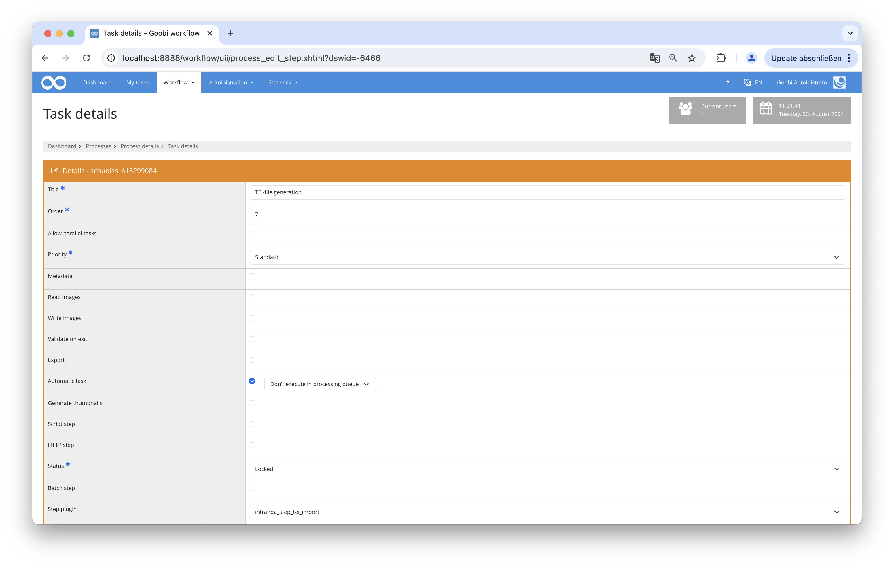

# Import of ECHO files as TEI

## Overview

Name                     | Wert
-------------------------|-----------
Identifier               | intranda_step_tei_import
Repository               | [https://github.com/intranda/goobi-plugin-step-tei-import](https://github.com/intranda/goobi-plugin-step-tei-import)
Licence              | GPL 2.0 or newer 
Last change    | 21.08.2024 21:10:26


## Intoduction
The plugin searches the stored ECHO XML files for one with the same MPIWG ID. This file is then converted into a TEI file using a predefined XSL file and saved in a designated folder. After that, the TEI file is copied into the Goobi process, into the _source subfolder within the Goobi process image folder. During this process, the image links are translated to the images in the viewer. From there, it is automatically exported (as a "Download" link) when the process is exported to the viewer.

## Installation
The plugin consists of two files:

```bash
goobi-plugin-step-tei-import.jar
plugin_intranda_step_tei-import.xml
```

The file `goobi-plugin-step-tei-import.jar` contains the program logic and must be installed in the following directory, readable by the Tomcat user:

```bash
/opt/digiverso/goobi/plugins/step/
```

The file `plugin_intranda_step_tei_import.xml` must also be readable by the Tomcat user and installed in the following directory:

```bash
/opt/digiverso/goobi/config/
```

## Overview and Functionality
After the plugin is installed and configured, it can be used within a Goobi work step.

To do this, the plugin `plugin_intranda_step_tei_import` must be entered within the desired task. Additionally, the checkboxes for Metadata and Automatic Task must be selected.



## Configuration

The configuration of the plugin is done in the file `plugin_intranda_step_tei_import.xml` as shown here:

```xml
<config_plugin>
    <config>
        <!-- which projects to use for (can be more then one, otherwise use *) -->
        <project>*</project>
        <step>*</step>
        <StepName>intranda_step_tei import</StepName>
        <ErrorMessage>TEI file could not be found.</ErrorMessage>

        <!--This is the path to the XSL file for transforming ECHO files into TEI files: -->
        <xslFile>/opt/digiverso/tei/info/echo2tei2.xsl</xslFile>
    
        <!--This is the base path to the TEI files: -->
        <teiFolder>/opt/digiverso/tei/</teiFolder>
    
        <!--This is the base path to the ECHo XML files: -->
        <echoFolder>/opt/digiverso/sftpupload/upload/uploads/echo_xml/</echoFolder>
        
        <!-- rulesets for the MM files: -->
        <rulesetPath>/opt/digiverso/goobi/rulesets/mpi.xml</rulesetPath>
        
        <!-- Viewer base path: the individual pages lie here + "id no."/"page no"/-->
        <viewerPages>https://mpiviewer.intranda.com/viewer/image/</viewerPages>

        <!--This is the base path to the Goobi MM files: -->
        <goobiMMFolder>/opt/digiverso/goobi/metadata/</goobiMMFolder>
    
    </config>
</config_plugin>
```

### General parameters 
The `<config>` block can occur repeatedly for different projects or work steps in order to be able to perform different actions within different workflows. The other parameters within this configuration file have the following meanings: 

| Parameter | Explanation | 
| :-------- | :---------- | 
| `project` | This parameter defines which project the current block `<config>` should apply to. The name of the project is used here. This parameter can occur several times per `<config>` block. | 
| `step` | This parameter controls which work steps the `<config>` block should apply to. The name of the work step is used here. This parameter can occur several times per `<config>` block. | 


### Further parameters 
In addition to these general parameters, the following parameters are available for further configuration: 


Parameter               | Explanation
------------------------|------------------------------------
`xslFile`               | This is used to store the path to the XSL file. |
`teiFolder`             | This parameter defines the folder where the TEI files are created. |
`echoFolder`            | This parameter defines the folder where the ECHO XML files are located. |
`rulesetPath`           | This parameter provides the path to the rule set. |
`viewerPages`           | This sets the URL for the Goobi viewer. |
`goobiMMFolder`         | This parameter defines the path to themetadata folder. It can only be changed for testing purposes. |