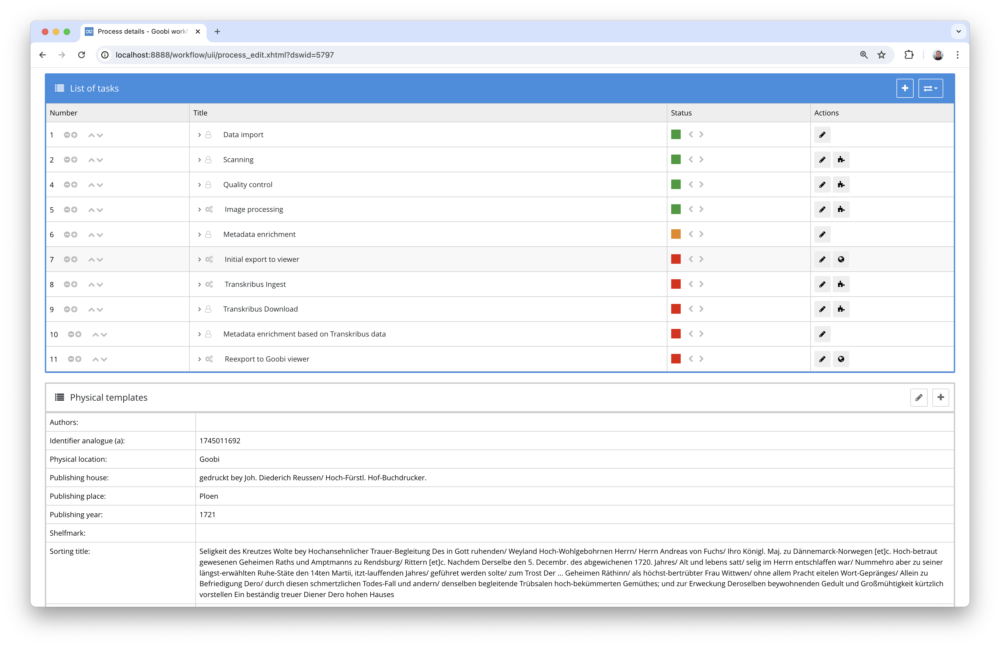
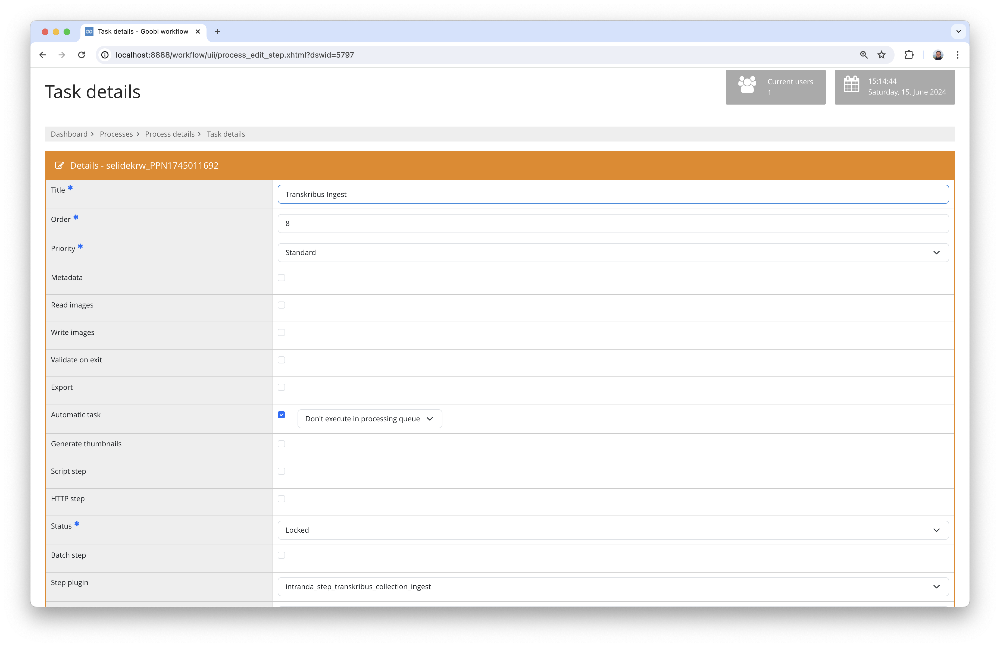
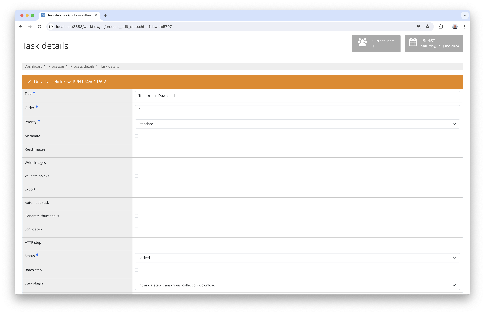

# Import and download from Transkribus Collections

## Overview

Name                     | Wert
-------------------------|-----------
Identifier               | plugin-step-transkribus-collection
Repository               | [https://github.com/intranda/goobi-plugin-step-transkribus-collection](https://github.com/intranda/goobi-plugin-step-transkribus-collection)
Licence              | GPL 2.0 or newer 
Last change    | 13.07.2024 09:56:47


## Introduction
This documentation describes the installation, configuration and use of the Step plug-in for importing images into Transkribus Collections as well as the subsequent download of the annotated results as ALTO files.

## Installation
In order to use the plugin, the following files must be installed:

```bash
/opt/digiverso/goobi/plugins/step/plugin-step-transkribus-collection.jar
/opt/digiverso/goobi/config/plugin_intranda_step_transkribus_collection.xml
```

Once the plugin has been installed, it can be selected within the workflow for the respective work steps and thus executed automatically. A workflow could look like the following example:



To import the images into a Transkribus collection, the work must be imported into Transkribus via a publicly accessible METS file using the `intranda_step_transkribus_collection_ingest` plugin.



Once the work has been edited within Transkribus as desired, it can be downloaded again using the `intranda_step_transkribus_collection_download` plugin.




## Overview and functionality
This plugin imports the METS file into Transkribus and receives a document ID. This is saved in Goobi as a property with the name `Transkribus Document ID` for later download. 

Once the work has been processed in Transkribus, the download of the results from Transkribus can be initiated in a further step. To do this, the document ID from the property is used again and the data is saved within the ALTO directory in the `ocr` folder.


## Configuration
The plugin is configured in the file `plugin_intranda_step_transkribus_collection.xml` as shown here:

```xml
<config_plugin>
    <!--
        order of configuration is:
          1.) project name and step name matches
          2.) step name matches and project is *
          3.) project name matches and step name is *
          4.) project name and step name are *
	-->
    
    <config>
        <!-- which projects to use for (can be more then one, otherwise use *) -->
        <project>*</project>
        <step>*</step>
        
        <!-- Login name for Transkribus user -->
        <transkribusLogin>user</transkribusLogin>
        
        <!-- Password for Transkribus user -->
        <transkribusPassword>password</transkribusPassword>
        
        <!-- URL for the Transkribus API to use -->
        <transkribusApiUrl>https://transkribus.eu/TrpServer/rest/</transkribusApiUrl>
        
        <!-- Name of the Collection where the documents shall be added to -->
        <transkribusCollection>280768</transkribusCollection>
       
        <!-- URL where the public available METS files can be downloaded -->
        <!-- Use the complete URL here with VariableReplacer expressions like this: -->
        <!-- https://viewer.goobi.io/viewer/sourcefile?id=$(meta.CatalogIDDigital) -->
        <metsUrl>https://dibiki.ub.uni-kiel.de/viewer/sourcefile?id=$(meta.CatalogIDDigital)</metsUrl>
        
		<!-- define a delay between the ingest trigger and the finishing of the ingest in Transkribus -->
        <ingestDelay>5000</ingestDelay>

		<!-- define a delay between the export trigger and the actual download of the exported results -->
        <downloadDelay>10000</downloadDelay>
        
    </config>

</config_plugin>

```

### General parameters 
The `<config>` block can occur repeatedly for different projects or work steps in order to be able to perform different actions within different workflows. The other parameters within this configuration file have the following meanings: 

| Parameter | Explanation | 
| :-------- | :---------- | 
| `project` | This parameter defines which project the current block `<config>` should apply to. The name of the project is used here. This parameter can occur several times per `<config>` block. | 
| `step` | This parameter controls which work steps the `<config>` block should apply to. The name of the work step is used here. This parameter can occur several times per `<config>` block. | 


### Further parameters 
In addition to these general parameters, the following parameters are available for further configuration: 


Parameter               | Explanation
------------------------|-----------
`transkribusLogin`      | Enter the user name for Transkribus here.
`transkribusPassword`   | Enter the password for Transkribus here.
`transkribusApiUrl`     | Use the API URL from Transkribus here. This is usually `https://transkribus.eu/TrpServer/rest/`
`transkribusCollection` | Enter the ID of the Transkribus collection into which the documents are to be imported here.
`metsUrl`               | Define the URL to the METS file here. You can work with Goobi's variable system within the URL so that the URL is equipped with the correct parameters.
`ingestDelay`           | Specify a delay in milliseconds here that should be waited for the data to be ingested in order to then request the document ID from Transkribus.
`downloadDelay`         | Specify a delay in milliseconds here that should be waited after the export is triggered and the actual download.