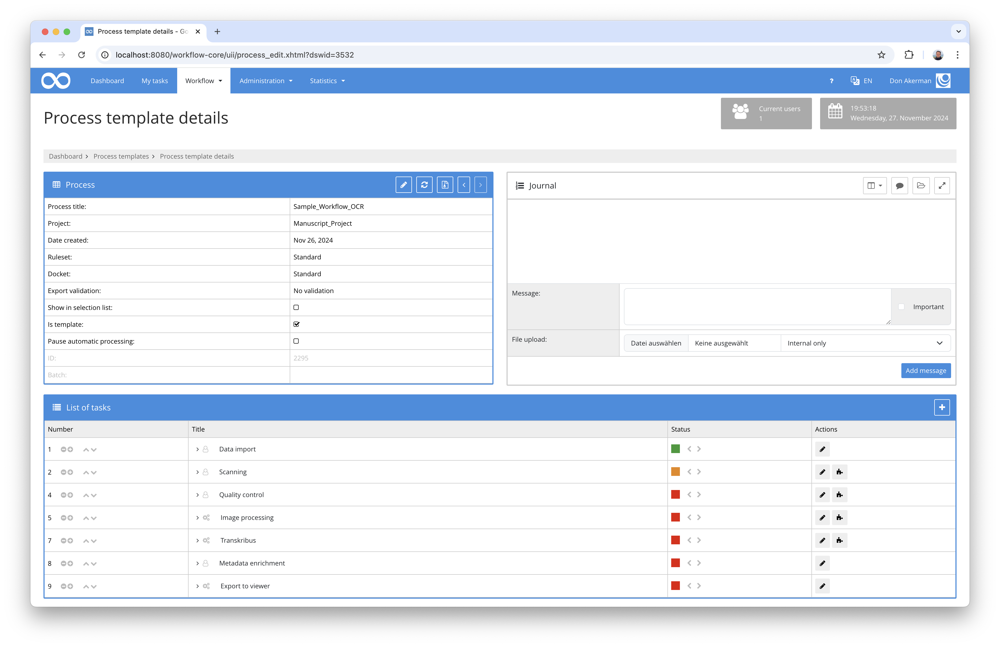
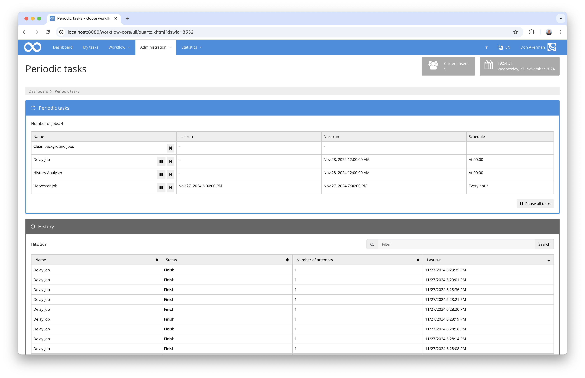
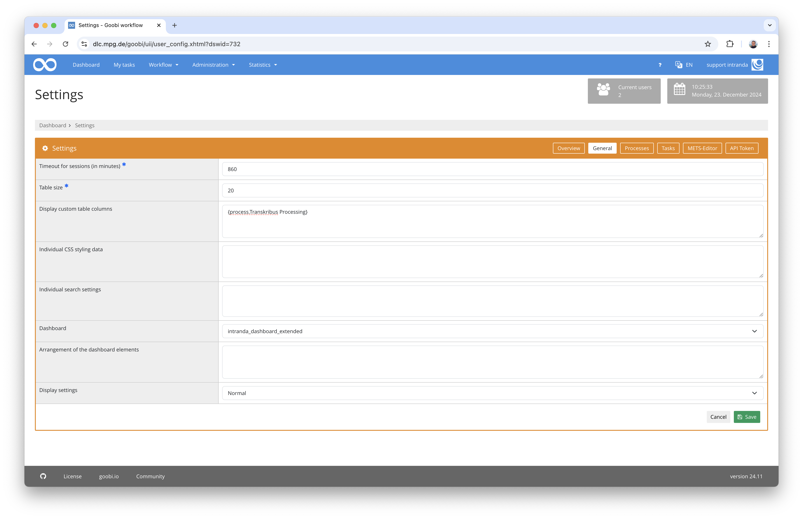
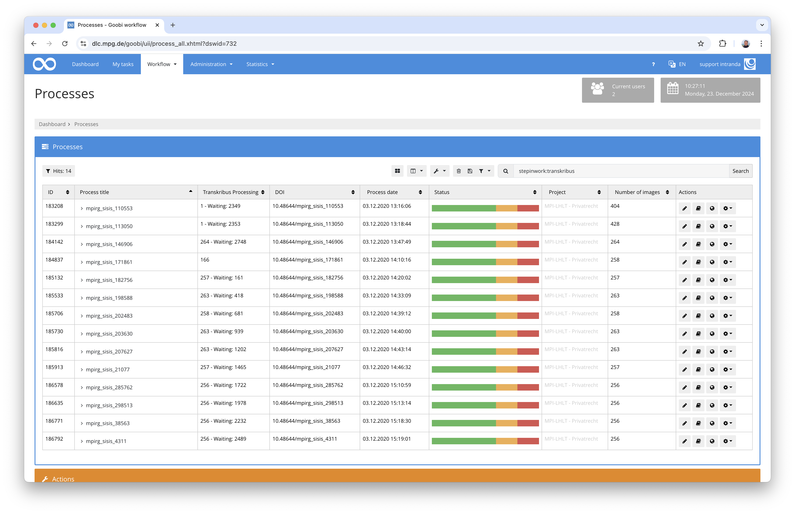

# OCR using Transkribus

## Overview

Name                     | Wert
-------------------------|-----------
Identifier               | intranda_step_transkribus
Repository               | [https://github.com/intranda/goobi-plugin-step-transkribus](https://github.com/intranda/goobi-plugin-step-transkribus)
Licence              | Proprietary commercial 
Last change    | 25.01.2025 09:01:36


## Introduction
This documentation describes the installation, configuration and use of the Step plug-in for OCR using Transkribus.

## Installation
To be able to use the plugin, the following files must be installed:

```bash
/opt/digiverso/goobi/plugins/step/plugin-step-transkribus-base.jar
/opt/digiverso/goobi/config/plugin_intranda_step_transkribus.xml
```

Once the plugin has been installed, it can be selected within the workflow for the respective work step and thus executed automatically. A workflow could look like the following example:



The work step must be configured so that the plugin is selected and the checkbox for the time delay is set.


## Overview and functionality
The plugin is designed in such a way that it first uploads all images of a process to Transkribus at the start and then leaves the work step in processing. A file `processing.json` is created in the file system within the `ocr` subdirectory of the process, which shows the exact status of the respective pages. This looks like this as an example:

```json
{
  "uuid" : "468ec642-10ab-4748-952d-07fa1d89dff5",
  "model" : "36202",
  "pages" : [ {
    "image" : "/opt/digiverso/goobi/metadata/2298/images/buch3_03_media/00000010.jpg",
    "alto" : "/opt/digiverso/goobi/metadata/2298/ocr/buch3_03_alto/00000010.xml",
    "transkribusId" : "13121160",
    "failCounter" : 0,
    "downloadCounter" : 4,
    "numberInQueue" : 0,
    "status" : "FINISHED"
  }, {
    "image" : "/opt/digiverso/goobi/metadata/2298/images/buch3_03_media/00000011.jpg",
    "alto" : "/opt/digiverso/goobi/metadata/2298/ocr/buch3_03_alto/00000011.xml",
    "transkribusId" : "13121161",
    "failCounter" : 0,
    "downloadCounter" : 4,
    "numberInQueue" : 0,
    "status" : "FINISHED"
  }, {
    "image" : "/opt/digiverso/goobi/metadata/2298/images/buch3_03_media/00000012.jpg",
    "alto" : "/opt/digiverso/goobi/metadata/2298/ocr/buch3_03_alto/00000012.xml",
    "transkribusId" : "13121162",
    "failCounter" : 0,
    "downloadCounter" : 4,
    "numberInQueue" : 0,
    "status" : "FINISHED"
  } ],
  "lastCheck" : "2024-11-27T19:21:04",
  "created" : "2024-11-27T19:17:55"
}
```

Goobi periodically calls all delay plug-ins in the background, including this one. With every automatic call and also every manual call via the administrative interface for the regular tasks, the plugin attempts to download the pages that have not yet been completed.




If all pages could be downloaded, the step is closed and the workflow continues. In the event of an error, however, the step changes its status to an error with corresponding error messages in the journal.


## Easy insight into the progress
During Transkribus processing, the plugin updates the exact progress within the `processing.json` file. However, in addition 
the progress of the processing is also saved as a process property with the name `Transkribus Processing`. This property can be displayed within the tabular process list by configuring it as an additional column for display.



The display then provides a good overview of the exact status of the processing. If several processes are being processed, not only the number of images still to be processed is displayed, but also the number of Transkribus jobs that still need to be processed before the process can be completed.




## Insight into the exact details of the progress
If you want to view the exact progress, this can be viewed in the `ocr` subfolder of the process. This contains a directory with the generated ALTO files and the file `processing.json` mentioned above.

A simple script that opens the path to the respective directory of the desired process looks like this and could be stored under `/usr/local/sbin/ocr-folder.sh`:

```bash
#!/bin/sh
cd /opt/digiverso/goobi/metadata/$1/ocr/
$SHELL
```

## Intervention in the event of an error
If a page is not uploaded, processed or downloaded correctly, it is recommended to proceed as follows, depending on the error:

### Listing of images in a specific status
The first step is to find out which images are currently in an undesired status. For example, the following call can be used to determine which images of a process have not already been completed:

```bash
jq '.pages[] | select(.status != "FINISHED") | {image, status}' processing.json
```

### Process image again from scratch
If individual images have failed during processing, they can be completely reprocessed without affecting the other images in the same directory. The best way to do this is as follows:

- Open the corresponding `processing.json` file from the `ocr` directory of the process
- Set the value in `status` to `RETRY` for the corresponding image
- Set the work step in the workflow to `In process` again
- Manually restart the delay job from the administrative interface for the regular tasks

If, for example, several images are incorrectly in the ‘NEW’ status, this can be easily changed for an operation as follows:

```bash
cd /opt/digiverso/goobi/metadata/123456/ocr/
sed -i "s/NEW/RETRY/g" processing.json
```

### Download results again
If there is a problem downloading the results, for example because the internet connection has been lost and the number of download attempts has exceeded the configured maximum, you can have the selected images downloaded again from the Transkribus server:

- Open the corresponding `processing.json` file from the `ocr` directory of the process
- Set the value in `status` to `RUNNING` for the corresponding image
- Set the work step in the workflow to `In process` again
- Manually restart the delay job from the administrative interface for the regular tasks

If many images are affected by the fact that they are incorrectly in the `CANCELED` status, this can be easily changed for a process as follows:

```bash
cd /opt/digiverso/goobi/metadata/123456/ocr/
sed -i "s/CANCELED/RUNNING/g" processing.json
```


## Configuration
The plugin is configured in the file `plugin_intranda_step_transkribus.xml` as shown here:

```xml
<config_plugin>
    <!--
        order of configuration is:
          1.) project name and step name matches
          2.) step name matches and project is *
          3.) project name matches and step name is *
          4.) project name and step name are *
	-->
    
    <config>
        <!-- which projects to use for (can be more then one, otherwise use *) -->
        <project>*</project>
        <step>*</step>
        
       	<!-- URL for the licence server application api -->
		<url>https://lic.intranda.com/api</url>
	
		<!-- Login and Password for the licence server -->
		<login>customer</login>
		<password>user</password>
    
    	<!-- name of the property to read the model ID from -->
    	<model>Transkribus Model</model>

		<!-- defaul model ID to use in case of missing process property -->
    	<model-default>36202</model-default>
    	
		<!-- how often should a file be re-uploaded to Transkribus in the event of an error?  -->
    	<max-failed>10</max-failed>

    	<!-- how many times should an attempt be made to download a result file before it is deemed to have failed? -->
    	<max-download>100</max-download>
    
    </config>

</config_plugin>

```

### General parameters 
The `<config>` block can occur repeatedly for different projects or work steps in order to be able to perform different actions within different workflows. The other parameters within this configuration file have the following meanings: 

| Parameter | Explanation | 
| :-------- | :---------- | 
| `project` | This parameter defines which project the current block `<config>` should apply to. The name of the project is used here. This parameter can occur several times per `<config>` block. | 
| `step` | This parameter controls which work steps the `<config>` block should apply to. The name of the work step is used here. This parameter can occur several times per `<config>` block. | 


### Further parameters 
In addition to these general parameters, the following parameters are available for further configuration: 


Parameter         | Explanation
------------------|----------------------------------------
`url`             | URL for the intranda licence server
`login`           | Login for the intranda licence server
`password`        | Password for the intranda licence server
`model`           | Process property to be used, in which the Transkribus model ID is stored. This property is usually called `Transkribus Model`.
`model-default`   | Transkribus model ID to be used if there is no property with a value in the process. Example: `36202`
`max-failed`      | Maximum number of new attempts if an OCR cannot be performed for a page. The workflow step remains in error status if the number of attempts is exceeded.
`max-download`    | Maximum number of attempts to download the OCR result from Transkribus. The workflow step remains in error status if the number of attempts is exceeded.


## Configuration of the time control
As the plugin was designed as a delay plugin, it is called periodically by Goobi's scheduler to retrieve new completed pages from Transkribus. The time control of the `dailyDelayJob` is used for this periodic query. However, this can also be configured differently in the configuration file `goobi_config.properties` using the following syntax: 

```toml
# Execution daily at midnight 
dailyDelayJob=0 0 0 * * ? 

# Execution every 15 minutes
dailyDelayJob=0 */15 * * * ?

# Execution every hour
dailyDelayJob=0 0 */1 * * ? 
```