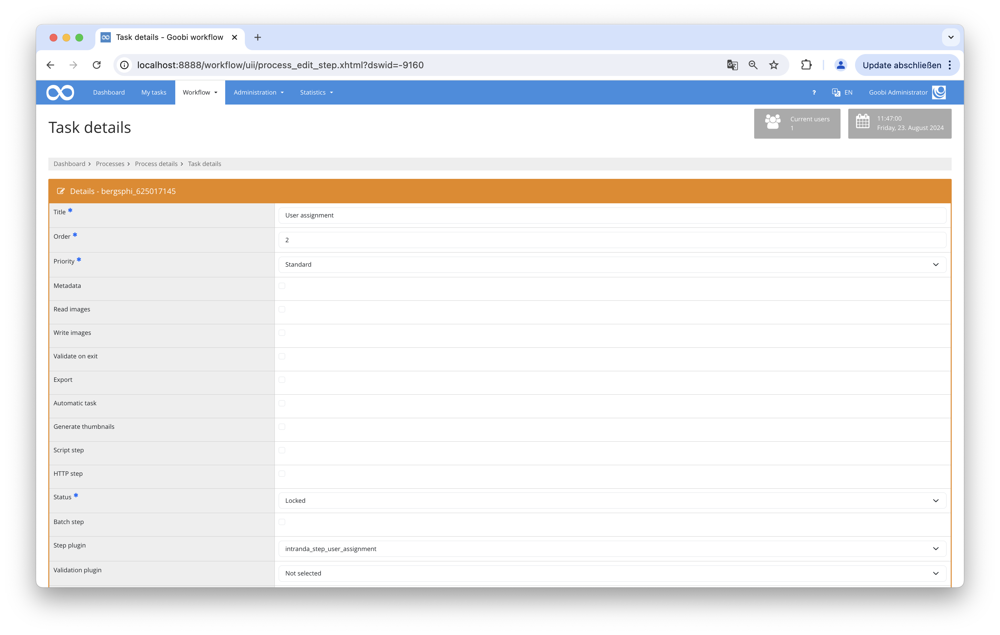
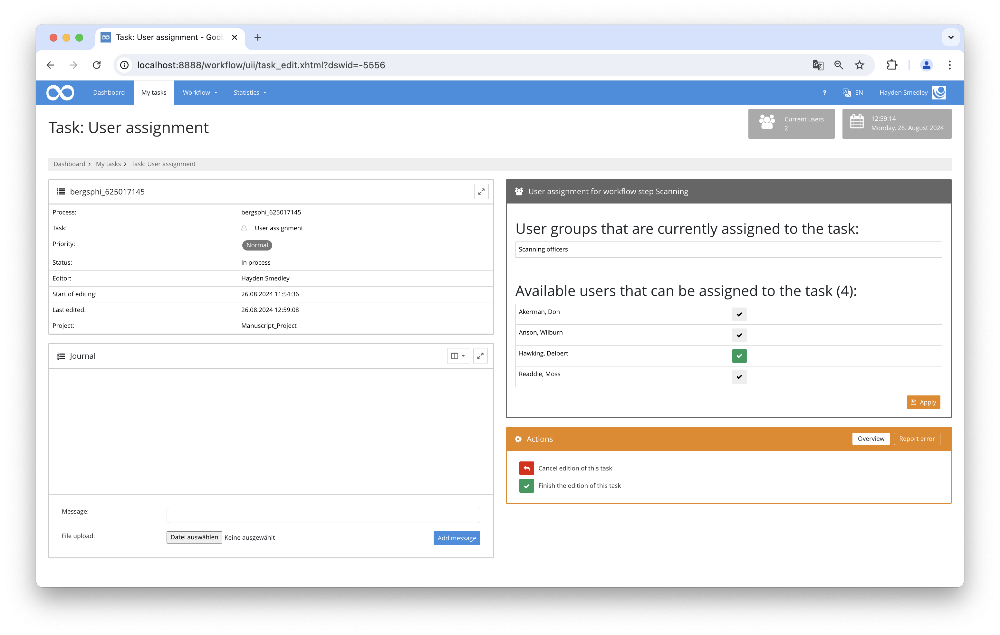

# User Assignment

## Overview

Name                     | Wert
-------------------------|-----------
Identifier               | intranda_step_user_assignment
Repository               | [https://github.com/intranda/goobi-plugin-step-user-assignment](https://github.com/intranda/goobi-plugin-step-user-assignment)
Licence              | GPL 2.0 or newer 
Last change    | 24.08.2024 15:17:37


## Introduction
This documentation explains the plugin used for assigning users to specific tasks within the workflow.

## Installation
To be able to use the plugin, the following files must be installed:

```bash
/opt/digiverso/goobi/plugins/step/plugin-step-user-assignment-base.jar
/opt/digiverso/goobi/config/plugin_intranda_step_user_assignment.xml
```
To use the plugin, it must be selected in a workflow step:



After executing the plugin, the plugin interface will appear as follows:



## Overview and functionality
First, the respective individual values must be entered in the configuration file. Afterward, the plugin can be executed. It initially collects all specified parameters and then loads all users. These users can then be assigned tasks within the plugin's user interface.

## Configuration
The plugin is configured in the file `plugin_intranda_step_user_assignment.xml` as shown here:

```xml
<config_plugin>
	<config>
		<!-- which process template name (can be more then one, otherwise use *) -->
		<workflow>Book workflow</workflow>
		<!-- configure the step name where the assignement shall be done (e.g. user assignement step) -->
		<assignmentStep>Decider step</assignmentStep>
		<!-- configure the step name for which the users shall be assigned (e.g. Scanning)-->
		<targetStep>Scanning</targetStep>
	</config>
	
	<config>
		<workflow>Archive workflow</workflow>
		<assignmentStep>Scanning decision step</assignmentStep>
		<targetStep>Book scanning</targetStep>
	</config>
	
	<config>
		<workflow>Archive workflow</workflow>
		<assignmentStep>QA decision step</assignmentStep>
		<targetStep>Final QA</targetStep>
	</config>
	
	<config>
		<workflow>Other workflow</workflow>
		<assignmentStep>Scanning decision step</assignmentStep>
		<targetStep>Scanning</targetStep>
	</config>
	
</config_plugin>

```

### General parameters 
The `<config>` block can occur repeatedly for different projects or work steps in order to be able to perform different actions within different workflows. The other parameters within this configuration file have the following meanings: 

| Parameter | Explanation | 
| :-------- | :---------- | 
| `project` | This parameter defines which project the current block `<config>` should apply to. The name of the project is used here. This parameter can occur several times per `<config>` block. | 
| `step` | This parameter controls which work steps the `<config>` block should apply to. The name of the work step is used here. This parameter can occur several times per `<config>` block. | 


### Further parameters 
In addition to these general parameters, the following parameters are available for further configuration: 


Parameter               | Explanation
------------------------|------------------------------------
`workflow`              | The name of the production template being used.|
`assignmentStep`        | The workflow step where the plugin activates to assign users for the next step (`targetStep`). |
`targetStep`            | The workflow step to which the user is assigned.|