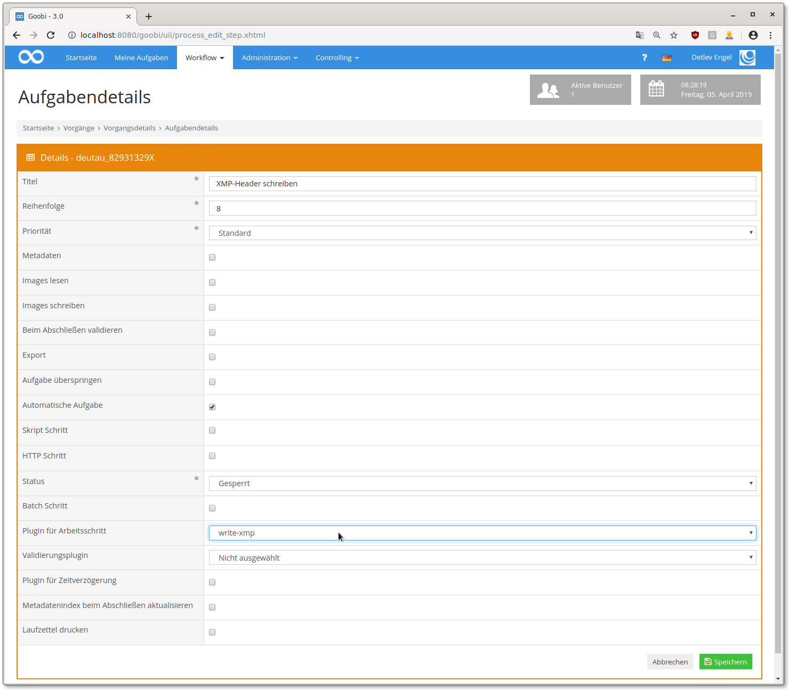

# Writing XMP metadata to image files

## Overview

Name                     | Wert
-------------------------|-----------
Identifier               | intranda_step_xmp_header
Repository               | [https://github.com/intranda/goobi-plugin-step-xmp-header](https://github.com/intranda/goobi-plugin-step-xmp-header)
Licence              | GPL 2.0 or newer 
Last change    | 25.07.2024 10:52:22


## Introduction
This documentation describes the installation, configuration and use of the XMP metadata plugin in Goobi. This plugin makes it possible to write various metadata from Goobi into the XMP headers of image files. Metadata can be written at the item level as well as metadata at the image level (for example, belonging to structural elements).


## Installation
To use the plugin, it must be copied to the following location:

```bash
/opt/digiverso/goobi/plugins/step/plugin-intranda-step-xmp-base.jar
```


## Overview and functionality
In Goobi, the `write-xmp` plugin must be selected in the steps in which the image metadata is to be written. In addition, these steps should be marked as `automatic` so that they do not have to be triggered manually. Since the writing of the metadata is based on the data of the METS file and expects a finished pagination and structuring, the writing of the XMP headers should happen only after the metadata processing.




## Configuration
The configuration file is expected under the following path:

```bash
/opt/digiverso/goobi/config/plugin_write-xmp.xml
```

This configuration file can be adapted during operation. An example configuration showing all possibilities of the plugin can be seen here:

```xml
<config_plugin>

    <config>
        <!-- define for which project this configuration block is used. Is repeatable if the same configuration shall be used on different project, * means any project. -->
        <project>*</project>
        <!-- define for which step name this configuration block is used. Is repeatable if the same configuration shall be used on different steps, * means any step. -->
        <step>*</step>
        <!-- define if the images in master folder are used -->
        <useDerivateFolder>true</useDerivateFolder>
        <!-- define if the images in master folder are used -->
        <useMasterFolder>false</useMasterFolder>
        <!-- call this command to write the metadata into the image-->
        <command>/usr/bin/exiftool</command>
        <!-- Each parameter is comma separated, double quotation " can be used.
        {PARAM} is replaced by the list of fields, {FILE} is replaced with the current file -->
        <parameter>-overwrite_original, -q, -q, -m, -sep, {PARAM}, {FILE}</parameter>
        <!-- @name - xmp field name -->
        <imageMetadataField name="-xmp:Location">
            <!-- separator - use this to separate the different entries. Default is white space (\u0020) -->
            <separator>;</separator>
            <goobiField>
                <!-- type: - type of the field: templateproperty, workpieceproperty, processproperty, staticText, metadata or docstruct, default is metadata -->
                <type>metadata</type>
                <!-- name: - name of the metadata field -->
                <name>PlaceOfPublication</name>
                <!-- use: - default is logical , use value from the physical, logical, anchor, current, page docstruct, last (lowest in hierarchy that has the metadata) or from all elements -->
                <use>logical</use> <!-- physical|logical|anchor|page|current|last|all-->
                <!-- separator - use this separator to separate the different occurences of a field, default is blank -->
                <separator>;</separator>
                <!-- useFirst: - use only the first occurence or all - default is true -->
                <useFirst>false</useFirst>
                <!-- staticPrefix: - text gets added before the metadata value, leading/trailing white spaces must be encoded \u0020 -->
                <staticPrefix>some static text \u0020</staticPrefix>
                <!-- staticSuffix: - text gets added after the metadata value -->
                <staticSuffix>\u0020additional text</staticSuffix>
            </goobiField>

            <goobiField>
                <type>docstruct</type>
                <!-- language - which language should be used - if not given, the internal names are used -->
                <language>en</language>
                <!-- use - use the first docstruct (usually the monograph), the last docstruct (the deepest in hierarchy) or all together -->
                <use>all</use>
                <separator>;\u0020</separator>
            </goobiField>
            <goobiField>
                <type>staticText</type>
                <text>some example text</text>
            </goobiField>
            <goobiField>
                <type>processproperty</type>
                <name>Physikalischer Standort</name>
                <useFirst>true</useFirst>
                <separator>;</separator>
            </goobiField>
            <goobiField>
                <type>templateproperty</type>
                <name>Artist</name>
                <useFirst>true</useFirst>
                <separator>;</separator>
            </goobiField>
            <goobiField>
                <type>workpieceproperty</type>
                <name>Hersteller der digit. Ausgabe</name>
                <useFirst>true</useFirst>
                <separator>;</separator>
            </goobiField>
        </imageMetadataField>
    </config>
</config_plugin>
```

The `config` block is repeatable and can therefore define different metadata in different projects. The sub-elements `project` and `step` are used to check whether the current block should be used for the current step. First, the system checks whether there is an entry that contains both the project name and the step name. If this is not the case, the system searches for an entry for any projects marked with the `*` and for the step name used. If also no entry was found, a search is made for the project name and any steps, otherwise the default block applies, where both `project` and `step` contain .

In the two fields `usDerivateFolder` and `useMasterFolder` you can define whether the changes should be applied to the files in the respective folder. At least one of the two values must be set to `true`.

With `command` you define the tool that is used to write the data. Different tools can be used here depending on the operating system or file formats used.

The `parameter` element defines the individual parameters that are passed when the tool is called. Two variables can be used. With `{FILE}` the absolute path to the file to be manipulated is passed and `{PARAM}` contains the configured elements.

The individual fields can be specified comma separated, then they are passed as individual parameters when called. If, on the other hand, the values of the parameters are to contain `','`, the parameters can be masked with `"`.

`imageMetadataField` contains the configuration for a single field to be written. To be able to write several fields in one call, this field is repeatable. The attribute `name` is mandatory and contains the field name to be written.

Within the field there are one or more `goobiField` elements. These contain the metadata used in Goobi to fill the XMP field. If several `goobiField` were used, a `separator` can be defined to separate the individual data. Leading or ending blanks must be specified as unicode using `\u0020`. The individual fields are added in the order in which they were configured.

Each `goobiField` element contains a series of sub-elements. This determines which element it is. Possible values are `processproperty`, `templateproperty`, `workpieceproperty`, `staticText`, `metadata` or `docstruct`.

The `processproperty`, `templateproperty` and `workpieceproperty` properties are searched in the Goobi database. They therefore always contain identical values for all images. Up to three additional subfields are expected.

`name`: contains the name of the property whose value is to be used.

`useFirst`: if this field contains the value true, the first value found will be used, otherwise further values will be searched for.

`separator`: the characters configured here will be used as separator if more than one entry is found.

When using `staticText`, an additional field `text` is expected. Its content will be used unchanged.

If it is a `metadata` field, a number of additional sub-elements are expected:

* `name`: contains the internal name of the metadata field.
* `use`: defines the structural elements in which the field is to be searched for. The following values are possible:
  * `logical`: the search is restricted to the main element such as monograph or volume. This is usually the data from the OPAC.
  * `anchor`: the search is limited to the anchor like multi-volume work or journal.
  * `physical`: the search is limited to the element `physSequence`. Here, for example, the URN of the work can be found.
  * `current`: the search is only performed in the element that has been assigned to the current image and is at the lowest level in the hierarchy. For example a chapter or an article.
  * `page`: the search is only done inside the page element. Usually the granular URNs or the physical and logical page number are displayed here.
  * `last`: the search is carried out in all logical elements that are assigned to the image. The metadatum with the lowest hierarchy level is taken.
  * `all`: the search is performed in all logical elements assigned to the image. The search starts with the highest element. All values found are concatenated.
* `separator`: the characters configured here are used as separator if more than one entry is found.
* `useFirst`: if this field contains the value true, the first value found will be used, otherwise further values will be searched for.
* `staticPrefix`: this text is placed before the metadata content
* `staticSuffix`: this text is appended to the metadata content. If the metadata is a person, the value from `displayName` is used, otherwise the normal value.

With `docstruct` the following fields are expected:

* `language`: this defines the language in which the name of the structure elements is to be written. If the specification is missing, the internal name is used.
* `use`: defines which structure element is to be used. The following values are valid here:
  * `first`: Use the first element assigned to the image. Usually this is the monograph or the band
  * `last`: Use the element that has been assigned to the current image and is the lowest in the hierarchy. For example a chapter or an article.
  * `all`: Use all assigned structural elements, starting with the highest element.
* `separator`: This separator is used when using all to separate the individual structural elements.


## Example: Writing Dublin Core metadata to all Images of a process
XMP headers allow you to write the complete Dublin Core metadata record. With the following sample configuration, the plugin writes all Dublin core metadata from Goobi to the XMP headers of the derivatives:

```xml
<config_plugin>
    <config>
        <project>*</project>
        <step>*</step>
        <useDerivateFolder>true</useDerivateFolder>
        <useMasterFolder>false</useMasterFolder>
        <command>/usr/bin/exiftool</command>
        <parameter>-overwrite_original, -q, -q, -m, {PARAM}, {FILE}</parameter>
        <!-- creator of the digital document -->
        <imageMetadataField name="-xmp-dc:Contributor">
            <goobiField>
                <type>workpieceproperty</type>
                <name>Artist</name>
                <useFirst>true</useFirst>
            </goobiField>
        </imageMetadataField>
        <!-- list of creators of the book -->
        <imageMetadataField name="-xmp-dc:Creator">
            <separator>;\u0020</separator>
            <goobiField>
                <type>metadata</type>
                <name>Author</name>
                <use>logical</use>
                <useFirst>false</useFirst>
                <separator>;\u0020</separator>
            </goobiField>
            <goobiField>
                <type>metadata</type>
                <name>Creator</name>
                <use>logical</use>
                <useFirst>false</useFirst>
                <separator>;\u0020</separator>
            </goobiField>
        </imageMetadataField>
        <!-- must be a valid date format, either YYYY or YYYY-MM-DD -->
        <imageMetadataField name="-xmp-dc:Date">
            <goobiField>
                <type>metadata</type>
                <name>PublicationYearSort</name>
                <use>logical</use>
                <useFirst>true</useFirst>
            </goobiField>
        </imageMetadataField>
        <!-- any text -->
        <imageMetadataField name="-xmp-dc:Description">
            <goobiField>
                <type>metadata</type>
                <name>Description</name>
                <use>logical</use>
                <useFirst>true</useFirst>
            </goobiField>
        </imageMetadataField>
        <!-- image format -->
        <imageMetadataField name="-xmp-dc:Format">
            <goobiField>
                <type>staticText</type>
                <text>image/tiff</text>
            </goobiField>
        </imageMetadataField>
        <!-- identifier of the document, could be goobi id, process title or catalogue id -->
        <imageMetadataField name="-xmp-dc:Identifier">
            <goobiField>
                <type>metadata</type>
                <name>CatalogIDDigital</name>
                <use>logical</use>
                <useFirst>true</useFirst>
            </goobiField>
        </imageMetadataField>
        <!-- all languages -->
        <imageMetadataField name="-xmp-dc:Language">
            <goobiField>
                <type>metadata</type>
                <name>DocLanguage</name>
                <use>all</use>
                <useFirst>false</useFirst>
                <separator>;\u0020</separator>
            </goobiField>
        </imageMetadataField>
        <!-- publisher name and publication place -->
        <imageMetadataField name="-xmp-dc:Publisher">
            <goobiField>
                <type>metadata</type>
                <name>PublisherName</name>
                <use>all</use>
                <useFirst>false</useFirst>
                <separator>;\u0020</separator>
            </goobiField>
            <goobiField>
                <type>metadata</type>
                <name>PlaceOfPublication</name>
                <use>all</use>
                <useFirst>false</useFirst>
                <separator>;\u0020</separator>
            </goobiField>
        </imageMetadataField>
        <!-- TODO remove this field? -->
        <imageMetadataField name="-xmp-dc:Relation">
            <goobiField>
                <type>docstruct</type>
                <language>en</language>
                <use>all</use>
                <separator>;\u0020</separator>
            </goobiField>
        </imageMetadataField>
        <!-- access rights -->
        <imageMetadataField name="-xmp-dc:Rights">
            <goobiField>
                <type>metadata</type>
                <name>AccessLicense</name>
                <use>logical</use>
                <useFirst>false</useFirst>
                <separator>;\u0020</separator>
            </goobiField>
        </imageMetadataField>
        <!-- TODO only main title or sub titles as well? -->
        <imageMetadataField name="-xmp-dc:Title">
            <goobiField>
                <type>metadata</type>
                <name>TitleDocMain</name>
                <use>logical</use>
                <useFirst>false</useFirst>
                <separator>;\u0020</separator>
            </goobiField>
        </imageMetadataField>
        <!-- document type = Manuscript or type = Chapter? -->
        <imageMetadataField name="-xmp-dc:Type">
            <goobiField>
                <type>docstruct</type>
                <language>en</language>
                <use>logical</use>
                <separator>;\u0020</separator>
            </goobiField>
        </imageMetadataField>

        <!-- some additional metadata to identify the document -->
        <imageMetadataField name="-xmp-dc:Source">
            <separator>;\u0020</separator>
            <goobiField>
                <type>metadata</type>
                <name>Author</name>
                <use>all</use>
                <useFirst>false</useFirst>
                <separator>;\u0020</separator>
            </goobiField>
            <goobiField>
                <type>metadata</type>
                <name>TitleDocMain</name>
                <use>logical</use>
                <useFirst>false</useFirst>
                <separator>;\u0020</separator>
            </goobiField>
            <goobiField>
                <type>metadata</type>
                <name>TitleDocSub1</name>
                <use>all</use>
                <useFirst>false</useFirst>
                <separator>;\u0020</separator>
            </goobiField>  
            <goobiField>
                <type>metadata</type>
                <name>PublicationYear</name>
                <use>logical</use>
                <useFirst>false</useFirst>
                <separator>;\u0020</separator>
            </goobiField>  
            <goobiField>
                <type>metadata</type>
                <name>PlaceOfPublication</name>
                <use>logical</use>
                <useFirst>false</useFirst>
                <separator>;\u0020</separator>
            </goobiField>  
            <goobiField>
                <type>metadata</type>
                <name>PublisherName</name>
                <use>logical</use>
                <useFirst>false</useFirst>
                <separator>;\u0020</separator>
            </goobiField>  
            <goobiField>
                <type>metadata</type>
                <name>physPageNumber</name>
                <use>page</use>
                <useFirst>false</useFirst>
                <separator>;\u0020</separator>
                 <staticPrefix>(page\u0020</staticPrefix>
                 <staticSuffix>)</staticSuffix>
            </goobiField>  
            <goobiField>
                <type>filename</type>
                <useAbsolutePath>true</useAbsolutePath>
            </goobiField>
            <goobiField>
                <type>variable</type>
                <value>Goobi-ID {processid}</value>
            </goobiField>
        </imageMetadataField>
    </config>
</config_plugin>
```