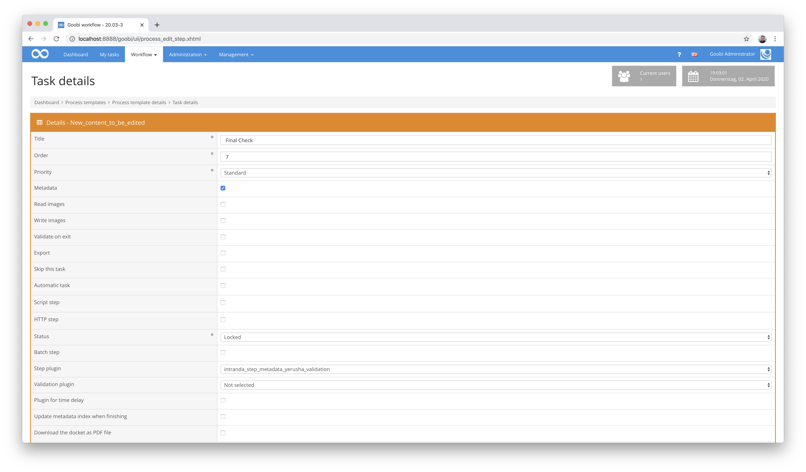
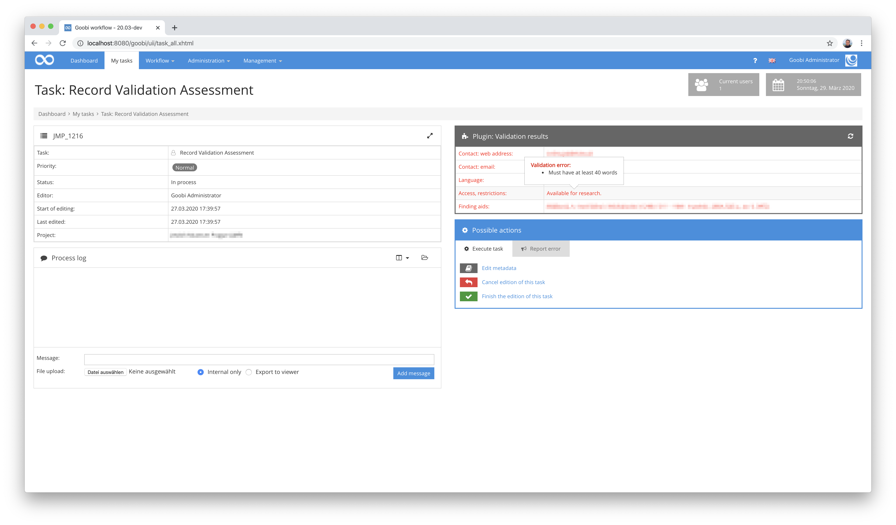

# Metadata validation within a task

## Overview

Name                     | Wert
-------------------------|-----------
Identifier               | intranda_step_metadata_yerusha_validation
Repository               | [https://github.com/intranda/goobi-plugin-step-yerusha-validation](https://github.com/intranda/goobi-plugin-step-yerusha-validation)
Licence              | GPL 2.0 or newer 
Last change    | 25.07.2024 11:51:25


## Introduction
This plug-in is used to validate metadata from the Goobi METS file and visualise the validation results within an accepted task. The way the plugin works requires a configuration file of the type required for the following workflow plugin: [Generic import plugin for Excel files including validation](https://docs.goobi.io/goobi-workflow-plugins-en/workflow-plugins/goobi-plugin-workflow-excelimport).


## Installation
To use the plugin, these two files must be copied to the following locations:

```bash
/opt/digiverso/goobi/plugins/step/plugin_intranda_step_yerusha-validation-base.jar
/opt/digiverso/goobi/plugins/GUI/plugin_intranda_step_yerusha-validation-gui.jar
```

The configuration of the Plugin is based on that of the [Excel Plugin with display of validation results](https://docs.goobi.io/goobi-workflow-plugins-en/workflow-plugins/goobi-plugin-workflow-excelimport) and is expected under the following path

```bash
/opt/digiverso/goobi/config/plugin_intranda_workflow_excelimport.xml
```

## Overview and functionality
To put the plugin into operation, it must be activated for one or more desired tasks in the workflow. This is done as shown in the following screenshot by selecting the `intranda_step_metadata_yerusha_validation` plugin from the list of installed plugins.



The plugin is executed and opened immediately after a task is entered. The results of the performed validation are immediately visible within the task. When moving the mouse over the individual errors, a detailed error message as defined in the configuration file is also displayed.



If the task has been configured to allow access to the Goobi Metadata Editor and changes have been made to the metadata, validation can be carried out again at any time afterwards. If the validation rules within the configuration file have been changed, it is also helpful to run the validation again.


## Configuration
The configuration of the Plugin is based on that of the Excel Plugin with display of validation results. Its structure [is explained in more detail here](https://docs.goobi.io/goobi-workflow-plugins-en/workflow-plugins/goobi-plugin-workflow-excelimport#general-configuration-of-the-plugin). It is structured as follows:

```xml
<config_plugin>

    <!-- which file types shall be allowed for uploading these -->
    <allowed-file-extensions>/(\\.|\\/)(xls|xlsx)$/</allowed-file-extensions>

    <qaStepName>Quality assurance</qaStepName>

    <config>
        <!-- publication type to create -->
        <publicationType>Collection</publicationType>
        <!-- which digital collection to use -->
        <collection>General</collection>
        <rowIdentifier>2</rowIdentifier>
        <!-- define in which row the header is written, usually 1 -->
        <rowHeader>3</rowHeader>
        <!-- define in which row the data starts, usually 2 -->
        <rowDataStart>4</rowDataStart>
        <!-- define in which row the data ends, usually 20000 -->
        <rowDataEnd>100</rowDataEnd>
        <identifierHeaderName>1</identifierHeaderName>

        <metadata ugh="CatalogIDDigital" identifier="1" required="true" requiredErrorMessage="Field is required" pattern="^[A-Z]*-\\d*$" patternErrorMessage="Needs to be of the Format AAA-000" />
        <metadata ugh="Country" identifier="2" required="true" requiredErrorMessage="Field is required" list="/opt/digiverso/goobi/config/plugin_intranda_workflow_excelimport_ISO3166-1.txt" listErrorMessage="Content not in list of valid options"/>
        <metadata ugh="Institution" identifier="3" required="true" requiredErrorMessage="Field is required" />
        <metadata ugh="InstitutionOfficial" identifier="4" required="true" requiredErrorMessage="Field is required" />
        <metadata ugh="LanguageInstitution" identifier="4a" required="true" requiredErrorMessage="Field is required" list="/opt/digiverso/goobi/config/plugin_intranda_workflow_excelimport_ISO639-2.txt" listErrorMessage="Content not in list of valid options"/>
        <metadata ugh="ContactPostal" identifier="5a"  required="true" requiredErrorMessage="Field is required" />
        <metadata ugh="ContactPhone" identifier="5b" required="true" requiredErrorMessage="Field is required" pattern="^[\\d-+() ]*$" patternErrorMessage="May only contain numbers, +, -, ( and )"/>
        <metadata ugh="ContactWeb" identifier="5c" required="true" requiredErrorMessage="Field is required" pattern="^(https?|ftp|file)://[-a-zA-Z0-9+&amp;@#/%?=~_|!:\,.;]*[-a-zA-Z0-9+&amp;@#/%=~_|]" patternErrorMessage="Must be valid web address"/>
        <metadata ugh="ContactEmail" identifier="5d" required="true" requiredErrorMessage="Field is required" pattern="(?:[a-z0-9!#$%&amp;'*+/=?^_`{|}~-]+(?:\\.[a-z0-9!#$%&amp;'*+/=?^_`{|}~-]+)*|\&quot;(?:[\\x01-\\x08\\x0b\\x0c\\x0e-\\x1f\\x21\\x23-\\x5b\\x5d-\\x7f]|\\\\[\\x01-\\x09\\x0b\\x0c\\x0e-\\x7f])*\&quot;)@(?:(?:[a-z0-9](?:[a-z0-9-]*[a-z0-9])?\\.)+[a-z0-9](?:[a-z0-9-]*[a-z0-9])?|\\[(?:(?:25[0-5]|2[0-4][0-9]|[01]?[0-9][0-9]?)\\.){3}(?:25[0-5]|2[0-4][0-9]|[01]?[0-9][0-9]?|[a-z0-9-]*[a-z0-9]:(?:[\\x01-\\x08\\x0b\\x0c\\x0e-\\x1f\\x21-\\x5a\\x53-\\x7f]|\\\\[\\x01-\\x09\\x0b\\x0c\\x0e-\\x7f])+)\\])$" patternErrorMessage="Must be valid Email address"/>
        <metadata ugh="ReferenceNumber" identifier="6a" required="true" requiredErrorMessage="Field is required" />
        <metadata ugh="ReferenceNumberType" identifier="6b" required="true" requiredErrorMessage="Field is required" />
        <metadata ugh="TitleDocMain" identifier="7" required="true" requiredErrorMessage="Field is required" />
        <metadata ugh="TitleDocMainOfficial" identifier="8" required="true" requiredErrorMessage="Field is required"/>
        <metadata ugh="TitleDocMainLanguage" identifier="8a" required="true" requiredErrorMessage="Field is required" list="/opt/digiverso/goobi/config/plugin_intranda_workflow_excelimport_ISO639-2.txt" listErrorMessage="Content not in list of valid options"/>
        <metadata ugh="Creator" identifier="9" required="true" requiredErrorMessage="Field is required" />
        <metadata ugh="DateOfOrigin" identifier="10" either="11" eitherErrorMessage="Either this or 11 must have content" pattern="(^\\d{4}$|^\\d{4}/\\d{4}$|^\\d{4}-\\d{2}$|^\\d{4}-\\d{2}/\\d{4}-\\d{2}$)" patternErrorMessage="Invalid date Format"/>
        <metadata ugh="DateNote" identifier="11" either="10" eitherErrorMessage="Either this or 10 must have content"/>
        <metadata ugh="DocLanguage" identifier="12" required="true" requiredErrorMessage="Field is required" list="/opt/digiverso/goobi/config/plugin_intranda_workflow_excelimport_ISO639-2.txt" listErrorMessage="Content not in list of valid options"/>
        <metadata ugh="Extent" identifier="13" required="true" requiredErrorMessage="Field is required"/>
        <metadata ugh="MaterialDescription" identifier="14a" required="true" requiredErrorMessage="Field is required" pattern="(^[Aa]udio$|^[Cc]artographic [Mm]aterial$|^[Gg]raphic [Mm]aterial$|^[Pp]hotographic [Ii]mages$|^[Tt]extual [Mm]aterial$|^[Mm]oving [Ii]mages$)" patternErrorMessage="Must be one of Audio\, Cartographic Material\, Graphic Material\, Photographic Images\, Textual Material\, Moving Images"/>
        <metadata ugh="MaterialDescription" identifier="14b" requiredFields="14a" requiredFieldsErrormessage="May only have content if 14a is filled" pattern="(^[Aa]udio$|^[Cc]artographic [Mm]aterial$|^[Gg]raphic [Mm]aterial$|^[Pp]hotographic [Ii]mages$|^[Tt]extual [Mm]aterial$|^[Mm]oving [Ii]mages$)" patternErrorMessage="Must be one of Audio\, Cartographic Material\, Graphic Material\, Photographic Images\, Textual Material\, Moving Images"/>
        <metadata ugh="MaterialDescription" identifier="14c" requiredFields="14a; 14b" requiredFieldsErrormessage="May only have content if 14a and 14b are filled" pattern="(^[Aa]udio$|^[Cc]artographic [Mm]aterial$|^[Gg]raphic [Mm]aterial$|^[Pp]hotographic [Ii]mages$|^[Tt]extual [Mm]aterial$|^[Mm]oving [Ii]mages$)" patternErrorMessage="Must be one of Audio\, Cartographic Material\, Graphic Material\, Photographic Images\, Textual Material\, Moving Images"/>
        <metadata ugh="Condition" identifier="15" required="true" requiredErrorMessage="Field is required" pattern="(^[Gg]ood$|^[Pp]oor$)" patternErrorMessage="Needs to be either good or poor"/>
        <metadata ugh="ScopeContent" identifier="16" required="true" requiredErrorMessage="Field is required" wordcount="400" wordcountErrorMessage="Must have at least 400 words" />
        <metadata ugh="ArchivalHistory" identifier="17" required="true" requiredErrorMessage="Field is required" wordcount="50" wordcountErrorMessage="Must have at least 50 words"/>
        <metadata ugh="AdministrativeHistory" identifier="18" required="true" requiredErrorMessage="Field is required" wordcount="100" wordcountErrorMessage="Must have at least 100 words"/>
        <metadata ugh="AccessLocations" identifier="19a" />
        <metadata ugh="AccessPersons" identifier="19b" />
        <metadata ugh="AccessCorporate" identifier="19c" />
        <metadata ugh="AccessSubject" identifier="19d" />
        <metadata ugh="Arrangement" identifier="20" wordcount="50" wordcountErrorMessage="Must have at least 50 words"/>
        <metadata ugh="AccessRestrictions" identifier="21" wordcount="40" wordcountErrorMessage="Must have at least 40 words"/>
        <metadata ugh="FindingAids" identifier="22" wordcount="40" wordcountErrorMessage="Must have at least 40 words"/>
        <metadata ugh="FindingAidsLink" identifier="22a" pattern="^(https?|ftp|file)://[-a-zA-Z0-9+&amp;@#/%?=~_|!:\,.;]*[-a-zA-Z0-9+&amp;@#/%=~_|]" patternErrorMessage="Must be valid web address"/>
        <metadata ugh="Copies" identifier="23" />
        <metadata ugh="Originals" identifier="24" />
        <metadata ugh="AuthorOfDescription" identifier="25" />
    </config>
</config_plugin>
```