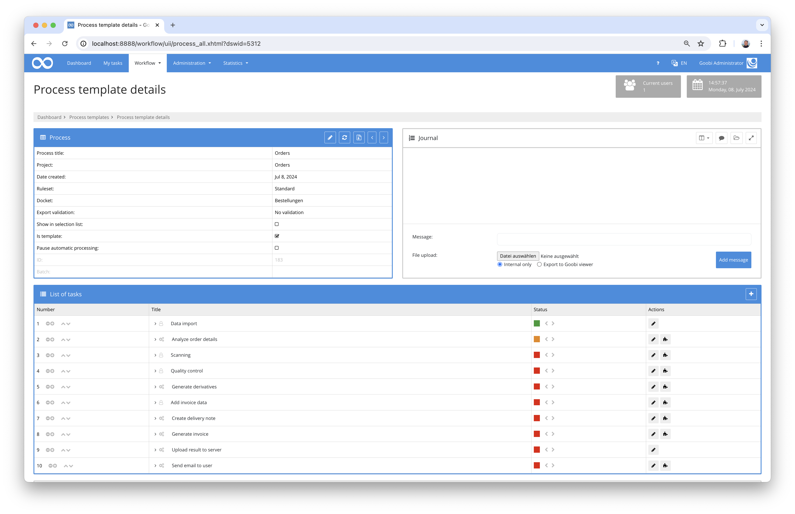
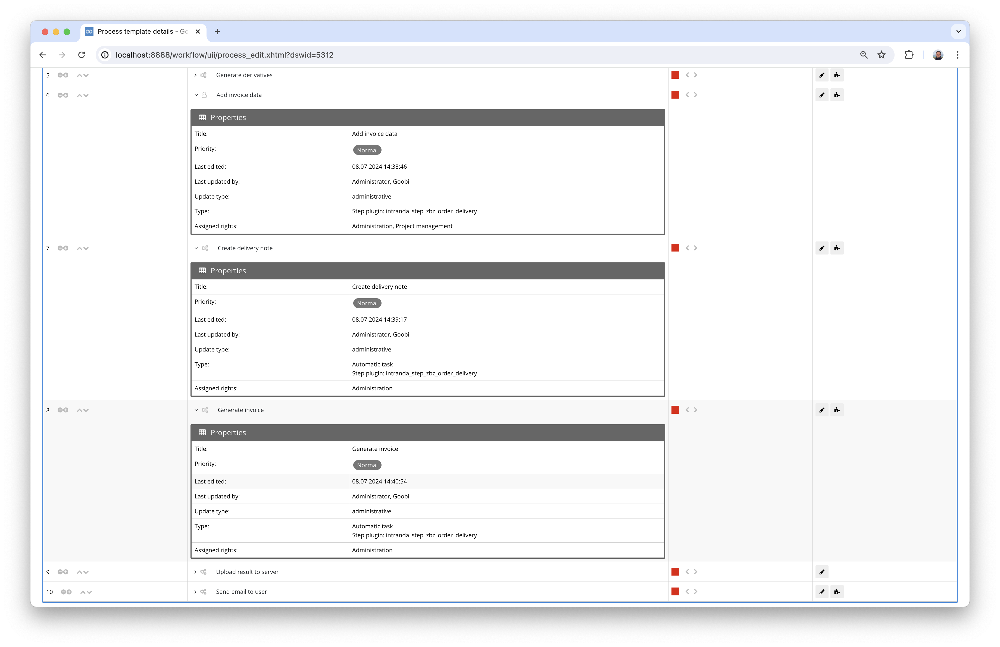
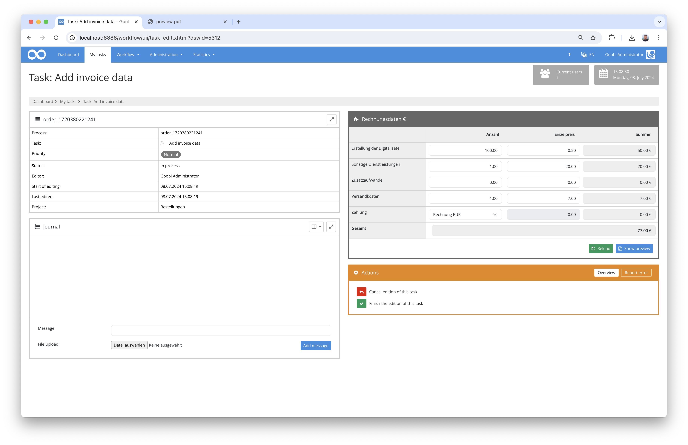
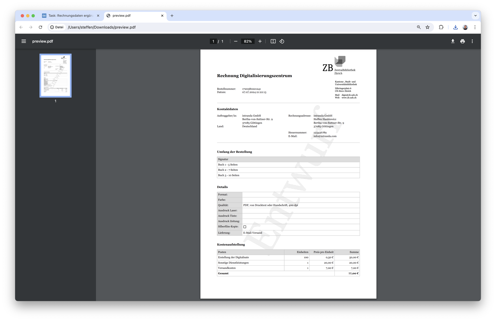

# Invoices and delivery notes for user orders

## Overview

Name                     | Wert
-------------------------|-----------
Identifier               | intranda_step_zbz_order_delivery
GitHub Repository        | https://github.com/intranda/goobi-plugin-step-zbz-order-delivery
Licence              | GPL 2.0 or newer 
Last change    | 13.07.2024 09:56:41


## Introduction
This documentation describes the installation, configuration and use of the Step plug-in for generating delivery notes and invoices for user orders at the Zentralbibliothek Zürich.

## Installation
In order to use the plugin, the following files must be installed:

```bash
/opt/digiverso/goobi/plugins/step/plugin-step-zbz-order-delivery-base.jar
/opt/digiverso/goobi/plugins/GUI/plugin-step-zbz-order-delivery-gui.jar
/opt/digiverso/goobi/config/plugin_intranda_step_zbz_order_delivery.xml
/opt/digiverso/goobi/xslt/delivery_invoice.xsl
/opt/digiverso/goobi/xslt/delivery_note.xsl
/opt/digiverso/goobi/xslt/delivery_preview.xsl
/opt/digiverso/goobi/xslt/letterhead.png
/opt/digiverso/goobi/xslt/preview.png
```

Once the plugin has been installed, it can be selected within the workflow for the respective workflow steps and thus executed manually in some cases and automatically in others. A workflow could look like the following example:



In this exemplary workflow, the plugin is integrated in a total of three workflow steps. The first of these steps provides a user interface for manual processing by a user in order to enter additional invoice data. The other two steps, on the other hand, call up the plugin automatically and generate a delivery note and an invoice in the file system.




## Overview and functionality
The plugin is designed to generate a delivery note and an invoice as PDF files on the basis of an XSL transformation. On the one hand, the data used for this comes from properties that were transferred to Goobi by the user during the order process (e.g. address information, contact details, etc.). On the other hand, additional data is recorded by a processor in Goobi in order to calculate the costs to be invoiced. This data is entered manually in the following form:



The additional data can be entered and customised here. It is also possible at this point to generate a preview of the future invoice after entering the additional invoice data.



Once the data capture step has been completed, the plugin can be integrated further times in the workflow to generate PDF files from the xsl files in accordance with the layout specifications.

In the further course of the workflow, these generated PDF files, whose storage path and naming can be defined within the configuration file, can be sent to the user by e-mail, for example.

## Configuration
The plugin is configured in the file `plugin_intranda_step_zbz_order_delivery.xml` as shown here:

```xml
<config_plugin>
    <!--
        order of configuration is:
          1.) project name and step name matches
          2.) step name matches and project is *
          3.) project name matches and step name is *
          4.) project name and step name are *
	-->
    
    <config>
        <!-- which projects to use for (can be more then one, otherwise use *) -->
        <project>*</project>
        <step>*</step>
        
        <!-- use debug mode if the temporary xml shall be saved in the Goobi tmp folder -->
		<debugMode>true</debugMode>
		
		<!-- Name of xsl file inside of the goobi xslt-folder that shall be used for the PDF generation -->
		<xslt>delivery_note.xsl</xslt>

		<!-- into which folder shall the generated PDF be stored, possible values are master|media|jpeg|source|delivery|invoice|... 
			make sure that the folder is configured inside of goobi_config.properties like this:
			
			process.folder.images.delivery={processtitle}_delivery
			process.folder.images.invoice={processtitle}_invoice	
		-->
		<resultFolder>delivery</resultFolder>
        
		<!-- Name of result pdf file that shall be generated -->
		<resultFile>delivery_note.pdf</resultFile>
    </config>

	<config>
        <!-- which projects to use for (can be more then one, otherwise use *) -->
        <project>*</project>
        <step>Rechnung</step>
		
        <!-- use debug mode if the temporary xml shall be saved in the Goobi tmp folder -->
		<debugMode>true</debugMode>
		
		<!-- Name of xsl file inside of the goobi xslt-folder that shall be used for the PDF generation -->
		<xslt>delivery_invoice.xsl</xslt>

		<!-- into which folder shall the generated PDF be stored, possible values are master|media|jpeg|source|delivery|invoice|... 
			make sure that the folder is configured inside of goobi_config.properties like this:
			
			process.folder.images.delivery={processtitle}_delivery
			process.folder.images.invoice={processtitle}_invoice	
		-->
		<resultFolder>delivery</resultFolder>
        
		<!-- Name of result pdf file that shall be generated -->
		<resultFile>delivery_invoice.pdf</resultFile>
    </config>

	<config>
        <!-- which projects to use for (can be more then one, otherwise use *) -->
        <project>*</project>
        <step>Rechnungsdaten ergänzen</step>
        
        <!-- use debug mode if the temporary xml shall be saved in the Goobi tmp folder -->
		<debugMode>true</debugMode>
		
		<!-- Name of xsl file inside of the goobi xslt-folder that shall be used for the PDF generation -->
		<xslt>delivery_preview.xsl</xslt>

		<!-- into which folder shall the generated PDF be stored, possible values are master|media|jpeg|source|delivery|invoice|... 
			make sure that the folder is configured inside of goobi_config.properties like this:
			
			process.folder.images.delivery={processtitle}_delivery
			process.folder.images.invoice={processtitle}_invoice	
		-->
		<resultFolder>delivery</resultFolder>
        
		<!-- Name of result pdf file that shall be generated -->
		<resultFile>delivery_preview.pdf</resultFile>
    </config>

</config_plugin>

```

### General parameters 
The `<config>` block can occur repeatedly for different projects or work steps in order to be able to perform different actions within different workflows. The other parameters within this configuration file have the following meanings: 

| Parameter | Explanation | 
| :-------- | :---------- | 
| `project` | This parameter defines which project the current block `<config>` should apply to. The name of the project is used here. This parameter can occur several times per `<config>` block. | 
| `step` | This parameter controls which work steps the `<config>` block should apply to. The name of the work step is used here. This parameter can occur several times per `<config>` block. | 


### Further parameters 
In addition to these general parameters, the following parameters are available for further configuration: 


Parameter         | Explanation
------------------|----------------------------------------
`debugMode`       | This parameter can be used to specify that when an invoice or delivery note is generated, an XML file is stored within Goobi's tmp folder which provides an insight into the calculation basis for the invoice.
`xslt`            | Enter the name of the 'xsl file' to be used to create the PDF file.
`resultFolder`    | Specify the directory where the PDF file is to be saved here.
`resultFile`      | Define the name of the PDF file to be generated here.