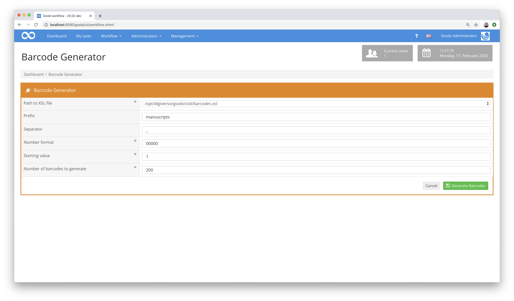
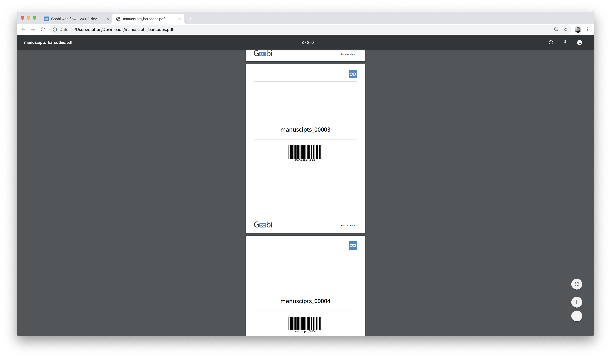

# Barcode Generator

## Overview

Name                     | Wert
-------------------------|-----------
Identifier               | intranda_workflow_barcode_generator
Repository               | [https://github.com/intranda/goobi-plugin-workflow-barcode-generator](https://github.com/intranda/goobi-plugin-workflow-barcode-generator)
Licence              | GPL 2.0 or newer 
Last change    | 24.07.2024 20:12:06


## Introduction
This workflow plugin is used for flexible generation of barcodes in a multi-page PDF file. For this purpose, the user can configure different values in a user interface and define which number of barcodes with which prefix and which counter should be generated. At the same time, the user can specify which `XSL file` is to be used to generate the `PDF file`, thus allowing a large degree of freedom with regard to the optical design.


## Installation
To install the plugin the following two files must be installed:

```bash
/opt/digiverso/goobi/plugins/workflow/plugin-intranda-workflow-barcode-generator-base.jar
/opt/digiverso/goobi/plugins/GUI/plugin-intranda-workflow-barcode-generator-gui.jar
```

To configure how the plugin should behave, different values can be adjusted in the configuration file. The configuration file is usually located here:

```bash
/opt/digiverso/goobi/config/plugin_intranda_workflow_barcode-generator.xml
```

The content of this configuration file looks like this:

```xml
<config_plugin>

    <!--  default value for the number format -->
    <format>00000</format>

    <!--  default value for the amount of barcodes to be generated -->
    <amount>200</amount>

    <!--  default value the first barcode number -->
    <start>1</start>

    <!--  default value the first barcode number -->
    <prefix></prefix>

    <!--  default separator to use between prefix and counter,
    if the prefix is empty this separator does not get used -->
    <separator>_</separator>

    <!-- path to xslt file for barcode generation,
    this value can exist multiple times and gets displayed as dropdown list -->
    <xslt-path>/opt/digiverso/goobi/xslt/barcodes.xsl</xslt-path>

</config_plugin>
```


## Overview and functionality
If the plugin has been installed and configured correctly, it can be found within the menu item Workflow. After entering it, the parameters described above can be adjusted individually in the interface.



After clicking the Generate Barcodes button, a PDF file is available for download. A PDF file with the reference configuration listed here looks like this:



To illustrate the operation, a screencast for the use of the plugin is available here:

[Screencast on how to use the plugin](https://www.youtube.com/watch?v=Eh8H4k1sKvE)


## Configuration

### General configuration of the plugin
The plugin is configured within the configuration file mentioned above. There you can define default values for different fields. These are as follows:

| Value | Description |
| :--- | :--- |
| `format` | This parameter determines whether the counters should be padded with leading zeros. For example, the value `00000` specifies that all numbers are displayed with at least five digits. |
| `amount` | This parameter determines how many barcodes are defined. |
| `start` | If the counter for the barcodes is to start at a certain starting value, this value can be defined here. |
| `prefix` | This parameter defines a prefix that is prefixed to the counter with an underscore `_`. |
| `separator` | With this parameter you can specify a separator to be used between the prefix and the counter. If the prefix is not specified, the separator is not used. |
| `xslt-path` | The parameter `xslt-path` allows the definition of any number of xsl files. The files configured here are then offered to the user for selection within the user interface. |


### Layout of the barcodes
The barcodes are generated on the basis of so-called [XSLT transformation](https://www.w3schools.com/xml/xsl_transformation.asp). For this purpose, a PDF file is generated on the basis of an XSL file and then offered for download. The definition of how the PDF file to be generated should look like and which contents it displays and how is done within such an XSL file. Just like the other XSL files that Goobi workflow already uses to generate the routing slips, the XSL files should ideally be located in the central `xslt` directory of Goobi. This is usually located here:

```bash
/opt/digiverso/goobi/xslt/
```

This folder usually contains several such XSL files. The reference file for the structure of the generated barcodes is located in this file, which is also installed as part of the plug-in installation:

```bash
/opt/digiverso/goobi/xslt/barcodes.xsl
```

It has the following content:

```xml
<?xml version="1.0" encoding="iso-8859-1"?>
<xsl:stylesheet xmlns:xsl="http://www.w3.org/1999/XSL/Transform" xmlns:fo="http://www.w3.org/1999/XSL/Format"
    xmlns:goobi="http://www.goobi.io/logfile" version="1.1" exclude-result-prefixes="fo">
    <xsl:output method="xml" indent="yes" />
    <xsl:template match="goobi:process">
        <fo:root xmlns:fo="http://www.w3.org/1999/XSL/Format">

            <!-- general layout -->
            <fo:layout-master-set>
                <fo:simple-page-master master-name="page" page-width="14.8cm" page-height="21.0cm" margin-left="1cm" margin-top="0.7cm"
                    margin-right="1cm">
                    <fo:region-body />
                </fo:simple-page-master>
            </fo:layout-master-set>

            <!-- run through each item to generate a new page with a barcode -->
            <xsl:for-each select="goobi:item">
                <fo:page-sequence master-reference="page">
                    <fo:flow flow-name="xsl-region-body" font-family="opensans, unicode">

                        <!-- Institution logos -->
                        <fo:block text-align="right">
                            <fo:external-graphic src="/opt/digiverso/goobi/xslt/logo_favicon.png" content-width="10mm" top="0cm"/>
                        </fo:block>

                        <!-- Separator -->
                        <fo:block border-top-width="1pt" border-top-style="solid" border-top-color="#cccccc" margin-top="7pt" />

                        <!-- identifier as readable text -->
                        <fo:block text-align="center" font-weight="bold" font-size="20pt" margin-top="160pt">
                            <xsl:value-of select="." />
                        </fo:block>

                        <!-- Separator -->
                        <fo:block border-top-width="1pt" border-top-style="solid" border-top-color="#cccccc" margin-top="20pt" margin-bottom="20pt" />

                        <!-- Barcode generation -->
                        <xsl:variable name="barcode" select="." />
                        <fo:block text-align="center">
                            <fo:instream-foreign-object>
                                <barcode:barcode xmlns:barcode="http://barcode4j.krysalis.org/ns" message="{$barcode}">
                                    <barcode:code128>
                                        <barcode:module-width>0.21mm</barcode:module-width>
                                        <barcode:height>20mm</barcode:height>
                                    </barcode:code128>
                                </barcode:barcode>
                            </fo:instream-foreign-object>
                        </fo:block>

                        <!-- Separator -->
                        <fo:block border-top-width="1pt" border-top-style="solid" border-top-color="#cccccc" margin-top="195pt" margin-bottom="10pt" />

                        <!-- Goobi logo -->
                        <fo:block-container position="fixed" left="1cm" top="19.5cm">
                            <fo:block>
                                <fo:external-graphic src="/opt/digiverso/goobi/xslt/logo.png" content-width="22mm" />
                            </fo:block>
                        </fo:block-container>

                        <!-- Goobi URL -->
                        <fo:block-container position="fixed" left="11.85cm" top="20.0cm">
                            <fo:block font-size="7pt">
                                https://goobi.io
                            </fo:block>
                        </fo:block-container>

                    </fo:flow>
                </fo:page-sequence>
            </xsl:for-each>
        </fo:root>
    </xsl:template>
</xsl:stylesheet>
```