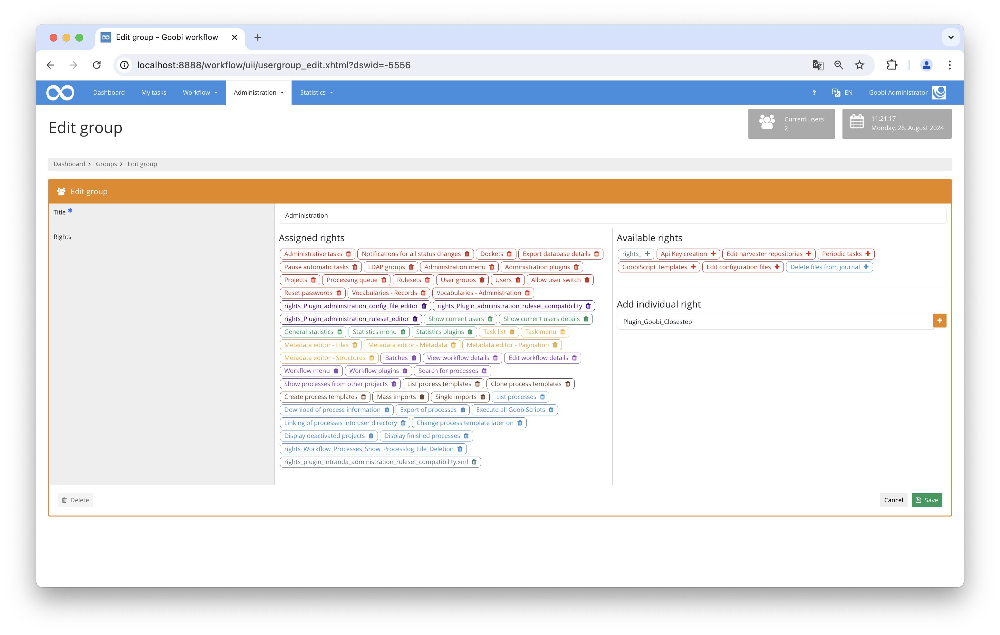
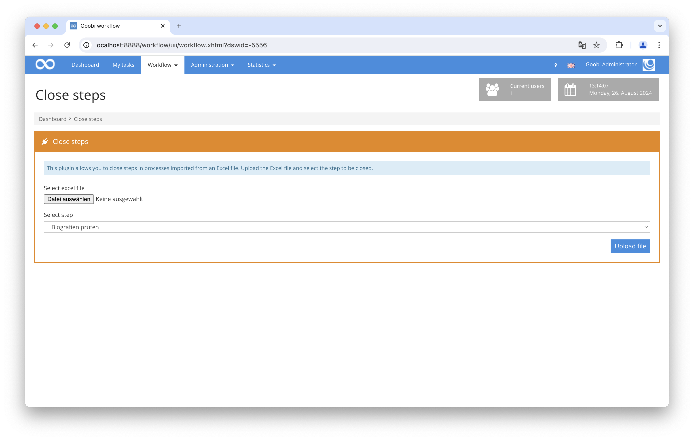

# Close steps

## Overview

Name                     | Wert
-------------------------|-----------
Identifier               | intranda_workflow_close_step
Repository               | [https://github.com/intranda/goobi-plugin-workflow-close-step](https://github.com/intranda/goobi-plugin-workflow-close-step)
Licence              | GPL 2.0 or newer 
Last change    | 04.09.2024 08:55:01


## Introduction
This workflow plugin makes it possible to close a specific step in several processes at the same time. The steps available for this are defined beforehand in a configuration file and are available for selection later on the web interface. The processes in which the selected step is to be closed are specified via file upload.

## Installation
The following files must be installed for the installation:

```bash
/opt/digiverso/goobi/plugins/workflow/plugin_intranda_workflow_closestep.jar
/opt/digiverso/goobi/plugins/GUI/plugin_intranda_workflow_closestep-GUI.jar
```

To set the closable steps for the plugin, the following configuration file must be created and customized:

```bash
/opt/digiverso/goobi/config/plugin_intranda_workflow_closestep.xml
```

To use this plugin, the user must have the correct role permission.

Therefore, please assign role `Plugin_Goobi_Closestep` to the group.




## Overview and functionality
If the plugin has been installed and configured correctly, it can be found under the `Workflow` menu item.



First, an Excel file is uploaded in `XLS` or `XLSX` format to specify the desired processes. This contains a listing of all IDs of the desired processes.

The easiest way to get such a file is to compile a list of the processes you want on the 'Search processes' page and export the result from the 'Processes' page to an Excel file.

**Important:** Make sure that `Select all fields` is selected, otherwise the file will not contain the required IDs in the second column and will not be compatible with this plugin.

Next, the step to be closed is selected. A drop-down menu is available for this purpose, which offers all the steps specified in the configuration file.

Now click on `Upload file`.

If the Excel file does not contain any task IDs, a corresponding error message is now displayed.

Otherwise, a list with all processes will now appear. Depending on whether a step can be closed, is already closed, or cannot be closed for certain reasons, an appropriate box is now displayed. If there are error messages, the list of error messages within an operation is expandable.

If there are closable steps, these are closed with a click on "Close steps" and the boxes for the corresponding steps change from "Can be closed" to "Is closed".

You can optionally download the list of status and error descriptions as an Excel file.

## Configuration
The plugin is configured in the file `plugin_intranda_workflow_closestep.xml` as shown here:

```xml
<config_plugin>
	<maximum_megabyte_per_file mb="5" />
	<!-- The status may be LOCKED, OPEN, INWORK, DONE, ERROR or DEACTIVATED -->
	<step_to_close name="Biografien prüfen">
		<condition stepname="Einspielen der Images" status="OPEN" />
		<condition stepname="Archivierung" status="DONE" />
	</step_to_close>
	<step_to_close name="Qualitätskontrolle">
		<condition stepname="Einspielen der Images" status="OPEN" />
		<condition stepname="Archivierung" status="DONE" />
	</step_to_close>
	<step_to_close name="Export in viewer">
		<condition stepname="Archivierung" status="DONE" />
		<condition stepname="Einspielen der Images" status="DONE" />
		<condition stepname="Bibliographische Aufnahme" status="DONE" />
	</step_to_close>
</config_plugin>
```

The following table contains a summary of the parameters and their descriptions:

Parameter               | Explanation
------------------------|------------------------------------
| :--- | :--- |
| `config_plugin` | This is the main element in the configuration file and must occur exactly once. It contains all configurations. |
| `maximum_megabyte_per_file` | The maximum allowed file size in megabytes can be specified here in the `mb` parameter. If the file upload exceeds this size, an error message is returned. |
| `step_to_close` | These code blocks each draw exactly one step to be available for selection on the user interface for closing. The `name` parameter specifies the name of the step to be closed. |
| `condition` | These sub-elements of `step_to_close` can be used to specify the preconditions for closing the respective step. For this purpose, the parameters `stepname` and `status` are used to specify the required state of another step. The status is always written in capital letters. |

The step specified in `stepname` is another step that must exist in each operation where the step selected by the user is to be closed. This step must also be in a certain state. This is selected from the following list:

| Status | Description |
| :--- | :--- |
| `DEACTIVATED` | Deactivated |
| `DONE` | Completed |
| `ERROR` | Error |
| `INWORK` | In process |
| `LOCKED` | Locked |
| `OPEN` | Open |