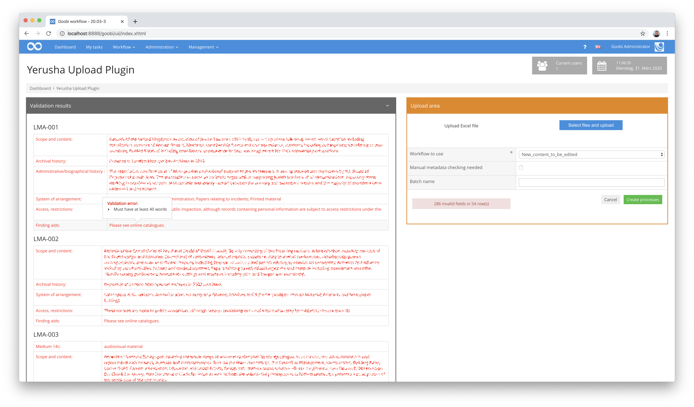

# Generic import plugin for excel files including validation

## Overview

Name                     | Wert
-------------------------|-----------
Identifier               | intranda_workflow_excelimport
Repository               | [https://github.com/intranda/goobi-plugin-workflow-excel-import](https://github.com/intranda/goobi-plugin-workflow-excel-import)
Licence              | GPL 2.0 or newer 
Last change    | 24.07.2024 20:14:01


## Introduction
This workflow plugin was implemented in order to provide an individual user interface in addition to the pure import routine, which provides extensive feedback on the validation of the content before it is actually imported.


## Installation
To configure how this import plugin imports an Excel file different values in its configuration file can be adapted. The configuration file is located here:

```bash
/opt/digiverso/goobi/config/plugin_intranda_workflow_excelimport.xml
```

## Configuration
The content of the configuration file looks like this:

```xml
<config_plugin>

    <!-- which file types shall be allowed for uploading these -->
    <allowed-file-extensions>/(\\.|\\/)(xls|xlsx)$/</allowed-file-extensions>

    <qaStepName>Quality assurance</qaStepName>

    <config>
        <!-- publication type to create -->
        <publicationType>Collection</publicationType>
        <!-- which digital collection to use -->

        <collection>General</collection>
        <rowIdentifier>2</rowIdentifier>
        <!-- define in which row the header is written, usually 1 -->
        <rowHeader>3</rowHeader>
        <!-- define in which row the data starts, usually 2 -->
        <rowDataStart>4</rowDataStart>
        <!-- define in which row the data ends, usually 20000 -->
        <rowDataEnd>100</rowDataEnd>

        <identifierHeaderName>1</identifierHeaderName>
        <!-- This block defines which column is mapped to which metadatum and what kind of validation it will be checked against
        Format: <metadata {list of attributes}/>

        Possible attributes include:
            - ugh: the name of the metadatum as defined in the ruleset
            - identifier: this metadatum will be associated with the column containing this in the row configured as <rowIdentifier> above

        Further there are a variety of possible validation criteria:
            - required: if this is set to true every cell of this metadatum will be expected to have some content
            - pattern: the contents of this attribute are interpreted as a regular expression, every cell of this metadatum is checked against it, note that in these regular expressions "," and "\" have to be escaped by "\", e.g. the expression for a single digit would be "\\d"
            - list: content of this attribute is expected to be the path to a plain text file with one expression per line, cells of this metadatum are checked to match one line of this file, cells may contain several elements of the list separated by "; "
            - either: checks that either this metadatum or the one provided by its identifier in this attribute have content
            - requiredFields: allows to configure fields that must have content before this metadatum is allowed to have content, takes a list of identifiers separated by "; "
            - wordcount: checks that a certain number of words are in the field

        Additionally it is possible to configure specific error messages for every validation criterion which are then displayed as a Mouse over Text in the validation area for any fields that failed a validation:
            - requiredErrorMessage: displayed if cell has no content despite being "required
            - patternErrorMessage: dispayed if cell contents do not match provided regex "pattern"
            - listErrorMessage: displayed if cell contents are not in provided "list"
            - eitherErrorMessage: displayed if neither this cell or the one configured as "either" have content
            - requiredFieldsErrorMessage: displayed if a cell had contents despite at least one of the ones listed as "requiredFields" being empty
            - wordcountErrorMessage: displayed if a cell has less Words than required
-->
        <metadata ugh="CatalogIDDigital" identifier="1" required="true" requiredErrorMessage="Field is required" pattern="^[A-Z]*-\\d*$" patternErrorMessage="Needs to be of the Format AAA-000" />
        <metadata ugh="Country" identifier="2" required="true" requiredErrorMessage="Field is required" list="/opt/digiverso/goobi/config/plugin_intranda_workflow_excelimport_ISO3166-1.txt" listErrorMessage="Content not in list of valid options"/>
        <metadata ugh="Institution" identifier="3" required="true" requiredErrorMessage="Field is required" />
        <metadata ugh="InstitutionOfficial" identifier="4" required="true" requiredErrorMessage="Field is required" />
        <metadata ugh="LanguageInstitution" identifier="4a" required="true" requiredErrorMessage="Field is required" list="/opt/digiverso/goobi/config/plugin_intranda_workflow_excelimport_ISO639-2.txt" listErrorMessage="Content not in list of valid options"/>
        <metadata ugh="ContactPostal" identifier="5a"  required="true" requiredErrorMessage="Field is required" />
        <metadata ugh="ContactPhone" identifier="5b" required="true" requiredErrorMessage="Field is required" pattern="^[\\d-+() ]*$" patternErrorMessage="May only contain numbers, +, -, ( and )"/>
        <metadata ugh="ContactWeb" identifier="5c" required="true" requiredErrorMessage="Field is required" pattern="^(https?|ftp|file)://[-a-zA-Z0-9+&amp;@#/%?=~_|!:\,.;]*[-a-zA-Z0-9+&amp;@#/%=~_|]" patternErrorMessage="Must be valid web address"/>
        <metadata ugh="ContactEmail" identifier="5d" required="true" requiredErrorMessage="Field is required" pattern="(?:[a-z0-9!#$%&amp;'*+/=?^_`{|}~-]+(?:\\.[a-z0-9!#$%&amp;'*+/=?^_`{|}~-]+)*|\&quot;(?:[\\x01-\\x08\\x0b\\x0c\\x0e-\\x1f\\x21\\x23-\\x5b\\x5d-\\x7f]|\\\\[\\x01-\\x09\\x0b\\x0c\\x0e-\\x7f])*\&quot;)@(?:(?:[a-z0-9](?:[a-z0-9-]*[a-z0-9])?\\.)+[a-z0-9](?:[a-z0-9-]*[a-z0-9])?|\\[(?:(?:25[0-5]|2[0-4][0-9]|[01]?[0-9][0-9]?)\\.){3}(?:25[0-5]|2[0-4][0-9]|[01]?[0-9][0-9]?|[a-z0-9-]*[a-z0-9]:(?:[\\x01-\\x08\\x0b\\x0c\\x0e-\\x1f\\x21-\\x5a\\x53-\\x7f]|\\\\[\\x01-\\x09\\x0b\\x0c\\x0e-\\x7f])+)\\])$" patternErrorMessage="Must be valid Email address"/>
        <metadata ugh="ReferenceNumber" identifier="6a" required="true" requiredErrorMessage="Field is required" />
        <metadata ugh="ReferenceNumberType" identifier="6b" required="true" requiredErrorMessage="Field is required" />
        <metadata ugh="TitleDocMain" identifier="7" required="true" requiredErrorMessage="Field is required" />
        <metadata ugh="TitleDocMainOfficial" identifier="8" required="true" requiredErrorMessage="Field is required"/>
        <metadata ugh="TitleDocMainLanguage" identifier="8a" required="true" requiredErrorMessage="Field is required" list="/opt/digiverso/goobi/config/plugin_intranda_workflow_excelimport_ISO639-2.txt" listErrorMessage="Content not in list of valid options"/>
        <metadata ugh="Creator" identifier="9" required="true" requiredErrorMessage="Field is required" />
        <metadata ugh="DateOfOrigin" identifier="10" either="11" eitherErrorMessage="Either this or 11 must have content" pattern="(^\\d{4}$|^\\d{4}/\\d{4}$|^\\d{4}-\\d{2}$|^\\d{4}-\\d{2}/\\d{4}-\\d{2}$)" patternErrorMessage="Invalid date Format"/>
        <metadata ugh="DateNote" identifier="11" either="10" eitherErrorMessage="Either this or 10 must have content"/>
        <metadata ugh="DocLanguage" identifier="12" required="true" requiredErrorMessage="Field is required" list="/opt/digiverso/goobi/config/plugin_intranda_workflow_excelimport_ISO639-2.txt" listErrorMessage="Content not in list of valid options"/>
        <metadata ugh="Extent" identifier="13" required="true" requiredErrorMessage="Field is required"/>
        <metadata ugh="MaterialDescription" identifier="14a" required="true" requiredErrorMessage="Field is required" pattern="(^[Aa]udio$|^[Cc]artographic [Mm]aterial$|^[Gg]raphic [Mm]aterial$|^[Pp]hotographic [Ii]mages$|^[Tt]extual [Mm]aterial$|^[Mm]oving [Ii]mages$)" patternErrorMessage="Must be one of Audio\, Cartographic Material\, Graphic Material\, Photographic Images\, Textual Material\, Moving Images"/>
        <metadata ugh="MaterialDescription" identifier="14b" requiredFields="14a" requiredFieldsErrormessage="May only have content if 14a is filled" pattern="(^[Aa]udio$|^[Cc]artographic [Mm]aterial$|^[Gg]raphic [Mm]aterial$|^[Pp]hotographic [Ii]mages$|^[Tt]extual [Mm]aterial$|^[Mm]oving [Ii]mages$)" patternErrorMessage="Must be one of Audio\, Cartographic Material\, Graphic Material\, Photographic Images\, Textual Material\, Moving Images"/>
        <metadata ugh="MaterialDescription" identifier="14c" requiredFields="14a; 14b" requiredFieldsErrormessage="May only have content if 14a and 14b are filled" pattern="(^[Aa]udio$|^[Cc]artographic [Mm]aterial$|^[Gg]raphic [Mm]aterial$|^[Pp]hotographic [Ii]mages$|^[Tt]extual [Mm]aterial$|^[Mm]oving [Ii]mages$)" patternErrorMessage="Must be one of Audio\, Cartographic Material\, Graphic Material\, Photographic Images\, Textual Material\, Moving Images"/>
        <metadata ugh="Condition" identifier="15" required="true" requiredErrorMessage="Field is required" pattern="(^[Gg]ood$|^[Pp]oor$)" patternErrorMessage="Needs to be either good or poor"/>
        <metadata ugh="ScopeContent" identifier="16" required="true" requiredErrorMessage="Field is required" wordcount="400" wordcountErrorMessage="Must have at least 400 words" />
        <metadata ugh="ArchivalHistory" identifier="17" required="true" requiredErrorMessage="Field is required" wordcount="50" wordcountErrorMessage="Must have at least 50 words"/>
        <metadata ugh="AdministrativeHistory" identifier="18" required="true" requiredErrorMessage="Field is required" wordcount="100" wordcountErrorMessage="Must have at least 100 words"/>
        <metadata ugh="AccessLocations" identifier="19a" />
        <metadata ugh="AccessPersons" identifier="19b" />
        <metadata ugh="AccessCorporate" identifier="19c" />
        <metadata ugh="AccessSubject" identifier="19d" />
        <metadata ugh="Arrangement" identifier="20" wordcount="50" wordcountErrorMessage="Must have at least 50 words"/>
        <metadata ugh="AccessRestrictions" identifier="21" wordcount="40" wordcountErrorMessage="Must have at least 40 words"/>
        <metadata ugh="FindingAids" identifier="22" wordcount="40" wordcountErrorMessage="Must have at least 40 words"/>
        <metadata ugh="FindingAidsLink" identifier="22a" pattern="^(https?|ftp|file)://[-a-zA-Z0-9+&amp;@#/%?=~_|!:\,.;]*[-a-zA-Z0-9+&amp;@#/%=~_|]" patternErrorMessage="Must be valid web address"/>
        <metadata ugh="Copies" identifier="23" />
        <metadata ugh="Originals" identifier="24" />
        <metadata ugh="AuthorOfDescription" identifier="25" />
    </config>
</config_plugin>
```

## Overview and functionality
After installing and starting the plugin, it is available within the `Workflow` menu. After the call, an Excel file can be uploaded here, so that all validation messages are immediately visible. You can then decide whether the processes should still be generated in Goobi despite any validation messages or whether the import should be cancelled.



## Configuration

### General configuration of the plugin
Some configurations of the plugin generally apply to all records to be imported. These are as follows:

| Value | Description |
| :--- | :--- |
| `allowed-file-extensions` | The entry `allowed-file-extensions` is used to allow only files of certain formats to be uploaded. It contains a regular expression which is compared with the name of the file to be uploaded, if they do not match, the file cannot be uploaded. |
| `qaStepName` | The entry `qaStepName` is the Name of the quality assurance step in goobi. |
| `publicationType` | The entry `publicationType` is the type of structure Element the Processes generated by this Plugin will contain as the top level. |
| `collection` | The entry `collection` is the name of the Collection the Processes generated by this Plugin will be added to. |
| `rowIdentifier` | The entry `rowIdentifier` determines in which row the plugin will look for text identifying the columns. |
| `rowHeader` | The entry `rowHeader` determines in which row the plugin will look for the name to display with this column. |
| `rowDataStart` | The entry `rowDataStart` tells the plugin which row is the first containing the content to parse. |
| `rowDataEnd` | The entry `rowDataEnd` tells the plugin which row is the last containing content. Rows before this may be empty. |


### Configuration of the individual metadata fields
For each individual metadata, you can specify how it is to be imported. Each field corresponds to the contents of a cell in an Excel column. The following values are possible.

| Value | Description |
| :--- | :--- |
| `identifier` | this tells the plugin which column this entry refers to (e.g. `1`, `2`, `4a` or `14b`) |
| `ugh` | this tells the plugin which metadatum the column should be written to (e.g. `CatalogIDDigital`, `Country or Institution`). In addition to this one may want the plugin to check the fields in a column for certain characteristics, for this there are more optional values: |
| `required` | if this has the value `true`, the plugin knows an entry in this column is required, and will mark rows where there are none (only the value `true` has an effect, others are ignored) |
| `wordcount` | the plugin checks how many words are in this column and marks rows, where there are fewer than required here (e.g. `50` or `100`) |
| `either` | if this has the value of another columns identifier (e.g. `1`, `2`, `4a` or `14b`) the plugin will check that either of them have content or mark both |
| `requiredFields` | similar to either, this is used to tell the plugin another column must have content before there is any allowed in this one, value must be the identifier of another column (e.g. `1`, `2`, `4a` or `14b`) |
| `list` | this entry is used to ensure that this metadatum is from a list of allowed words, the value needs to be the location of a textfile containing the allowed words, rows with content not on the list will be marked(e.g. `1`, `2`, `4a` or `14b`) |
| `pattern` | this entry allows to use regular expressions to compare a metadatum with, the value is the regular expression the contents of this column is compared with, rows not matching will be marked (e.g. `^\\d{4}$` to check that the metadatum consists of exactly 4 digits) |

**Attention:** Please note that columns which do not exist in the excel file (e.g. `14d`) are ignored by the plugin but have to be configured here.