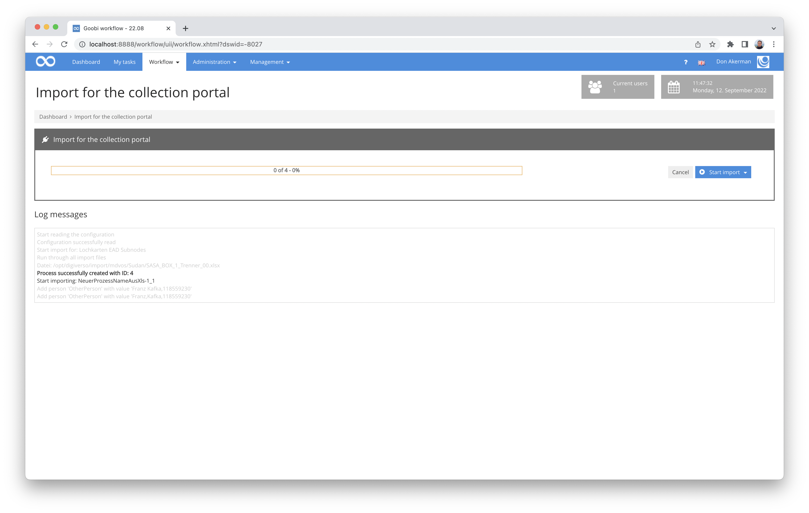

# Mass import from Excel data with EAD enrichment

## Overview

Name                     | Wert
-------------------------|-----------
Identifier               | intranda_workflow_hu_importer
Repository               | [https://github.com/intranda/goobi-plugin-workflow-hu-importer](https://github.com/intranda/goobi-plugin-workflow-hu-importer)
Licence              | GPL 2.0 or newer 
Last change    | 25.07.2024 10:57:59


## Introduction
This workflow plugin for Goobi workflow allows a mass import of metadata from Excel files, creating not only tasks in Goobi, each of which has a METS file. In addition, an existing EAD file is enriched with further nodes. 

This plugin was developed for importing data from the HU Berlin to enrich the collection portal. Usually, at least two different Excel files of different types are used for such an import. Type 1 specifies the metadata for the object itself (TopStruct with metadata such as main title, keywords, etc.) and data for the properties of the operation (e.g. future name of the operation). Type 2, on the other hand, usually specifies those structural elements that are to be created as sub-elements within the METS file and what metadata these are to receive (in the case of HU Berlin, e.g. chapter/hole map, name of a media file, etc.).


## Installation
The plugin consists of the following files:

```bash
plugin-intranda-workflow-hu-importer-base.jar
plugin-intranda-workflow-hu-importer-gui.jar
```

The file `plugin-intranda-workflow-hu-importer-base.jar` must be copied into the following directory:

```bash
/opt/digiverso/goobi/plugins/workflow/
```
The file `plugin-intranda-workflow-hu-importer-gui.jar` must be copied into the following directory:
```bash
/opt/digiverso/goobi/plugins/GUI
```

In addition, there is the configuration file `plugin_intranda_workflow_hu_importer.xml`, which must be stored in the following folder:

```bash
/opt/digiverso/goobi/config/
```


## Overview and functionality
After the installation and commissioning of the plug-in, it is available within the menu 'Workflow'. After calling it up, an ImportSet can be selected and the data import can be started. The plug-in will try to create the folders 'processed' and 'failure' in the 'metadata folder'. It should therefore be ensured that Goobi has write access to this folder. If a file is read in without errors, it is moved to the `processed` folder. If an error occurs, it will be moved to the folder `failure`. 

The plugin can be operated with or without EAD binding. If the EAD binding is not to be used for an ImportSet, the attributes `eadType`, `eadFile` and `eadNode` must simply be omitted in the corresponding `ImportSet`.

The files in the `mediaFolder` are copied to the directories of the created processes during the import.




## Configuration
The plugin is configured via the configuration file `plugin_intranda_workflow_hu_importer.xml` and can be adapted during operation. The following is an example configuration file:

```xml
<config_plugin>

	<!--import set for excel files
	Attributes in [] are optional
		name: name of the import set, which will be displayed in the dropdonwnmenu
		metadataFolder: where are the documents located
		[mediaFolder]: where are the media files located
		workflow: the workflow that shall be used
		[project]: the goobi project that shall be used
		mappingSet: the mapping that shall be used by the import set
		publicationType: the publicationType that shall be used i.e. Monograph,...
		structureType: structureType the metadata will be mapped to
		[importSetDescription]: Path to xls-file with description of importset-files
		[descriptionMappingSet]: Mapping for the importsetdescription file
		[eadType]: Type of the EAD-entry
		[eadFile]: Name of the EAD-file/database
		[eadNode]:"ID of the parent node that this Imporset will use"
		[rowStart]: first row that will be read
		[rowEnd]: last row that will be read
		[processTitleMode]: specifies how the process naming shall be handled
	  -->
    <!-- EAD-> Lochkartei - Grabungsdokumentation Fritz und Ursula Hintze -->
    <importSet name="Lochkarten EAD Subnodes"
		metadataFolder="/opt/digiverso/import/mdvos/Sudan-Trenner/"
		mediaFolder ="/opt/digiverso/import/mdvos/Sudan-Bilder/"
		workflow="Sample_Workflow"
		project="Archive_Project"
		mappingSet="Lochkarten"
		publicationType="Divider"
		structureType="PunchCard"
		importSetDescription="/opt/digiverso/import/mdvos/Sudan-Beschreibungen/SASA_Trenner_Zuordnung.xlsx"
		descriptionMappingSet="Description"
		eadType="folder"
		eadFile="EAD-Store - Sudanarchäologie.xml"
		eadNode="f91585c7-9cd4-47f1-b9e4-5f26a6744fe3"
		eadSubnodeType="file"
		processTitleMode="EAD"
	/>

	<!-- mapping set -> set of fields that describe a mapping
		name = name of the MappingSet

		field - mapping for a row of an excel file
		Attributes in [] are optional
		column: column of the xls-file that will be mapped
        [label]; column header
        [mets] mets of metadata element
        type: person, metadata, media, structureType
        [separator]: default value is ;
        [blankBeforeSeparator]: default value is false
        [blankAfterSeparator]: default value is false
        [ead] name of the ead metadata type
	-->
  <!-- Metadata for each structure element (Punchcard) to be created inside of process (Divider) -->
	<mappingSet name="Lochkarten">
		<field column="D" label="Inventar-Nr" type="metadata" mets="InventoryNumber"/>
		<field column="F" label="Titel" type="metadata" mets="TitleDocMain" ead="unittitle"/>
		<field column="I" label="Material" type="metadata" mets="MaterialDescription"/>
		<field column="J" label="Maße" type="metadata" mets="SizeSourcePrint"/>
		<field column="L,M" label="Datei recto, Datei verso" type="media"/>
		<field column="N" label="Strukturtyp" type="structureType" />
	</mappingSet>


	<!-- General description mapping for each process (Divider) -->
	<mappingSet name="Description">
		<field column="C" label="Dateiname" type="FileName" />
		<field column="E" label="Digitale Collection" type="metadata" mets="singleDigCollection" />
		<field column="F" label="Titel" type="metadata" mets="TitleDocMain"  ead="unittitle"/>
		<field column="H" label="Haupttitel (englisch)" type="metadata" mets="TitleDocMainEN" />
		<field column="J" label="Umfang" type="metadata" mets="physicalDescriptionExtent" />
		<field column="K" label="Datierung/Zeitangabe" type="metadata" mets="OriginationPeriod" ead="unitdate" />
		<field column="L" label="Entstehungsort" type="metadata" mets="PlaceOfOrigin" />
		<field column="M" label="Beteiligte Person 1" type="person" mets="Creator" gndColumn="O" />
		<field column="P" label="Beteiligte Person 2" type="person" mets="Creator" gndColumn="R" />
		<field column="T" label="Zusätzliche Informationen" type="metadata" mets="AdditionalInformation" />
		<field column="U" label="Schlagwort (lokal)" type="metadata" mets="SubjectLocal" />
		<field column="V" label="Formschlagwort" type="metadata" mets="SubjectForm" gndColumn="W" />
		<field column="X" label="Geographisches Schlagwort 1" type="metadata" mets="SubjectGeographic" gndColumn="Y" />
		<field column="Z" label="Geographisches Schlagwort 2" type="metadata" mets="SubjectGeographic" gndColumn="AA" />
		<field column="AB" label="Sachschlagwort 1" type="metadata" mets="SubjectTopic" gndColumn="AC" />
		<field column="AD" label="Sachschlagwort 2" type="metadata" mets="SubjectTopic" gndColumn="AE" />
		<field column="AF,AG" blankAfterSeparator="true" label="Geokoordinaten" type="metadata" mets="Coordinates" />
		<field column="AH" label="Sprache" type="metadata" mets="DocLanguage" />
	</mappingSet>

</config_plugin>
```


### Element types
The plugin initially knows the following element types.

| Element | Description |
| :--- | :--- |
| `config_plugin`  | `config_plugin` is the main element of the configuration file and contains all other elements  |
| `importSet`  | An ImportSet describes similar import processes.   |
| `mappingSet`  |  A MappingSet consists of a set of `field` elements.|
| `field`  | `field` elements are child elements of `mappingSet`. Each element maps a property of the operation to be created or its metadata to a column of the excel document.  |


### Element: importSet
| Attribute | Description |
| :--- | :--- |
| `name` | Name of the ImportSets. This will be displayed later within the user interface. |
|`metadataFolder`| Here it must be specified where the folder with the files is located that are mapped with the MappingSet specified in the attribute `mappingSet`.|
|`mediaFolder`| This optional attribute indicates where the media files are located. |
|`workflow`| Here you must specify which production template is to be used to create the processes. |
|`project`| Here you can specify to which project the activity is to be assigned. The attribute is optional. If no project is specified, the project specified in the production template is used. |
|`mappingSet`| Here it must be specified with which mapping the file in the `metadataFolder` is to be processed.|
|`publicationType`| The publication type of the process (e.g. monograph) |
|`structureType`| The structure type of the elements that are to be created as sub-elements in the process (e.g. chapters or punch cards). Each line of an Excel document of type 2 describes one element of this structure type. |
|`importSetDescription`| This optional attribute specifies where the file containing the metadata for the processes is located. If the parameter is set, a line must be specified in this document for each file in the `metadataFolder`. |
|`descriptionMappingSet`| The MappingSet for the file with the ImportSet description can be specified here. The attribute is optional.|
|`eadType`| Type of the EAD node (e.g. file). The attribute is optional.|
|`eadFile`| Name of the EAD file/database. The attribute is optional.|
|`eadNode`| ID of the parent node below which the new EAD node is to be inserted. The attribute is optional.|
|`rowStart`| Specification for the first line of the Excel file in the metadataFolder to be evaluated. The attribute is optional.|
|`rowEnd`| Specification for the last line of the Excel file in the metadataFolder to be evaluated. The attribute is optional. If `0` is specified as the value, the complete file is evaluated. |
|`processTitleMode`| Here you can specify how the processes to be created are to be named. The modes `FILENAME`, `UUID`, `XLSX` and `EAD` are available for selection. By default, the `UUID` mode is used. If the mode `XLSX` is used, it is expected that a `field` of the type `ProcessName` is present in the configuration element `descriptionMappingSet`. In `FILENAME` mode, the file name is used as the process name. In `UUID` and `EAD` mode, a UUID is generated for the process. In the case of `EAD` mode, this UUID is also used as the ID of the node in the EAD tree. |
|`processPerRow`| If no value has been specified within the configuration of `importSetDescription` and if a process is to be created for each line of the Excel file to be imported, this attribute must be set to `true`. |


### The elements mappingSet and field
An element of the type 'mappingSet' has only the attribute 'name'. This allows it to be directly addressed for mapping. As sub-elements, any number of elements `field` are allowed.

| Attribute | Description |
| :--- | :--- |
|`column`| Column(s) to be mapped. The read value is then assigned to the metadatum defined in the `mets` attribute. Alternatively, the contents of the cell can be mapped to a process property such as the process title if `ProcessName` is specified as the type. If several columns are to be mapped into one value, they can simply be listed separated by commas (e.g. `A,B,AA`). The attribute is mandatory. |
|`label`| The column title can optionally be entered here. It is not evaluated by the plugin and is only used for documentation purposes. |
|`mets`| This attribute determines to which metadata type the read-in value is to be assigned. All values that are a valid metadata for the corresponding structural element according to the rule set are permissible here. |
|`type`| This parameter is mandatory and can take the values: `person`, `metadata`, `media`, `copy`, `FileName` and `ProcessName`. The values are explained in more detail below. |
|`gndColumn`| For mappings whose attribute `type` takes the value `metadata` or `person`, the column containing a authority url describing the record in more detail (e.g. https://d-nb.info/gnd/118551310) can be specified here. The authority record is then linked to the metadata. |
|`separator`| This separator is used when several elements are to be mapped in one value. The default value is `;`.  The attribute is optional.|
|`blankBeforeSeparator`| If the contents of several columns are to be mapped into one value, it can be determined here whether a space is to be set before the separator. The default value is `false`.|
|`blankAfterSeparator`| If the contents of several columns are to be mapped into one value, it can be determined here whether a space is to be set after the separator. The default value is `false`. |
|`ead`| If this parameter is set, the content of the cell is assigned to this EAD metadata type. |
|`target`| Only supported if the value `copy` was used in the `type` attribute. The destination folder for the files to be copied can be specified here. The Goobi variable system is supported here. |
|`structureType`| Supported only if `media` has been used as the value in the `type` attribute. If it is desired that the media files are assigned to a specific structural element to be created, the type of the structural element is specified here. |


### Type attribute values
| Value | Description |
| :--- | :--- |
|`metadata`| An element of type `metadata` is associated with the metadatum specified in the attribute `mets` in the METS file |
| `person`| This is a METS data type. If the type `person` is used, the attribute `mets` should always be set as well. |
|`media`| There must be one or more file names in the specified column. The separator here is normally `,`. However, it can be set differently if required by using the `separator` attribute. It is assumed that the file is located in the directory `mediaFolder`. For more information, see the configuration of `Importset`. |
|`copy` | There must be one or more file names in the specified column. The separator here is normally `,`. However, it can be set differently if required by using the `separator` attribute. It is assumed that the file is located in the directory `mediaFolder`. For more information, see the configuration of `Importset`. The files are moved to the folder specified in the `target` attribute. The `target` attribute also supports the Goobi variable system. |
|`FileName`| This type must be used to specify the process description file name column. This field type is therefore only useful in a `descriptionMappingSet`.  |
|`ProcessName` | This type must be used to specify the column with the future process name.  |
|`PublicationType` | If the type `PublicationType` is used, the value from the cell is used as the publication type. If the cell is empty, the `PublicationType` set in the `ImportSet` attribute is used. The type is only used for creating the top structure item of a process.|
|`structureType`| If the type `structureType` is used, the value from the cell is used as the structure type. If the cell is empty, the `sturctureType` specified in the `ImportSet` attribute is used. The type is only used for creating structure elements of an operation, i.e. its sub-elements. In relation to a book, this corresponds to the title pages and chapters, for example. |