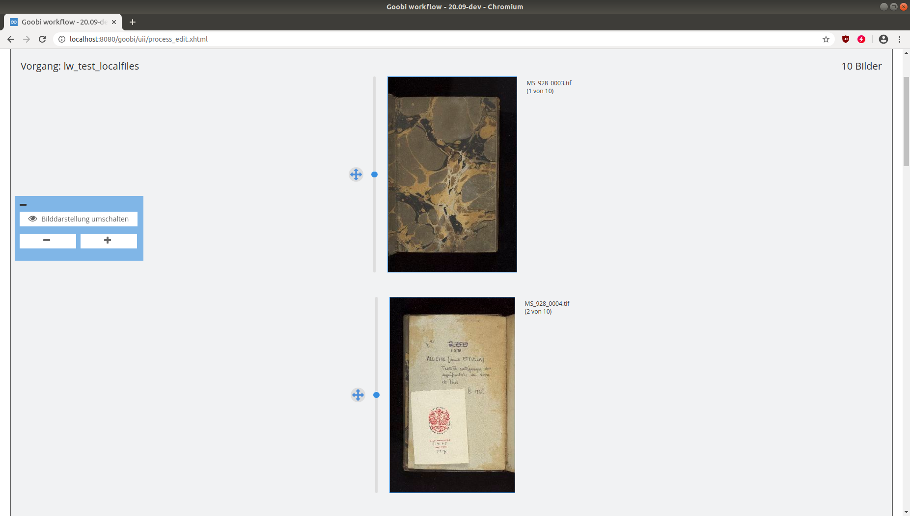

# LayoutWizzard workflow plugin

## Overview

Name                     | Wert
-------------------------|-----------
Identifier               | intranda_workflow_crop
Repository               | [https://github.com/intranda/goobi-plugin-workflow-layoutwizzard](https://github.com/intranda/goobi-plugin-workflow-layoutwizzard)
Licence              | GPL 2.0 or newer 
Last change    | 25.07.2024 11:04:39


## Introduction
This workflow plugin allows you to edit several images from different Goobi processes in a common LayoutWizard interface. To do this, it determines all the processes whose workflow is currently in the open workflow step to be configured and offers a LayoutWizzard correction for them.


## Installation
To install the plugin the following two files must be installed:

```bash
/opt/digiverso/goobi/plugins/workflow/plugin-intranda-workflow-crop-base.jar
/opt/digiverso/goobi/plugins/GUI/plugin-intranda-workflow-crop-gui.jar
```

To configure how the plugin should behave, various values can be adjusted in the configuration file. The configuration file is usually located here:

```bash
/opt/digiverso/goobi/config/plugin_intranda_workflow_crop.xml
```


## Overview and functionality
If the plugin has been correctly installed and configured, it can be found within the menu item `Workflow`. After entering the plugin, a LayoutWizzard preview view is opened, which is very similar to the [Step plugin for Layoutwizzard](https://docs.goobi.io/goobi-workflow-plugins-en/step/layoutwizzard/01_use/01_preview).



The operation of this plugin is largely identical to that of the regular LayoutWizard within the preview mode. The only difference worth mentioning here is the presentation of the individual processes, which are visually separated from each other and can be completed by a simple click on the corresponding button. The display of the images is then updated and shows the next process.


## Configuration
The content of the configuration file is as follows:

```xml
<config>
    <!-- this step must be open in a process for the process to appear in the plugin-->
    <allowed-step>
        LayoutWizzard
    </allowed-step>
    <singleImage>
        <cropFrame>
            <linewidth>2</linewidth>
            <linecolor>#00fa9a</linecolor>
            <fillcolor>#ffffff</fillcolor>
            <clickradius>20</clickradius>
            <fillcolor>#ffffff</fillcolor>
        </cropFrame>
        <spineMarker>
            <linewidth>2</linewidth>
            <linecolor>#ff0000</linecolor>
            <fillcolor>#ffffff</fillcolor>
            <clickradius>20</clickradius>
        </spineMarker>
    </singleImage>
    <!-- Config for appearance of images in preview mode -->
    <preview>
        <cropFrame>
            <linewidth>2</linewidth>
            <linecolor>#368EE0</linecolor>
            <fillcolor>#f1f2f3</fillcolor>
            <clickradius>20</clickradius>
            <fillcolor>#f1f2f3</fillcolor>
        </cropFrame>
        <spineMarker>
            <linewidth>2</linewidth>
            <linecolor>#ff0000</linecolor>
            <fillcolor>#f1f2f3</fillcolor>
            <clickradius>10</clickradius>
        </spineMarker>
    </preview>

    <previewCroppingOptions>
        <show>true</show>
    </previewCroppingOptions>
</config>
```