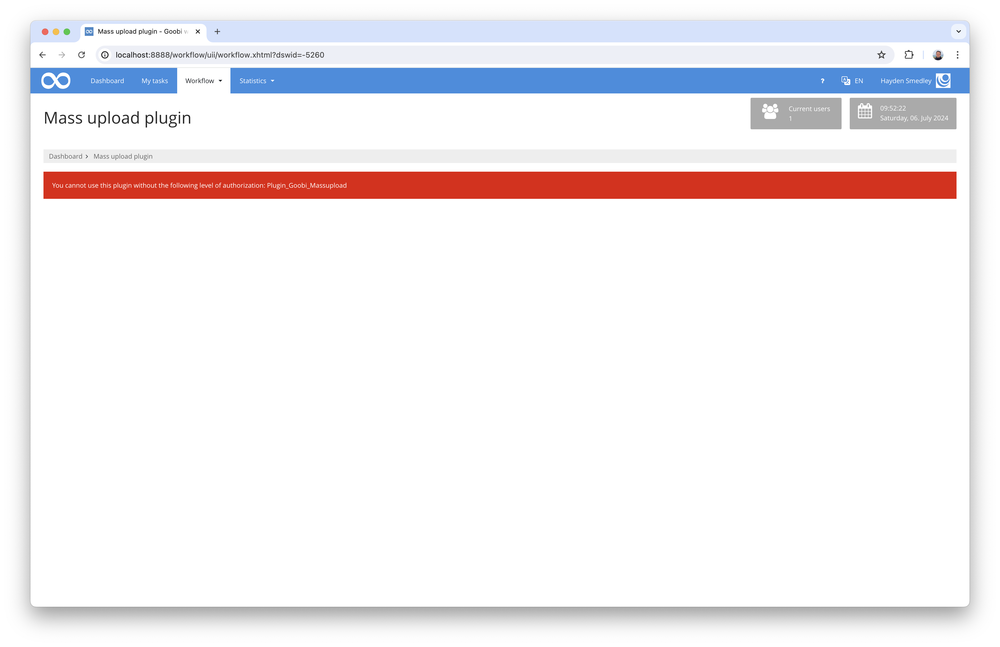
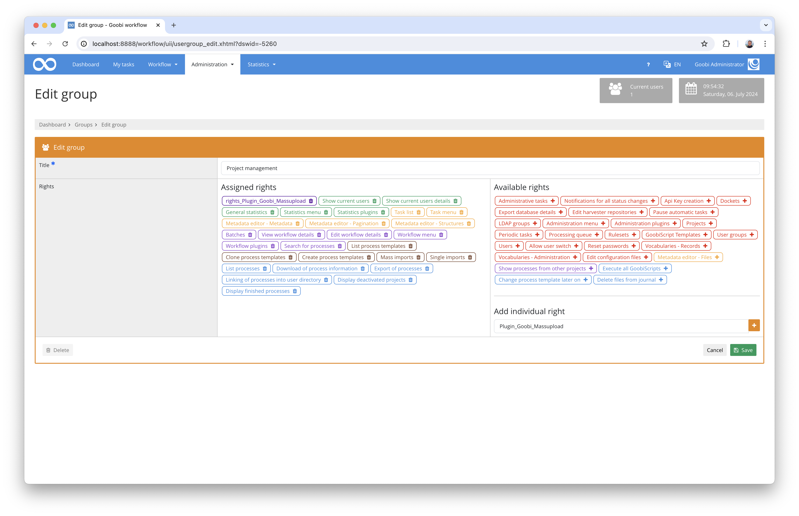
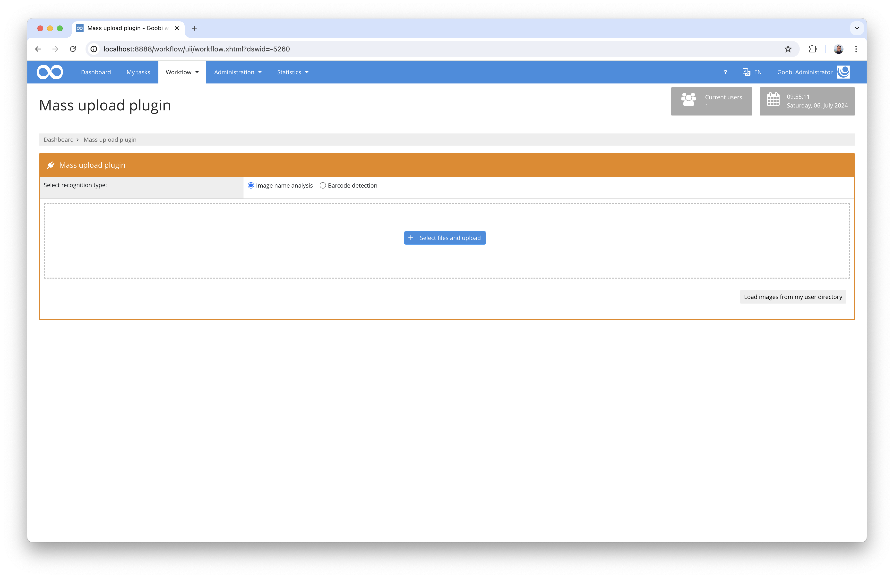
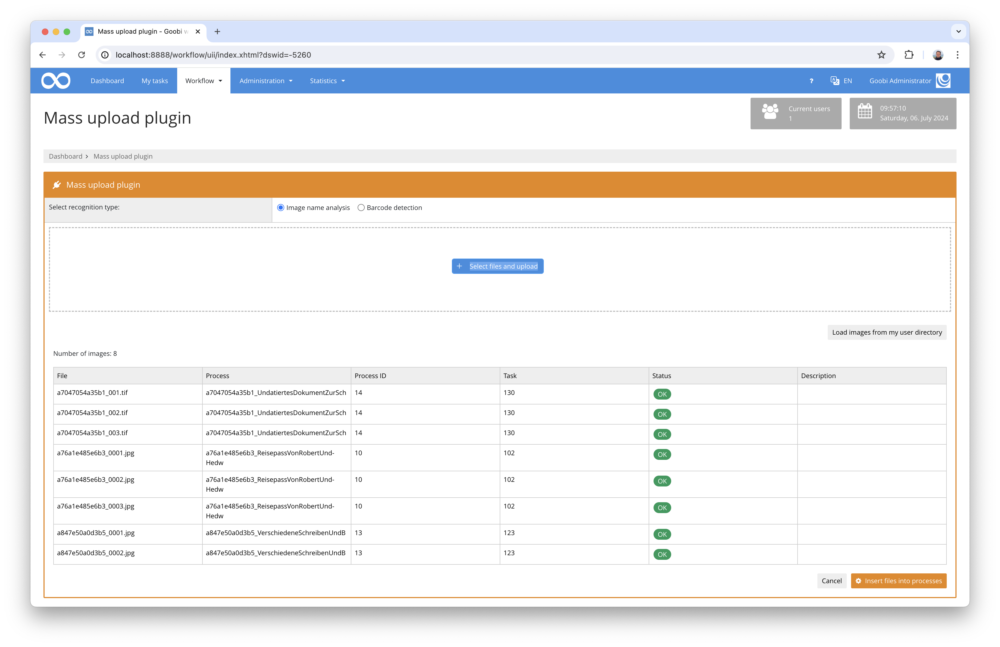
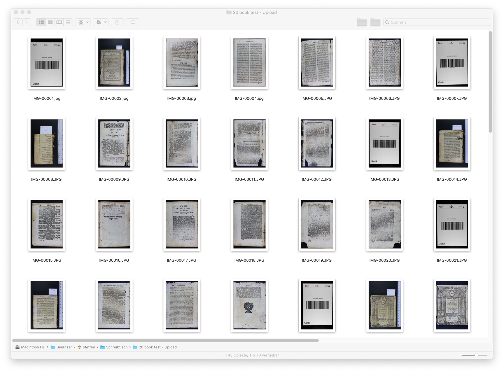

# Mass upload

## Overview

Name                     | Wert
-------------------------|-----------
Identifier               | intranda_workflow_massupload
Repository               | [https://github.com/intranda/goobi-plugin-workflow-mass-upload](https://github.com/intranda/goobi-plugin-workflow-mass-upload
Licence              | GPL 2.0 or newer 
Last change    | 13.07.2024 09:56:33


## Introduction
This workflow plugin allows the mass upload of files that are to be automatically assigned to the correct processes by Goobi workflow. The plugin provides its own interface for this purpose, which either allows uploading directly via the web interface or, alternatively, can also read images from the user directory. These images are checked by the plugin for their name in order to determine the corresponding Goobi process. If the process can be identified unambiguously and the Goobi process identified is also in the configured workflow step, the images are assigned to this step and the workflow is processed further.

In addition to assigning the files based on the file name, it is also possible to configure an image analysis that reads barcodes instead. This makes it possible for images of several processes to be named consecutively, for example, and only a separator sheet needs to be included between the images. All images after such a separator sheet with an identifiable barcode are assigned to the respective process until the next barcode in the file stack is determined.

## Installation
To install the plugin, the following two files must be installed:

```bash
/opt/digiverso/goobi/plugins/workflow/plugin_intranda_workflow_massupload.jar
/opt/digiverso/goobi/plugins/GUI/plugin_intranda_workflow_massupload-GUI.jar
```

To configure how the plugin should behave, various values can be adjusted in the configuration file. The configuration file is usually located here:

```bash
/opt/digiverso/goobi/config/plugin_intranda_workflow_massupload.xml
```

To use this plugin, the user must have the correct role authorisation.



Therefore, please assign the role `Plugin_Goobi_Massupload` to the group.




## Overview and functionality
If the plugin has been installed and configured correctly, it can be found under the 'Workflow' menu item.



At this point, files can either be uploaded or read from the user directory. After analysing the file names or images, Goobi workflow shows which processes the uploaded images can be assigned to.



Click on the `Import files into processes` button to move the images to the directories of the recognised processes and continue the workflow.

Please note: If barcodes are to be recognised in order to determine the processes, it is important that the barcodes are also available in sufficient size and quality for the recognition to be successful.




## Configuration
The plugin is configured in the file `plugin_intranda_workflow_massupload.xml` as shown here:

```xml
<config_plugin>

	<!-- which file types shall be allowed for uploading these -->
	<allowed-file-extensions>/(\.|\/)(gif|jpe?g|png|tiff?|jp2|pdf)$/</allowed-file-extensions>

	<!-- name of the folder inside of a users home directory to use as alternative for web upload -->
	<user-folder-name>mass_upload</user-folder-name>

	<!-- define the method how to detect the processes from the uploaded images the following methods are available:
		- "filename" to use the filenames for matching the right Goobi processes
		- "barcode" to detect barcodes inside of the images to assign to the right Goobi processes up to the next barcode page
		- "user" to let the user decide between filename or barcode detection -->
	<detection-type>filename</detection-type>

	<!-- copy images using goobi script in the background (true or false) -->
	<copy-images-using-goobiscript>false</copy-images-using-goobiscript>

	<!-- which workflow step has to be open to allow the upload into the process -->
	<allowed-step>Scanning</allowed-step>
	<allowed-step>Upload</allowed-step>

	<!-- which part of the files shall be used to find the right process (prefix, suffix or complete) -->
	<filename-part>prefix</filename-part>
	<filename-separator>_</filename-separator>

    <!-- define if the process title must contain the value or must match the exact title (contains or exact)  -->
    <match-type>contains</match-type>

    <!-- which part of the process title shall be used to match the right process (prefix, suffix or complete) - STILL UNUSED <processname-part>complete</processname-part>  -->
    <!-- <processname_separator>_</processname_separator> -->

</config_plugin>

```

Parameter                       | Explanation
--------------------------------|----------------------------------------
`allowed-file-extensions`       | This parameter is used to specify which files may be uploaded. This is a regular expression.
`user-folder-name`              | If the files are to be read from the user directory, the name of the folder within the user directory from which the files are to be read can be specified here.
`detection-type`                | This parameter is used to specify whether the assignment to the processes should be based on barcodes or whether it should be based on the file names. The values available here are `filename` for the use of file names and `barcode` for barcode recognition. If the value " `user` is specified, the user is given a selection option in the user interface.
`copy-images-using-goobiscript` | If data transfer is to take place in the background using the GoobiScript queue functionality, this can be specified here.
`allowed-step`                  | Use this repeatable parameter to specify which work step in the determined process must currently be in the `open` status.
`filename-part`                 | This parameter can be used to specify how the file names are to be assigned to the processes.
`filename-separator`            | Specify the separator that is to be used to truncate a prefix or suffix. This allows you to specify that, for example, an operation called `kleiuniv_987654321` is to be determined from a file named `kleiuniv_987654321_00002.tif` when an assignment is made using `prefix` and the separator `_`.
`match-type`                    | Specify here whether the matching of the processes should be carried out using `exact` via an exact name or using `contains` whether the process name should only contain the value.