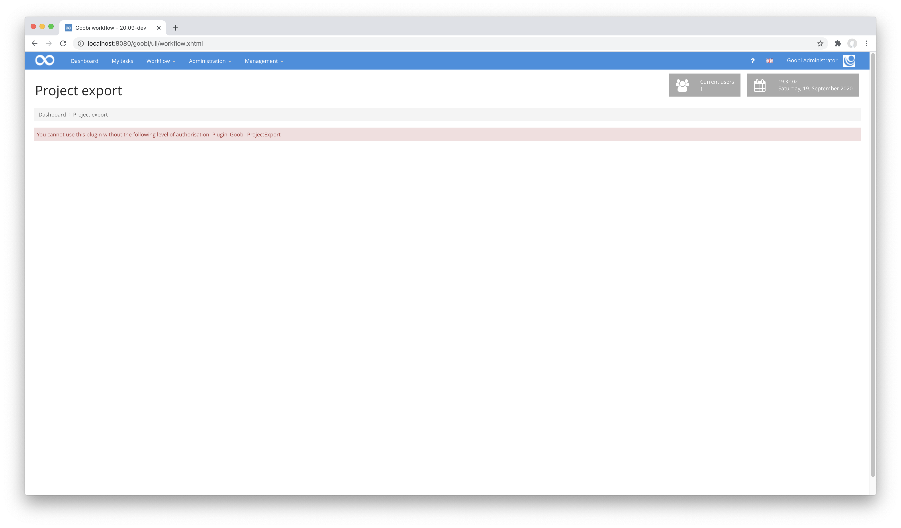
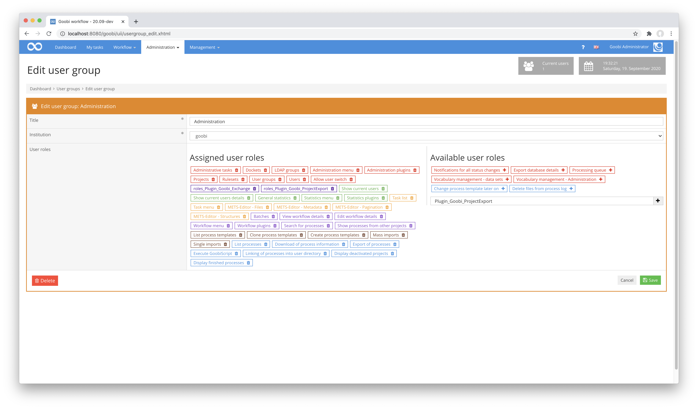
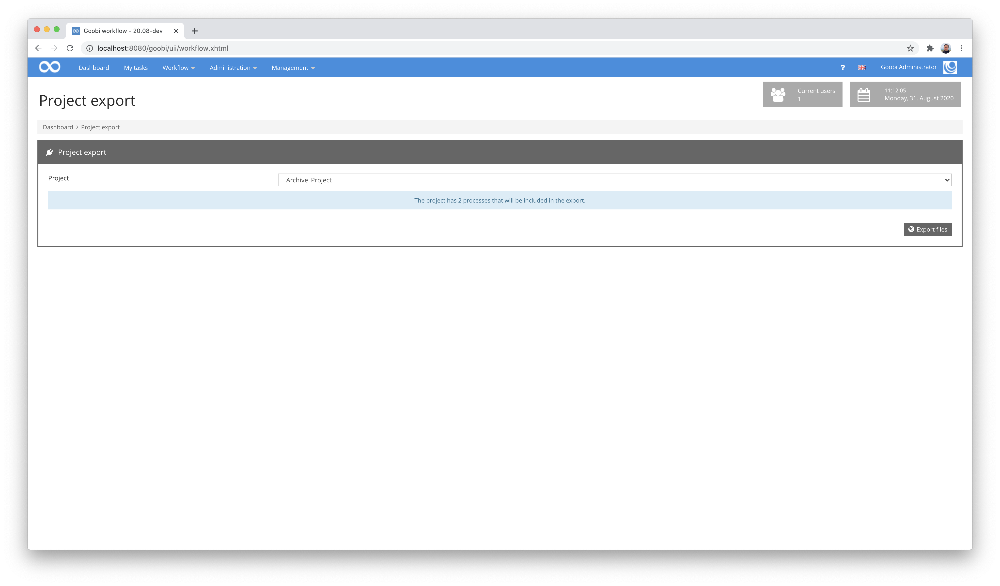
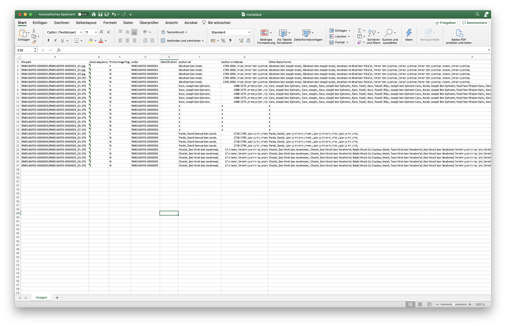

# Project export as folder with images and Excel file

## Overview

Name                     | Wert
-------------------------|-----------
Identifier               | intranda-workflow-projectexport
Repository               | [https://github.com/intranda/goobi-plugin-workflow-project-export](https://github.com/intranda/goobi-plugin-workflow-project-export)
Licence              | GPL 2.0 or newer 
Last change    | 25.07.2024 10:44:47


## Introduction
This workflow plugin allows a very specific export of an entire project. For this purpose, the plugin first checks whether the configured step in the workflow has actually been completed in all processes of the selected project. Depending on this check, the plugin then allows an export of all images of a defined image directory (e.g. the master images) and an export of defined metadata within an Excel file. The structure of the Excel file is such that the respective metadata is redundantly listed in a separate line for each image.

If the initial check determines that the configured workflow step in the workflow has already been completed for all processes of the project, the configured export workflow step is also set to completed for all processes of the project.


## Installation
To install the plugin, the following two files must be installed:

```bash
/opt/digiverso/goobi/plugins/workflow/plugin-intranda-workflow-projectexport-base.jar
/opt/digiverso/goobi/plugins/GUI/plugin-intranda-workflow-projectexport-gui.jar
```

To configure how the plugin should behave, various values can be adjusted in the configuration file. The configuration file is usually located here:

```bash
/opt/digiverso/goobi/config/plugin_intranda_workflow_projectexport.xml
```

The content of this configuration file looks like this:

```xml
<config_plugin>

    <config>
        <!-- name of the project, can be repeated. Use * for any project -->
        <project>*</project>
        <!-- check if all proceses of the project have finished this task -->
        <finishedStepName>Metadata enrichment</finishedStepName>
        <!-- close this step after the export was successful -->
        <closeStepName>Export</closeStepName>
        <!-- define which image folder (master|media|jpeg|source|...) shall be used for the export -->
        <imageFolder>media</imageFolder>
        <!-- write the export into this directory -->
        <exportDirectory>/opt/digiverso/viewer/hotfolder</exportDirectory>
        <!--  define if the export result shall be provided as zip file download -->
        <allowZipDownload>true</allowZipDownload>
    </config>

</config_plugin>
```

To use this plugin, the user must have the correct role authorisation.



Therefore, please assign the role `Plugin_Goobi_ProjectExport` to the group.




## Operation of the plug-in

If the plugin has been installed and configured correctly, it can be found within the menu item `Workflow` and can be started from there. If you have the necessary rights to use the plugin, you can now select from the available projects.



After selecting the desired project, two buttons are available depending on the configuration. These allow either the execution of the export into the desired target directory or the download of the entire export result as a large zip file.


The export result is structured in such a way that for each process a subfolder is created within which the corresponding images from the defined directory are located. In addition, an Excel file is created.



Within each line of this Excel file there is now the respective metadata that was read from the METS file, whereby these are listed redundantly for each image repeatedly.


## Configuration
The configuration of the plug-in is as follows:

| Value | Description |
| :--- | :--- |
| `config` | The block `config` can occur any number of times. This allows several individual settings to be made for individual projects. |
| `project` | Use this parameter to define for which project the configuration should take effect. The names of the projects can be listed here in a repeatable manner. |
| `finishedStepName` | This parameter is used to define which workflow step is to be completed for all tasks of the selected project so that the export workflow step is also marked as completed for all processes of the project after the export has been carried out. |
| `closeStepName` | Here you can specify the name of the workflow step that is closed after the export has been carried out. |
| `imageFolder` | Specify here which directory is to be used for the export. Typical values for this are `master` or `media`. |
| `exportDirectory` | A target directory for the export can be specified for each configuration block. All exports will take place within the folder specified here. |
| `allowZipDownload` | If, in addition to exporting to the configured directory, it should also be possible to download the entire export as a zip file, this can be activated here. |