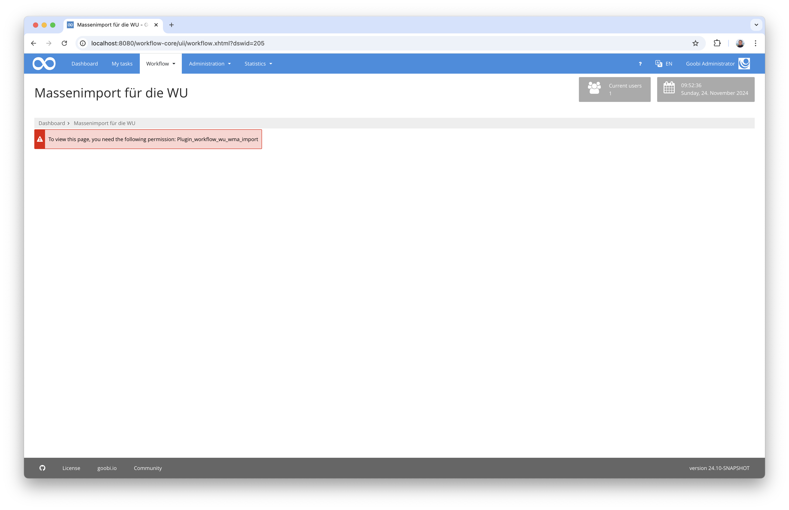
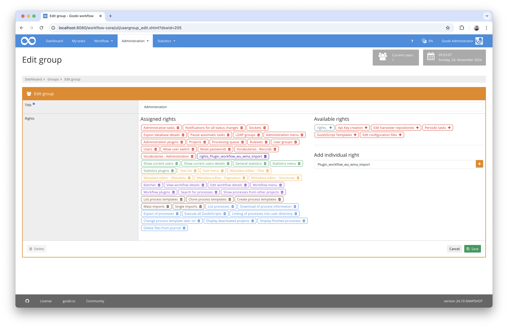
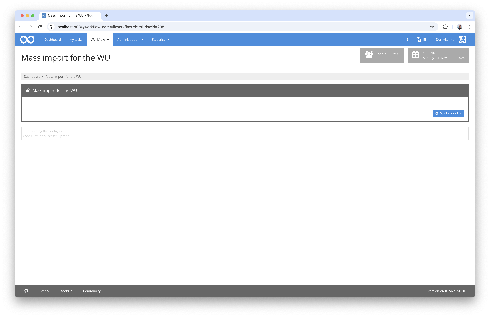
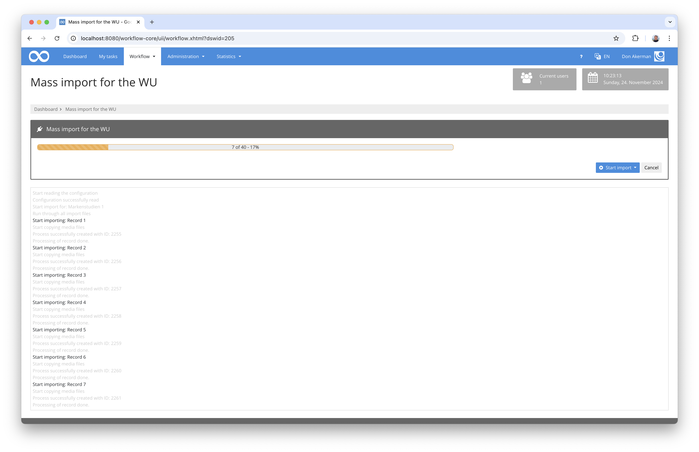

# Mass import for brand studies and advertising material

## Overview

Name                     | Wert
-------------------------|-----------
Identifier               | intranda_workflow_wu_wma_import
Repository               | [https://github.com/intranda/goobi-plugin-workflow-wu-wma-import](https://github.com/intranda/goobi-plugin-workflow-wu-wma-import)
Licence              | GPL 2.0 or newer 
Last change    | 24.11.2024 19:07:56


## Introduction
This workflow plugin allows a mass import for the brand studies and the advertising material archive at the Vienna University of Economics and Business.

## Installation
In order to use the plugin, the following files must be installed:

```bash
/opt/digiverso/goobi/plugins/workflow/plugin-workflow-wu-wma-import-base.jar
/opt/digiverso/goobi/plugins/GUI/plugin-workflow-wu-wma-import-gui.jar
/opt/digiverso/goobi/config/plugin_intranda_workflow_wu_wma_import.xml
```

To use this plugin, the user must have the correct role authorisation.



Therefore, please assign the role `Plugin_workflow_wu_wma_import` to the group.




## Overview and functionality
If the plugin has been installed and configured correctly, it can be found under the `Workflow` menu item.



An import for a data set can now be started here on the right-hand side.



Once the import of the data has started, the progress bar shows the progress. Details about the import of the individual data records can be viewed in the log below.


## Configuration
The plugin is configured in the file `plugin_intranda_workflow_wu_wma_import.xml` as shown here:

```xml
<config_plugin>
	
	<title>Mass import for the WU</title>

	<!-- importsets with source folder definition -->
	<importSet title="Markenstudien 1" source="/opt/digiverso/import/markenstudien01/" />
	<importSet title="Markenstudien 2" source="/opt/digiverso/import/markenstudien02/" />
	<importSet title="Markenstudien 3" source="/opt/digiverso/import/markenstudien03/" />
	<importSet title="Markenstudien 4" source="/opt/digiverso/import/markenstudien04/" />
	
	<!-- which workflow to use -->
	<workflow>Sample_Workflow</workflow>
		
</config_plugin>

```

The following table contains a summary of the parameters and their descriptions:

Parameter               | Explanation
------------------------|------------------------------------
`title`                 | An individual title for the display in the menu and the headings of the plugin can be defined here.
`importSet`             | Individual import sets can be defined with this element. They each consist of a `title` for the name to be displayed and a specification for the storage location from which the data is to be imported. The storage location can have any depth of directory structure.
`workflow`              | This allows you to specify which production template is to be used for creating Goobi processes.