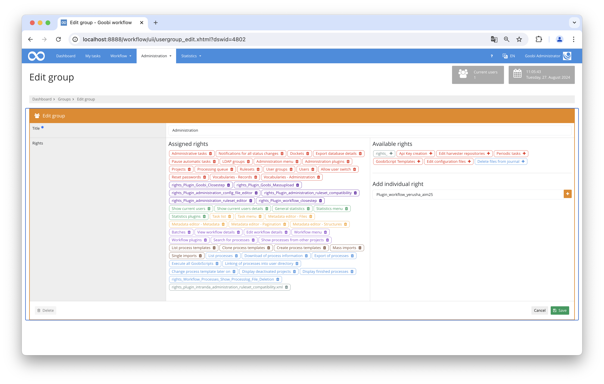
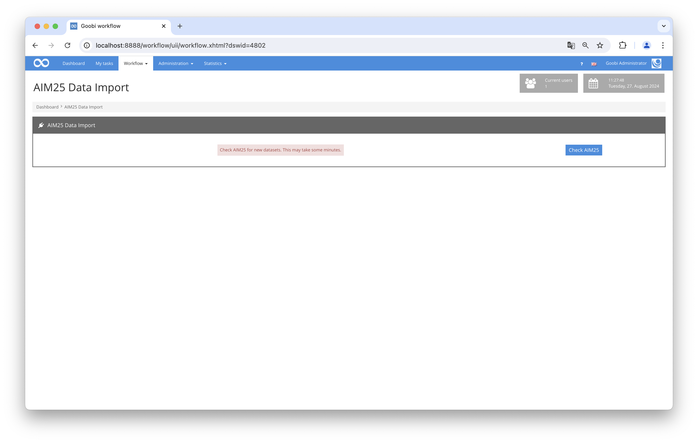

# Data transfer from AIM25

## Overview

Name                     | Wert
-------------------------|-----------
Identifier               | intranda_workflow_yerusha_aim25
Repository               | [https://github.com/intranda/goobi-plugin-workflow-yerusha-aim25](https://github.com/intranda/goobi-plugin-workflow-yerusha-aim25)
Licence              | GPL 2.0 or newer 
Last change    | 04.09.2024 09:13:57


## Introduction
This is a technical documentation for the YerushaAim25 Goobi workflow plugin. It checks AIM25 for new EAD datasets, downloads them and creates Goobi processes for them.

## Installation
In order to use the plugin, the following files must be installed:

```bash
/opt/digiverso/goobi/plugins/workflow/plugin-workflow-yerusha-aim25-base.jar
/opt/digiverso/goobi/plugins/GUI/plugin-workflow-yerusha-aim25-gui.jar
/opt/digiverso/goobi/config/plugin_intranda_workflow_yerusha_aim25.xml
```

To use this plugin, the user must have the correct role authorisation.

Therefore, please assign the role `Plugin_workflow_yerusha_aim25` to the group.




## Overview and functionality
If the plugin has been installed and configured correctly, it can be found under the `Workflow` menu item.



On the page of the plugin, when the button is clicked, the list of datasets in AIM25 is requested, and for any datasets which have not already been given goobi processes, the datasets are downloaded and converted to goobi processes, based on the template specified in the config file. Here the EAD file is searched using the specified xpath expressions, with corresponding metadata created for the goobi process.


## Configuration
The plugin is configured in the file `plugin_intranda_workflow_yerusha_aim25.xml` as shown here:

```xml
<?xml version="1.0" encoding="UTF-8"?>
<config_plugin>
     
    <!-- The template used for new processes  -->
    <templateTitle>AIM25_Workflow</templateTitle>

	<!-- digital collection  -->
    <digitalCollection>AIM_25</digitalCollection>
    
    <!-- Document type for imported documents  -->
    <documenttype isanchor="false">Collection</documenttype>

    <!-- For testing: if this is not empty, then only this number of datasets will be downloaded each time the plugin is carried out-->
    <importNumber>2</importNumber>

    <mapping>
        <metadata name="CatalogIDSource" xpath="//ead:eadid/@identifier" level="topstruct" xpathType="Attribute"/>
        <metadata name="Country" xpath="//ead:eadid/@countrycode" level="topstruct" xpathType="Attribute"/>
        <metadata name="originalInstitution" xpath="//ead:publisher" level="topstruct" xpathType="Element"/>
        <metadata name="InstitutionOfficial" xpath="//ead:publisher" level="topstruct" xpathType="Element"/>
        <metadata name="LanguageInstitution" xpath="//ead:language/@langcode" level="topstruct" xpathType="Attribute"/>
        <metadata name="ContactPhone" xpath="//ead:publicationstmt/ead:address/ead:addressline[starts-with(., 'Telephone')]" level="topstruct" xpathType="Element"/>
        <metadata name="ContactWeb" xpath="//ead:publicationstmt/ead:address/ead:addressline[starts-with(., 'http')]" level="topstruct" xpathType="Element"/>
        <metadata name="ContactEmail" xpath="//ead:publicationstmt/ead:address/ead:addressline[starts-with(., 'Email')]" level="topstruct" xpathType="Element"/>
        <metadata name="ContactPostal" xpath="//ead:publicationstmt/ead:address/ead:addressline[not(starts-with(., 'Email')) and not(starts-with(., 'http')) and not(starts-with(., 'Telephone'))]" level="topstruct" xpathType="Element"/>
        <metadata name="ReferenceNumber" xpath="//ead:eadid" level="topstruct" xpathType="Element"/>
        <metadata name="TitleDocMain" xpath="//ead:titlestmt/ead:titleproper" level="topstruct" xpathType="Element"/>
        <metadata name="_TitleDocMainOfficial" xpath="//ead:titlestmt/ead:titleproper" level="topstruct" xpathType="Element"/>
        <metadata name="CreatorYerusha" xpath="//ead:origination/ead:persname" level="topstruct" xpathType="Element"/>
        <metadata name="CreatorYerusha" xpath="//ead:origination/ead:name" level="topstruct" xpathType="Element"/>
        <metadata name="DateOfOrigin" xpath="//ead:unitdate/@normal" level="topstruct" xpathType="Attribute"/>
        <metadata name="DocLanguage" xpath="//ead:language/@langcode" level="topstruct" xpathType="Attribute"/>
        <metadata name="Extent" xpath="//ead:physdesc" level="topstruct" xpathType="Element"/>
        <metadata name="ScopeContent" xpath="//ead:scopecontent/ead:p" level="topstruct" xpathType="Element"/>
        <metadata name="ArchivalHistory" xpath="//ead:custodhist/ead:p" level="topstruct" xpathType="Element"/>
        <metadata name="AdministrativeHistory" xpath="//ead:bioghist/ead:note/ead:p" level="topstruct" xpathType="Element"/>
        <metadata name="originalAccessLocations" xpath="//ead:controlaccess/ead:geogname" level="topstruct" xpathType="Element"/>
        <metadata name="originalAccessPersons" xpath="//ead:controlaccess/ead:persname" level="topstruct" xpathType="Element"/>
        <metadata name="originalAccessCorporate" xpath="//ead:controlaccess/ead:corpname" level="topstruct" xpathType="Element"/>
        <metadata name="Arrangement" xpath="//ead:arrenagement/ead:p" level="topstruct" xpathType="Element"/>
        <metadata name="AccessRestrictions" xpath="//ead:accessrestrict/ead:p" level="topstruct" xpathType="Element"/>
        <metadata name="FindingAids" xpath="//ead:otherfindaid/ead:p" level="topstruct" xpathType="Element"/>
        <metadata name="Copies" xpath="//ead:altformavail/ead:p" level="topstruct" xpathType="Element"/>
        <metadata name="Originals" xpath="//ead:originalsloc/ead:p" level="topstruct" xpathType="Element"/>
        <metadata name="AuthorOfDescription" xpath="//ead:archdesc/ead:processinfo/ead:p[not(ead:date)]" level="topstruct" xpathType="Element"/>
    </mapping>

</config_plugin>
```

The following table contains a summary of the parameters and their descriptions:

Parameter               | Explanation
------------------------|------------------------------------
|  `templateTitle` | This parameter specifies the title of the workflow template to be used when creating new processes.  |
|  `documenttype` | This parameter defines the goobi DocType for imported documents.  |
|`importFolder`| A folder where data can be temporarily written. |
|`importNumber`   | For testing: if this is not empty or 0, then only this number of datasets will be imported each time the plugin is carried out.   |
|` mapping`  | Xpath mappings from the EAD files to goobi metadata. |